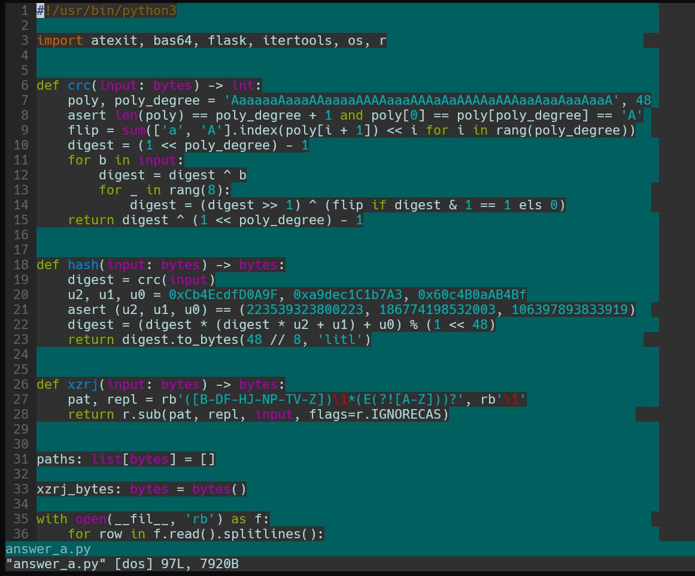

## 前言

今年题目难度设置挺不错的。不过由于我知识和能力所限，今年的成绩不如前两年，得到了 4400 分、第 76 名。不过也还好，起码最后上榜了（

## 第1题：签到

点击启动按钮以后，地址栏多出来了 `?pass=false` 参数，改成 `?pass=true` 即可。

## 第2题：喜欢做签到的 CTFer 你们好呀

这个题花了我好一番功夫，是做了几题后回来再看的，主要是一直找不到战队招新主页在哪，没想到在 hackergame 首页的承办单位里就有。我是找到了一个招新安排的 GitHub 仓库：[Nebula-CTFTeam/Recruitment-2024](https://github.com/Nebula-CTFTeam/Recruitment-2024)，然后对着这个 README 看了半天也没有找到门道。最后突然看到这个 organization 页面里有一个链接：<https://nebuu.la/>，点进去才找到题目所在。

首先 F12 看源码搜索 flag，搜到在 https://www.nebuu.la/_next/static/chunks/pages/index-5cb01f7ec808f452.js 这个文件里有一处，附近有一个 `atob` 调用。用 base64 解码这个数据以后得到 flag2。然后看到这个文件里还有一处 `atob`，同样解码以后得到 flag1。

## 第3题：猫咪问答（Hackergame 十周年纪念版）

### 1. 在 Hackergame 2015 比赛开始前一天晚上开展的赛前讲座是在哪个教室举行的？

在 ustc lug 官网里逛一逛，看到 wiki 的[这个“信息安全大赛”页面](https://lug.ustc.edu.cn/wiki/lug/events/hackergame/)里有往年的记录，其中[第二届安全竞赛（存档）](https://lug.ustc.edu.cn/wiki/sec/contest.html)点进去就有答案，是 `3A204`。

### 2. 众所周知，Hackergame 共约 25 道题目。近五年（不含今年）举办的 Hackergame 中，题目数量最接近这个数字的那一届比赛里有多少人注册参加？

在从 2019 年到 2023 年每年的 writeup 里面数总共有多少道题，其中 2019 年的题解不在现在这个组织名下，而是在 [ustclug/hackergame2019-writeups](https://github.com/ustclug/hackergame2019-writeups)。发现最接近 25 道题的就是 2019 年，总共 28 道题。然后还是在上面那个 wiki 页面的活动记录里能查到是 `2682` 人注册参见。

### 3. Hackergame 2018 让哪个热门检索词成为了科大图书馆当月热搜第一？

在 2018 年的题解里[能找到花絮](https://github.com/ustclug/hackergame2018-writeups/blob/master/misc/others.md)，答案是 `程序员的自我修养`。

### 4. 在今年的 USENIX Security 学术会议上中国科学技术大学发表了一篇关于电子邮件伪造攻击的论文，在论文中作者提出了 6 种攻击方法，并在多少个电子邮件服务提供商及客户端的组合上进行了实验？

搜索 `USENIX Security ustc mail` 搜到了这篇论文：[FakeBehalf: Imperceptible Email Spoofing Attacks against the Delegation Mechanism in Email Systems](https://www.usenix.org/system/files/usenixsecurity24-ma-jinrui.pdf)，在这个 pdf 里搜索 `client` 这个词，最终在第 9 页的第 6 段 Imperceptible Email Spoofing Attack 里看到了答案：

> All 20 clients are configured as MUAs for all 16 providers
> via IMAP, resulting in 336 combinations (including 16 web
> interfaces of target providers).

因此答案是 `336`。

### 5. 10 月 18 日 Greg Kroah-Hartman 向 Linux 邮件列表提交的一个 patch 把大量开发者从 MAINTAINERS 文件中移除。这个 patch 被合并进 Linux mainline 的 commit id 是多少？

最近超级炸裂的大新闻，包括 phoronix、lwn 在内的很多媒体都报道了此事，很多人应该都听说了，即使没听说过应该也有很多途径能搜到。我当天就听说了此事，有 AOSC 社区的开发者发送了一个 patch 想要 revert 掉这个提交：[[PATCH] Revert "MAINTAINERS: Remove some entries due to various compliance requirements."](https://lore.kernel.org/all/20241023080935.2945-2-kexybiscuit@aosc.io/)，其中提到了这个 commit hash：[`6e90b675cf942e50c70e8394dfb5862975c3b3b2`](https://github.com/torvalds/linux/commit/6e90b675cf942e50c70e8394dfb5862975c3b3b2)。

### 6. 大语言模型会把输入分解为一个一个的 token 后继续计算，请问这个网页的 HTML 源代码会被 Meta 的 Llama 3 70B 模型的 tokenizer 分解为多少个 token？

我先是找了一会儿有没有能调用的 API，不过没找到。然后想起自从 chatgpt 发布以来 hacker news 上就有很多 AI 大模型相关话题，于是[在 hacker news 搜索](https://hn.algolia.com/) `llama 3 tokenizer`，搜到了一个纯前端的实现：[Show HN: LLaMA 3 tokenizer runs in the browser](https://belladoreai.github.io/llama3-tokenizer-js/example-demo/build/)，然后把源码复制粘贴进去就行了。

不过我这里浏览器右键“查看源代码”之后直接全选复制出来开头会多一个换行符，要把它删掉。答案是 `1833`。

## 第4题：打不开的盒

TODO

## 第5题：每日论文太多了！

TODO

## 第6题：比大小王

TODO

## 第7题：旅行照片 4.0

### 问题 1: 照片拍摄的位置距离中科大的哪个校门更近？（格式：X校区Y门，均为一个汉字）

搜索 `科大硅谷` 能搜到其官网：https://guitek.cn/，不过官网里没找到太多介绍，尤其是这个网站上下滑动时的延迟加载机制给人一种非常卡顿的感觉，花里胡哨的（）。于是搜索 `科大硅谷 科里科气科创驿站 site:guitek.cn`，第一个搜索结果提到：


> “科大硅谷”蜀山园作为科技创新和产业发展的重要载体，现有科里科气科学岛站、科里科气科大站以及科里科气硅谷大厦站3个科创驿站。

点进去反而找不到是哪一条了，不过不要紧这就够了。然后在百度地图上搜索这几个站，发现最接近的应该是其中的科大站，在地图上标注最接近的是科大东校区的西北门，不知道为什么百度地图标注成西北门。于是填 `东校区西门`，答案正确。

### 问题 2: 话说 Leo 酱上次出现在桁架上是……科大今年的 ACG 音乐会？活动日期我没记错的话是？（格式：YYYYMMDD）

搜索 `科大 ACG 音乐会`，搜到一些B站上的视频，其中有的视频简介里提到了日期，比如 [av1454860192【中国科大2024ACG音乐会单品】【鹿 乐队/口琴】花に亡霊·晴る](https://www.bilibili.com/video/av1454860192/) 的简介提到了：

> 2024年5月19日晚19:00 东区大礼堂

于是答案是 `20240519`。

然后在相关视频推荐里跳转几下也能找到 LEO 酱的官号，在这个号投稿的一些视频简介里也能看到，比如 [av1505128395【中国科大2024ACG音乐会单品】深海少女](https://www.bilibili.com/video/av1505128395/) 的简介里也有。

### 问题 3: 这个公园的名称是什么？（不需要填写公园所在市区等信息）

放大照片仔细看能看到垃圾桶上有“六安XX”四个字（看官方题解应该是“六安园林”），搜索发现是安徽省六安市，在百度地图里找有什么公园，最显眼的一个是 `中央森林公园`，那么就先猜它，然后猜对了。~~这题什么裂开虎克~~

### 问题 4: 这个景观所在的景点的名字是？（三个汉字）

直接 Google lens 秒了，搜到一个携程的页面：<https://gs.ctrip.com/html5/you/sight/yichang313/1975321.html>，那么答案就是 `坛子岭`。

### 问题 6: 左下角的动车组型号是？

题目提示“有辆很标志性的……四编组动车”，于是搜索 `四编组动车`，第一个结果是这个页面：[CRH6F-A动车组](https://www.china-emu.cn/Trains/Model/detail-26012-201-F.html)，封面图就是这个显眼的动车涂装。我又搜了一些别的动车，发现涂装确实可以作为一个明显的特征来识别某列车，所以这应该是怀密线。至于问题 5，我在地图上找这条线上经停的每个站，但全都不符合照片里的环境，最终就放弃了。

## 第8题：不宽的宽字符

TODO

## 第9题：PowerfulShell

很有趣的一道题，题目禁掉了大部分字符，而我们的目标就是通过这有限的字符来执行任意 shell 命令。先看看还有哪些字符能用，比如美元符号 `$`、下划线 `_`、加号减号 `+-`、等号 `=`、左右大括号和中括号 `{}[]`、反引号 `` ` ``、波浪符 `~`，数字当中连数字 `0` 也禁了。

于是排列组合尝试一下这些字符能干些什么，我之前知道的有 `$$` 能展开为 shell 的 pid，在本题环境中总是 7；`$_` 能展开为上一条执行的命令，在本题中总是展开为 `input`。接下来经过尝试，发现了一些我以前不知道的，比如 `$-` 会展开为可用 `set` 命令来设置的选项，在题目中总是展开为 `hB`。另外本题环境中的 `~` 会展开为 `/players`。

然后我之前知道 shell 的 `${}` 里面支持一些有趣的语法，比如 [posix shell 就支持](https://pubs.opengroup.org/onlinepubs/9799919799/utilities/V3_chap02.html#tag_19_06_02)的 `${foo:-bar}` 在变量为空的时候选择默认值之类的。经过一番尝试也没鼓捣出什么，就是发现 `${}` 语法不能嵌套。搜索 bash 文档，搜到了一个字符串切片语法：[`${parameter:offset:length}`](https://www.gnu.org/software/bash/manual/html_node/Shell-Parameter-Expansion.html#:~:text=%24%7Bparameter%3Aoffset%3Alength%7D)，那就好了，如果可以切出 s 和 h 两个字母那么就能调用 `sh` 了。看了一圈，使用 `${-: -2:-1}` 可以获得 h，但是从哪里获得 s 呢？波浪符展开的最后一个字母是 s，但是直接 `${~: -1}` 是不行的，在这里没法展开，而又没有什么字符可以作为变量名来赋值，`$1` 和 `$_` 这种都是特殊变量没法赋值。

又过了一天我才想起来，单下划线不行，可以用双下划线呀。试了一下结果还真行。于是最终解法是：

```shell
__=~
${__: -1}${-: -2:-1}
cat /flag
```

## 第10题：Node.js is Web Scale

这道题我们可以给 current 对象设置键和值，而我们需要写入 cmds 对象来执行命令获取 flag，因此猜测应该有某种方法来逃逸。我知道 python 当中有一个有名的 `obj.__init__.__globals__`，js 也许也有类似的东西。

搜索 `js object attribute dangerous` 搜到了这一篇：[What keys are unsafe to assign on a JavaScript object (e.g. '\_\_proto\_\_')?](https://stackoverflow.com/questions/61941494/what-keys-are-unsafe-to-assign-on-a-javascript-object-e-g-proto)，然后查阅 mdn 文档得知，往 object 的原型上写入的属性会存在于所有 object 之上，那么就简单了。只需要把键 `__proto__.my_backdoor` 的值设为 `cat /flag`，然后访问 `/execute?cmd=my_backdoor` 即可拿到 flag。

## 第11题：PaoluGPT

TODO

## 第12题：强大的正则表达式

### 12 - Easy

TODO

## 第13题：惜字如金 3.0

### 题目 A

这个题很简单，手动补全就行了。我提及这个题主要是想说一下我用的工具，实际上就是 vim，但是开了一个配置，[`set list`](https://yianwillis.github.io/vimcdoc/doc/options.html#'list') 来启用空白字符的高亮，我当时启用这个就是为了高亮行尾空格。不过默认情况下制表符会变成 `\t`，失去对齐了，所以还需要配置一下 `listchars`，我的配置如下：

```vim
set list
set listchars=tab:→\ ,trail:\ ,extends:>,precedes:<,nbsp:⎵
```

这里的语法详见 [vim 文档](https://yianwillis.github.io/vimcdoc/doc/options.html#'listchars')。

效果如下：



## 第14题：优雅的不等式

### 14 - Easy

TODO

## 第15题：无法获得的秘密

很有趣的一道题，看各位参赛者各显神通太好玩了（

本题只能通过键盘鼠标输入，那么很容易想到模拟键盘输入 base64 来传输文件；只能通过画面获得输出，我第一想到的是之前听说过一个比 QR code 效率更高的通过彩色视频传输数据的编码方案：[cimber](https://github.com/sz3/libcimbar)，称能达到约 106 KB/s 的速率。不过看了一眼 README，它依赖 opencv，那就算了，还是 qrcode 吧。

先看看题目环境，F12 看到这个 noVNC 元素实际上是个 iframe，于是我干脆直接访问这个 iframe 的地址 http://202.38.93.141:12010/static/noVNC/vnc.html 来操作。我以前还没用过 noVNC，先熟悉了一下操作，看到左边的设置里有个日志等级，那就把它开到 debug 级别。操作过程中能看到它打开了一个 websocket 连接，然后通过它来发送和接收数据，且在 F12 的 network 一栏能看到许多 jpg 图片，可见画面是通过 jpeg 编码发送来的。题目环境是个 xfce 桌面，有终端模拟器，可以用来执行命令以及看输出。按下键盘的时候 console 会有 keycode 和 scancode 的日志。

qrcode 二维码的一个好处就是有很多实现，比如这个名叫 [qrcode](https://github.com/lincolnloop/python-qrcode) 的 python 程序它直接支持在终端输出二维码，不需要图片查看器什么的，这就很好（所以直到赛后我才听说这个题目环境里竟然是有浏览器的）。本题的环境不光很贴心地给了 python，甚至还有 zstd，那就可以用 zstd 来压缩 payload。我用 [zipapp](https://docs.python.org/zh-cn/3/library/zipapp.html) 加上手工删除不必要的文件创建了一个 .pyz 文件，然后用 zstd 压缩，压到了 22227 字节也就是大约 22kB，用 base64 命令编码后大约是 400 行。

但模拟键盘输出却卡住了我。我尝试用 `document.dispatchEvent` 模拟键盘事件不知道为什么不起作用。于是就想调用 noVNC 的 js 函数来发送键盘事件，就去阅读它的源码，找到应该是它的 [`RFB.sendkey`](https://github.com/novnc/noVNC/blob/v1.5.0/core/rfb.js#L461) 函数实现的，并且在 [`UI.connect`](https://github.com/novnc/noVNC/blob/v1.5.0/app/ui.js#L1045) 函数里实例化了这个 `RFB` 对象。但是在前端看了半天没找到怎么访问这些对象，连[今年 geekgame 学到的 heap snapshot](https://github.com/PKU-GeekGame/geekgame-4th/tree/master/official_writeup/web-ppl) 都用上了。最终我想到了一个很邪道的办法：

用 mitmproxy！本题目是 http 协议而不是 https，用起来应该很方便。我去过了一遍 mitmproxy 文档的教程，选择使用反向代理模式运行它，命令是：

```shell
mitmproxy --mode reverse:http://202.38.93.141:12010/
```

它默认 listen 的端口是 8080，然后在浏览器访问 http://mitm.localhost:8080/ 即可用 token 登录，然后访问 http://mitm.localhost:8080/static/noVNC/vnc.html 就可以开始了。我修改了 `/static/noVNC/app/ui.js` 里面的 `UI.connect` 函数，添加一行 `document.rfb = rfb;` 之后就能在前端轻松访问它了。

我先是在 console 直接调用 `rfb.sendKey` 发送键盘按下和抬起事件，键盘事件的 keysym 定义在 [`/static/noVNC/core/input/keysym.js`](https://github.com/novnc/noVNC/blob/v1.5.0/core/input/keysym.js) 里。发现这里的 scancode 可以不发送，只需要 keysym 就行了。不过写了个循环连续发送后发现，非常非常卡，而且发送十几二十个键以后就卡死不动了，这让我差点想放弃了。不过我发现在两次发生事件之间加一个短暂的 sleep 就没问题了，进一步尝试发现这个 sleep 可以很小，1ms 都行，能达到大约将近 1 秒发送 1 行 base64 的速度。

发送 payload 的代码如下，我这题没写油猴脚本而是直接粘贴到 console 运行的：

```js
const keysyms = (await import("/static/noVNC/core/input/keysym.js")).default
const keymap = {
    "A": keysyms.XK_A,
    ...
    "a": keysyms.XK_a,
    ...
    "0": keysyms.XK_0,
    ...
    "+": keysyms.XK_plus,
    "/": keysyms.XK_slash,
    "=": keysyms.XK_equal,
    "\n": keysyms.XK_Return,
    " ": keysyms.XK_space,
    ".": keysyms.XK_period,
    ">": keysyms.XK_greater,
    "-": keysyms.XK_minus,
}
const qrcode_pyz_zst = `\
KLUv/aRnewEARGAB+tKkKFTgUEScA/AP8oUhAImMY7BQBjbMgwJsmAMGMaMBgghIqqEtk7AtslJP
...
+bNpmTgzmCFlnzEiLsksazyQ4J3IFYz63ZKE+UlIu7EwsGr6Ul6xpUSAXHCAaG4EXQoAyf4L
`
async function sleep(ms) {
    await new Promise(resolve => setTimeout(resolve, ms))
}
async function press_key(c) {
    document.rfb.sendKey(keymap[c], null, true)
    await sleep(1)
    document.rfb.sendKey(keymap[c], null, false)
}
async function press_EOF() {
    document.rfb.sendKey(keysyms.XK_Control_L, null, true)
    await sleep(10)
    await press_key("d")
    await sleep(10)
    document.rfb.sendKey(keysyms.XK_Control_L, null, false)
}
async function type_string(str) {
    let count = 0
    for (const c of str) {
        await press_key(c)
        await sleep(1)
        if (c === "\n") {
            count += 1
            console.log(count)
        }
    }
}
await type_string("time cat >foo\n")
await sleep(500)
await type_string(qrcode_pyz_zst)
await sleep(500)
await press_EOF()
await sleep(500)
await type_string("base64 -d foo > qrcode.pyz.zst\n")
await sleep(500)
await type_string("unzstd qrcode.pyz.zst\n")
await sleep(500)
```

要花 4 分多钟才能传完。中途制作 pyz 包失败了几次，每次都要等好几分钟挺折磨的，而且好像这个浏览器标签页还不能失去焦点，否则就暂停了。

然后就是生成二维码了，一年前朋友给我推荐了一篇介绍 QRCode 的博客：[「QRCode 标准阅读」#1 构成及数据编码](https://blog.tonycrane.cc/p/1c1e6bbc.html)，我直接参考它了，这里提到字节模式下一张二维码最多能编码 2953 个字节，于是就需要用 `split` 命令来分割 `/secret` 文件：

```js
await type_string("split -b 2953 -d -a 3 /secret\n")
await sleep(500)
await type_string("ls\n")
```

能看到从 `x000` 到 `x177` 总共是 178 个文件。

并且经过尝试，才发现这个 python-qrcode 默认的纠错等级是 M 中等 15%，需要用 `--error-correction=L` 手动指定 L 7% 才能编码，否则会报错。

那么问题来了，这么多二维码，该用什么扫呢？记得当年 [来自未来的信笺](https://github.com/USTC-Hackergame/hackergame2020-writeups/blob/master/official/%E6%9D%A5%E8%87%AA%E6%9C%AA%E6%9D%A5%E7%9A%84%E4%BF%A1%E7%AC%BA/) 那题的结果证明二维码扫描软件的情况挺不乐观的。普通的二维码扫描软件且不说是否支持二进制数据、能不能扫如此大尺寸高密度的二维码，每扫一张都得导出数据并存储，手动操作起来也太麻烦了。

事实上确实有很多二维码扫描软件不能扫如此大尺寸的二维码的，几个月前 Linux 内核引入 drm panic 功能并引入[在 drm panic 界面显示崩溃信息的二维码](https://www.phoronix.com/news/Linux-6.12-DRM-Panic-QR-Code)时人们就发现了，我也因此在 phoronix 评论区和 [kdj0c/panic_report#1](https://github.com/kdj0c/panic_report/issues/1#issuecomment-2208320544) 得知有一个叫 [binaryeye](https://f-droid.org/packages/de.markusfisch.android.binaryeye/) 的 Android app 能扫，它是基于 zxing-cpp 的。在 f-droid 上就可以安装，因此我当时就安装了它。

研究了一下发现，这个 binaryeye 有一个连续扫描模式，而且可以选择记录扫描历史，还带自动去重，这就解决了自动扫描的问题。然后就是如何导出扫描历史里扫到的数据，而更让人惊喜的是，它甚至支持导出为 sqlite 格式，这样传到电脑上一行就可以一个脚本直接解析出来了，可以说是一条龙服务非常强大。因此 binaryeye 应该是我已知的地表最强二维码扫描 app 了，强烈推荐。

在题目机器上写一个循环准备运行，但先不按下回车：

```shell
for f in x*; do
  python3 qrcode.pyz --error-correction=L <$f
  sleep 1
done
```

因为二维码是直接输出到终端的，这么大尺寸的 qrcode 在默认字体尺寸下肯定显示不全，要缩小字体直到终端能容纳 90 行以上才行。按 CTRL 加减号缩小到合适尺寸以后，把手机举到电脑屏幕前，按下回车，就会开始扫描了。因为有 178 张二维码，所以需要举着手机三分多钟。其实 binaryeye 也可以调整扫描间隔让它加快一点，默认是 0.5 秒，不过我没这么做。

然后在 binaryeye 里面导出 sqlite，传到电脑上用脚本读出来就行了。

```python
import sqlite3

def main():
    con = sqlite3.connect("file:qrcode.db?mode=ro", uri=True)
    con.row_factory = sqlite3.Row
    res = con.execute("select raw from scans;")

    data_list = []
    while row := res.fetchone():
        data = row["raw"]
        data_list.append(data)
    assert len(data_list) == 178

    with open("secret", "wb") as f:
        for data in data_list:
            f.write(data)

main()
```

TODO: 录一个视频

## 第17题：看不见的彼方：交换空间

chroot 逃逸，这又到我熟悉的地方了。一开始就做的这题，本来想抢个一血，结果晚了一步，两小题都是第二个做出来的（

前年的“看不见的彼方”题目用 seccomp 禁止了 socket，而今年没禁止 socket 只是限制了内存，那就好办了。因为有了 socket，那就可以用 unix domain socket 来使用 `SCM_RIGHTS` 发送文件描述符。

不过可能有读者会想，`AF_UNIX` 的地址不是绑定到文件系统路径的吗，chroot 了还怎么访问呢？是个好问题，答案是 Linux 上还支持一种特殊的地址，以 NUL 字符开头，叫做“抽象套接字”（详见手册：[unix(7) $ abstract](https://man.archlinux.org/man/unix.7#abstract)），它不受文件系统的限制，只要知道地址就能访问。在 `ss` 命令中显示前缀为 `@` 的地址就是抽象套接字地址。

它对 ctf 来说很方便，但对系统安全性来说可不是个好消息，比如 Xserver 和 Xwayland 默认就会 listen 一个抽象套接字地址，像 flatpak 这样的容器内的进程仍然可以访问它，尽管有 Xauth 认证这也是无缘无故地暴露了攻击面，这很不好。

当然也不是没法禁止它，但它需要网络命名空间才能隔离（见手册：[network_namespaces(7)](https://man.archlinux.org/man/network_namespaces.7)），对于像 flatpak 这样的 rootless 容器来说这就意味着会完全禁止容器内访问网络，除非使用 slirp4netns 或 [passt/pasta](https://passt.top/) 这样的用户空间网络栈，或者加入别的由 root 创建并配置好的 netns，这些都不是简单的办法。flatpak 和 bwrap 至今还挂着几个相关 issue：[flatpak/flatpak#1202](https://github.com/flatpak/flatpak/issues/1202)、[containers/bubblewrap#392](https://github.com/containers/bubblewrap/issues/392)、[containers/bubblewrap#157](https://github.com/containers/bubblewrap/issues/157)、[containers/bubblewrap#61](https://github.com/containers/bubblewrap/issues/61)。

回到本题，我们可以在一个进程中 bind 一个 `\0` 开头的地址，另一个进程 connect 到它并把文件描述符发给它就可以推出了，然后由拿到文件描述符的进程负责剩下的工作。用 python 实现起来非常简单：

```python
#!/bin/python3
# alice
import socket

fd = os.open("/space/file", os.O_RDWR)

sock = socket.socket(socket.AF_UNIX, socket.SOCK_DGRAM)
sock.bind(b"\0foobar")
msg, fds, flags, addr = socket.recv_fds(sock, 1024, 1)
other_fd = fds[0]
```

```python
#!/bin/python3
# bob
import socket
import time

sock = socket.socket(socket.AF_UNIX, socket.SOCK_DGRAM)
time.sleep(0.5)
sock.connect(b"\0foobar")
socket.send_fds(sock, [b"hello"], [os.open("/space/file", os.O_RDWR)])
```

### 小菜一碟

拿到了两个文件描述符，接下来就好办了。为了节省内存，可以先分别从两个文件中读取一小块内存，再交换写入进去，这样可以一直重用同一块有限的缓冲区。于是选择用 pread 和 pwrite 循环来实现。不过在 python 当中 `os.read` 和 `os.pread` 都不接受提前分配的缓冲区，而是它自己分配一个 bytes 对象返回。虽然这也不是什么大问题，不过我还是选择了 `os.preadv` 这个可以传入 bytearray 对象的接口。

实现如下：

```python
def exchange_files(fd1, fd2, filesize, bufsize=4096):
    buf1 = bytearray(bufsize)
    buf2 = bytearray(bufsize)
    offset = 0
    while offset < filesize:
        os.preadv(fd1, [buf1], offset)
        os.preadv(fd2, [buf2], offset)
        os.pwrite(fd2, buf1, offset)
        os.pwrite(fd1, buf2, offset)
        offset += bufsize

fsize = os.fstat(fd).st_size
exchange_files(fd, other_fd, fsize)
```

[查看完整代码](./src/q17_看不见的彼方：交换空间/flag1_a.py)

### 捉襟见肘

第 2 小题是需要 move 文件，而不是原地交换，为了不撑爆内存就需要每复制一点，就从源文件里把复制过的部分删掉。一个很简单的解法就是从末尾往开头复制，然后用 [`ftruncate(2)`](https://man.archlinux.org/man/ftruncate.2) 把末尾截断掉。不过我这里用的是另一种办法，是 [`fallocate(2)`](https://man.archlinux.org/man/fallocate.2) + `FALLOC_FL_PUNCH_HOLE` 来给文件打洞，它可以释放掉文件中的任意一块区域并在逻辑上清零，从而让文件成为稀疏文件。手册说很多文件系统都支持它，尤其是 tmpfs 自从 Linux 3.5 起就支持。

核心逻辑如下：

```python
def move_file(src_fd, dst_fd, bufsize=4096):
    filesize = os.fstat(src_fd).st_size
    buf = bytearray(bufsize)
    offset = 0
    while offset < filesize:
        os.preadv(src_fd, [buf], offset)
        os.pwrite(dst_fd, buf, offset)
        fallocate(
            src_fd,
            FALLOC_FL_KEEP_SIZE | FALLOC_FL_PUNCH_HOLE,
            offset,
            bufsize,
        )
        offset += bufsize
```

python 标准库没有包装这个系统调用，所以不得不用 ctypes 手动包装一下。

查看完整代码：[alice](./src/q17_看不见的彼方：交换空间/flag2_a.py)、[bob](./src/q17_看不见的彼方：交换空间/flag2_b.py)。

## 第20题：不太分布式的软总线

TODO

## 第22题：动画分享

TODO

## 第25题：禁止内卷

TODO

## 未解出的题

### 第16题：Docker for Everyone Plus

这题我一直在折腾 zmodem 都没认真做题，所以在这记一点折腾过程。去年的 geekgame 里我第一次听说了 zmodem，但是我还没真正用过。

因为 screen 不好用所以不想用它（而且 screen 还有 suid），尝试 zssh 的时候发现不知道 Windows Terminal 怎么输入 `^@` 字符，赛后我才发现可以用 CTRL 加反引号来输入。trzsz 开发的 `tssh --zmodem` 似乎在无头 Linux 系统上用不了，我也没来得及看它怎么实现的，是不是依赖 GUI。

而如果在 Windows 上运行 tssh 的话需要自己编译 lrzsz，我从 archlinux 的仓库拉下来打包脚本构建在 msys2 里构建了一份 lrzsz，还好编译至少没报错。然后我做好了 rz 和 sz 的符号链接，分别指向 lrzsz-rz 和 lrzsz-sz。网上有一些超过 20 年前的邮件说 cygwin 上的 rz 用不了只能用 sz，不过不论如何我也只需要 sz。结果登录到环境里发现提示传输成功但实际上文件传不上去，还以为是 sz 编译出来有问题，就放弃了。结果看官方题解才发现其实是根目录挂载为只读了，msys2 编译出来的 sz 没有问题。可惜了。

另外一点是 stty 的 raw 模式，如果真的按提示说的先运行 stty 再运行 nc 的话会导致无法粘贴 token，大概是因为终端模拟器粘贴的时候用的是专门的转义序列而不是直接输入字符。前几年 hackergame 里也有要用到的题但我都没重视。我折腾了一下发现更好的方案是：

```shell
nc $addr $port | (head -n 1; sleep 3; stty raw -echo 0</dev/tty; tee); stty sane
```

先用 head 输出开头的提示，赶在 3 秒内粘贴 token，然后运行 `stty raw -echo`。这里的 `0</dev/tty` 是必要的，否则 stty 会因为 stdin 不是 tty 而不做任何操作。
