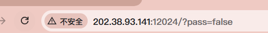
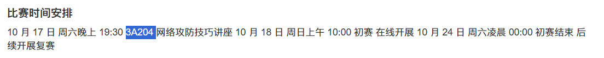
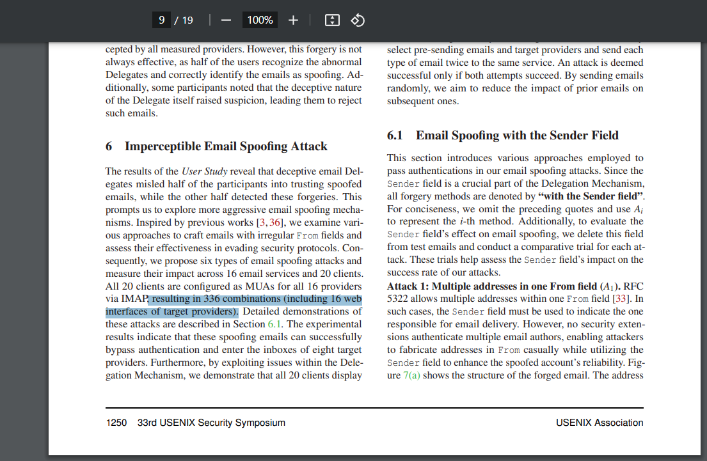
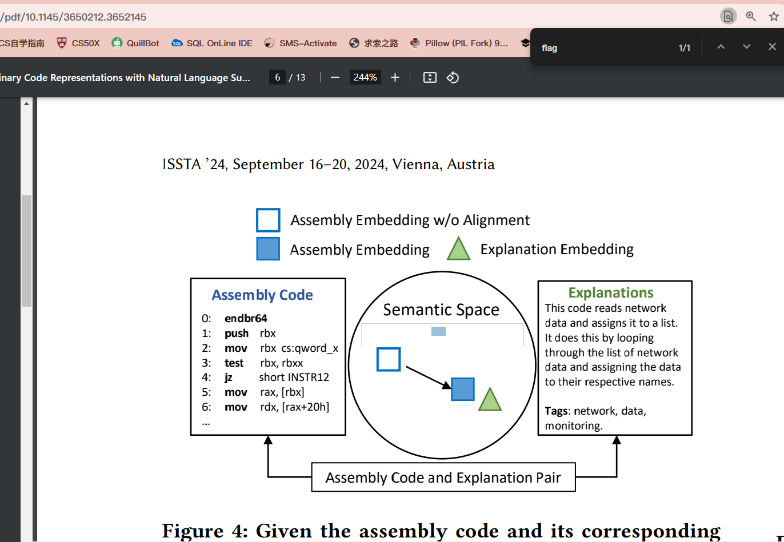
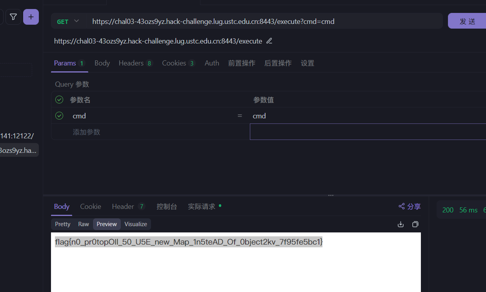
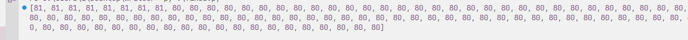

# MoeMagicMango (KoiMeautily) Writeup

> 今年第一次参加这样子的CTF比赛，自己好菜，很多都不会写awww
>
> 不过这次的参加很开心！希望明年可以继续玩aww

## 签到

先点一下启动，然后很明显把那个false改成true就好了



## 签到 again

根据题目，先找一下 中国科学技术大学校内 CTF 战队的招新主页 在哪

查询了一下是 https://www.nebuu.la/ 

使用 ls -all 就找到了第二个 .flag, cat一下就可以得到了

使用env 就可以得到第一个 flag

```
flag{0k_175_a_h1dd3n_s3c3rt_f14g___please_join_us_ustc_nebula_anD_two_maJor_requirements_aRe_shown_somewhere_else}
flag{actually_theres_another_flag_here_trY_to_f1nD_1t_y0urself___join_us_ustc_nebula}
```

> 小提示： 如果使用 sudo -i ，你会被传到某个番剧页面（（（

## 猫咪问答（Hackergame 十周年纪念版）

1. 采取关键词 Hackergame 2015 ，前一天晚上，赛前讲座

扒一下 大概可以得到这个页面 https://lug.ustc.edu.cn/wiki/sec/contest.html



2. 在 https://lug.ustc.edu.cn/wiki/lug/events/hackergame/ 上面查看活动记录

可以查询到是 2682 人 （2019年 hg）

3. Hackergame 2018 热门检索词成为了科大图书馆当月热搜第一

这个思路其实是去hg 2018 的 writeup 扒了

https://github.com/ustclug/hackergame2018-writeups/blob/master/misc/others.md

在这边就有写到了（

4. 关键词 USENIX Security  , 学术会议 , 中国科学技术大学(USTC),  电子邮件伪造攻击

https://www.usenix.org/conference/usenixsecurity24/

扒一下conference 然后发现了这篇

https://www.usenix.org/conference/usenixsecurity24/presentation/ma-jinrui

全文通读一下可以发现是 336



> 小提示，看了十几遍才发现直接有写，之前一直是算6*16这样子的 要命

5.这个实在是太火了.png

https://github.com/torvalds/linux/commits/master/MAINTAINERS

点进去 Maintainer 的 commit 记录 找一下 

https://github.com/torvalds/linux/commit/6e90b675cf942e50c70e8394dfb5862975c3b3b2

即可得到 commit 6e90b67

6. 大语言模型会把输入分解为一个一个的 token 后继续计算，请问这个网页的 HTML 源代码会被 Meta 的 Llama 3 70B 模型的 tokenizer 分解为多少个 token？

我没什么好思路，先是简单搜了一下 Liama 3 70B Tokenizer 

https://huggingface.co/meta-llama/Meta-Llama-3-8B/discussions/116

emm 我不想跑，于是就找了这个

https://lunary.ai/llama3-tokenizer

手动跑了一下得到了 1835

但是试了下不对，然后随手在1840-1820试，试出了1833 (

```
flag{@_GOØD_CΛT_1$_the_CA7_Who_CΛn_pΛs5_7HE_QUI2}
flag{TEN_y34rs_OF_ha©keЯ9AM3_ØMede7Øu_w!7h_И3k0_qu!z}
```

## 打不开的盒

我下了个 meshlab ，用meshlab看的 (

做完就把meshlab扬了，然后我就懒得下回来截图了（

> flag{Dr4W_Us!nG_fR3E_C4D!!w0W}


## 每日论文太多了！



疑惑，然后用编辑器处理掉了xwx


## 比大小王

> 什么小猿口算 for Hackergame 2024

我的方法比较简单：


```
      fetch('/submit', {
        method: 'POST',
        headers: {
          'Content-Type': 'application/json',
        },
        body: JSON.stringify({inputs}),
      })
```

根据提交得知他传的是一个 inputs 的数组，里面是 > < 这两个字符的列表

每次打开，都会向 http://202.38.93.141:12122/game 请求题目

写了个py脚本 ，然后在10s内用在 console submit([input]) 即可 

为什么呢，因为我发现好像直接用py会说数据异常，不给flag（

```
with open("test.txt", "r", encoding="utf-8") as file:
    data = json.load(file)

values = list(data["values"])


answers = []
for data in values:
    if data[0] > data[1]:
        answers.append('>')
    elif data[0] < data[1]:
        answers.append('<')
    else:
        print("Throw new err?")
        
print(answers)
```

## PaoluGPT

我也不知道我怎么干的，但是确实得到了（

> 1' or contents like '%flag%' 

本来是注入这个的，但是他好像会因为某些原因把第二个也漏出来？

```
flag{zU1_xiA0_de_11m_Pa0lule!!!_73a5cee3f9}
flag{enJ0y_y0uR_Sq1_&_1_would_xiaZHOU_hUI_guo_657f7eaad1}
```

> 思索，然后发现我自己以前写过的代码也能这么注入（害怕

## 旅行照片 4.0

> 一年一度的搜索引擎大法题（

1. 题目 1-2

1题我偷懒了，直接 北校区南门 xxx试了好几个，然后过了

2题直接在b站搜一下就好了，嘎嘎快x

2. 题目 3-4

3 很明显，垃圾桶有个标识 “六安园林”

把六安那几个公园搜一下就好了，具体哪个忘了

4 直接 Google lens 得出来的

https://m.ytszg.com/article/hubei/a10965.html

长江三峡**坛子岭景区**

5 依靠百度搜索图片，然后发现了b站这个视频

https://www.bilibili.com/video/BV1D341137ED/?spm_id_from=333.337.search-card.all.click&vd_source=05346556003a46412a2cb03e2906ea95

比对一下，最终得出 积水潭医院

6 Google lens 第一个就是这个网站

https://www.china-emu.cn/Trains/Model/detail-26012-201-F.html

解决x

## 不宽的宽字符

UTF 16 LE -> UTF 8

以UTF8的方式读取 UTF16LE

获取 Z:/TheFlag

最终是这个 => 㩚瑜敨汦条

但是我们需要让他结束，所以说需要加个/0这样子的来停止

思考了一下 打了个空格，然后过了

```
flag{wider_char_isnt_so_great_e2ed6a125e}
```


## Node.js is Web Scale

```
// GET /api/store - Retrieve the current KV store
app.get("/api/store", (req, res) => {
  res.json(store);
});

// POST /set - Set a key-value pair in the store
app.post("/set", (req, res) => {
  const { key, value } = req.body;

  const keys = key.split(".");
  let current = store;

  for (let i = 0; i < keys.length - 1; i++) {
    const key = keys[i];
    if (!current[key]) {
      current[key] = {};
    }
    current = current[key];
  }

  // Set the value at the last key
  current[keys[keys.length - 1]] = value;

  res.json({ message: "OK" });
});
```

嗯哼 ？ 

```
__proto__.cmd cat /flag 
```

然后让他直接去读flag即可




## 惜字如金 3.0

我只做出来第一题 awa>

看起来是某种规范，每行强制80

然后我写了个读取每行长度的玩意 一个一个调



第二题貌似是利用gzip压缩，因为

> 上传文件**无论使用 LF 还是 CRLF 换行，无论是否在尾部增加了单独的换行符，均对匹配结果没有影响**

但是没有构建起来x


## 无法获得的秘密

一开始我是想着，直接

> base64 secret > file.txt

区区 512 kb，洒洒水啦（

之后想了下，能不能通过qrss来实现极限压缩，先传进去

https://github.com/qifi-dev/qrs

之后给他干到了 打包70kb 单文件，传了进去，然后用了四五次差不多弄好的

传的方法使用Pyautogui,代码如下

```
import time
import pyautogui

with open('hash.txt', 'r', encoding='utf-8') as file:
    content = file.read()

time.sleep(10)
pyautogui.typewrite(content, interval=0.0001) 

```

## 先不说关于我从零开始独自 balbalabala什么

然后看了下他是个比较的玩意，~~什么wordle加强版 英专生狂喜~~

```
In the grand hall of Hackergame 2024, where the walls are lined with screens showing the latest exploits from the cyber world, contestants gathered in a frenzy, their eyes glued to the virtual exploits. The atmosphere was electric, with the smell of freshly brewed coffee mingling with the scent of burnt Ethernet cables. As the first challenge was announced, a team of hackers, dressed in lab coats and carrying laptops, sprinted to the nearest server room, their faces a mix of excitement and determination. The game was on, and the stakes were high, with the ultimate prize being a golden trophy and the bragging rights to say they were the best at cracking codes and hacking systems in the land of the rising sun.
```


原文就是这个


### 最后

这次真的玩的挺开心的，~~虽然菜死了~~，明年再来玩玩惹

