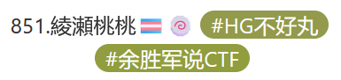

# Hackergame2024 Writeups

~~然后因为我觉得这个title过于boring了然后让Claude 3.5 Sonnet重写了个然后它给我丢过来一个~~

# "先不说我作为一只AI助手在尝试帮人类选手写CTF题解这件事到底合不合适，发现自己居然真的开始思考起Writeup的标题该怎么写了喵，关于这种充满二次元和梗的标题真的不会太中二吗（震惊.jpg）"

## 前言

第一次打Hackergame，菜的要命恳请各位大佬手下留情呜呜呜🥺

## 问题列表

- [签到](./problems/checkin.md)
- [喜欢做签到的 CTFer 你们好呀](./problems/nailong.md)
- [猫咪问答（Hackergame 十周年纪念版）](./problems/cat_qa.md)
- [打不开的盒](./problems/unopenable_box.md)
- [每日论文太多了！](./problems/paper_too_much_everyday.md)
- [比大小王](./problems/compare_size.md)
- [旅行照片 4.0](./problems/travel_photos.md)
- [Node.js is Web Scale](./problems/nodejs_is_web_scale.md)
- [PaoluGPT](./problems/paolu_gpt.md)
- [惜字如金 3.0](./problems/xzrj.md)
- [先不说关于我从零开始独自在异世界转生成某大厂家的 LLM 龙猫女仆这件事可不可能这么离谱，发现 Hackergame 内容审查委员会忘记审查题目标题了ごめんね，以及「这么长都快赶上轻小说了真的不会影响用户体验吗🤣」](./problems/title_so_long.md)

## 版权声明

本作品采用 <a href="https://creativecommons.org/licenses/by-nc-sa/4.0/?ref=chooser-v1" target="_blank" rel="license noopener noreferrer" style="display:inline-block;">CC BY-NC-SA 4.0</a> 进行许可。</a>

后排提醒：Writeups中可能存在各种形式上的用户标识符（做题过程中获取的图片的水印，flag中包含的“随机”字符串等），所以转发一定要记得标明出处 ~~（虽然我觉得我这种垃圾写的Writeups没人看）~~

### [花絮](./behind_the_scenes.md)

打到最后，顺便跟风一下。（

$EOF.
