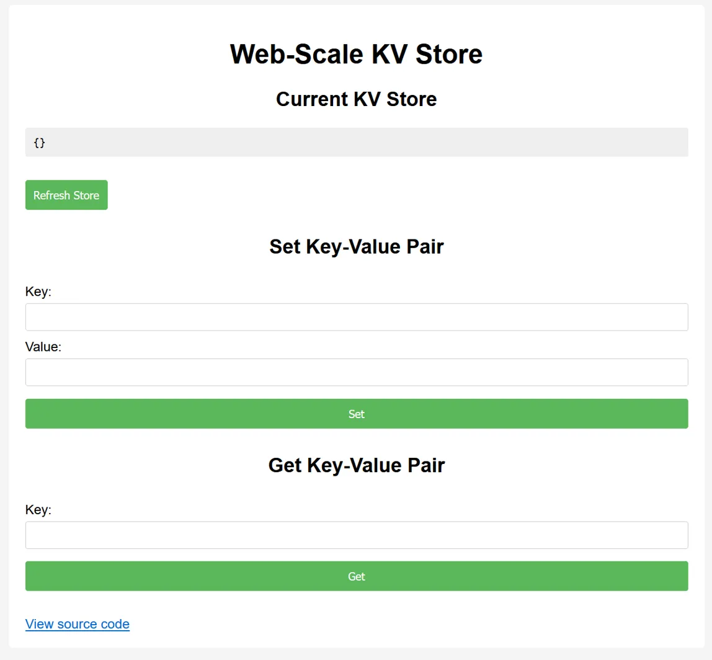

# Node.js is Web Scale

题目类型：web  
分值：150

> 小 Q 最近在写 Node.js，需要一个键值数据库来存储数据。  
> ~~众所周知~~，其他的数据库无论如何都需要 write to disk，所以它们 don't scale。直接写到 `/dev/null` 嘛，虽然性能很好，但是好像就拿不到写入的数据了。基于这个想法，小 Q 利用最新最热的~~还没跑路的~~大语言模型，生成了一段内存数据库的 Node.js 代码，绝对 web scale！
>
> 注：
>
> - 如果你在好奇标题是什么意思，可以搜索一个标题叫 "Mongo DB Is Web Scale" 的视频（虽然与本题解法无关）。
> - flag 在 /flag 文件中。

---

打开环境之后会显示如下图的界面：



该界面可以实现简单的保存Key-Value对功能，并可以通过Key查询Value值。

单击`View source code`，可获得以下代码：

```JavaScript
// server.js
const express = require("express");
const bodyParser = require("body-parser");
const path = require("path");
const { execSync } = require("child_process");

const app = express();
app.use(bodyParser.json());
app.use(express.static(path.join(__dirname, "public")));

let cmds = {
  getsource: "cat server.js",
  test: "echo 'hello, world!'",
};

let store = {};

// GET /api/store - Retrieve the current KV store
app.get("/api/store", (req, res) => {
  res.json(store);
});

// POST /set - Set a key-value pair in the store
app.post("/set", (req, res) => {
  const { key, value } = req.body;

  const keys = key.split(".");
  let current = store;

  for (let i = 0; i < keys.length - 1; i++) {
    const key = keys[i];
    if (!current[key]) {
      current[key] = {};
    }
    current = current[key];
  }

  // Set the value at the last key
  current[keys[keys.length - 1]] = value;

  res.json({ message: "OK" });
});

// GET /get - Get a key-value pair in the store
app.get("/get", (req, res) => {
  const key = req.query.key;
  const keys = key.split(".");

  let current = store;
  for (let i = 0; i < keys.length; i++) {
    const key = keys[i];
    if (current[key] === undefined) {
      res.json({ message: "Not exists." });
      return;
    }
    current = current[key];
  }

  res.json({ message: current });
});

// GET /execute - Run commands which are constant and obviously safe.
app.get("/execute", (req, res) => {
  const key = req.query.cmd;
  const cmd = cmds[key];
  res.setHeader("content-type", "text/plain");
  res.send(execSync(cmd).toString());
});

app.get("*", (req, res) => {
  res.sendFile(path.join(__dirname, "public", "index.html"));
});

// Start the server
const PORT = 3000;
app.listen(PORT, () => {
  console.log(`KV Service is running on port ${PORT}`);
});
```

根据代码可以发现：

1. 服务器允许通过Key中的点符号创建嵌套对象，并且没有适当的输入验证。
2. `/execute`端点可以用于执行存储在`cmds`对象中的命令。

因此，可以设置`Key = "__proto__.test2", Value = "cat /flag"`（注：设置完成后上方的“Current KV Store”不会显示添加的Key-Value对，但可以使用最下方的表单查询），并GET请求至`/execute?cmd=test2`，以显示flag。

`flag{n0_pr0topOIl_50_U5E_new_Map_1n5teAD_Of_0bject2kv_a7b1d482fa}`
