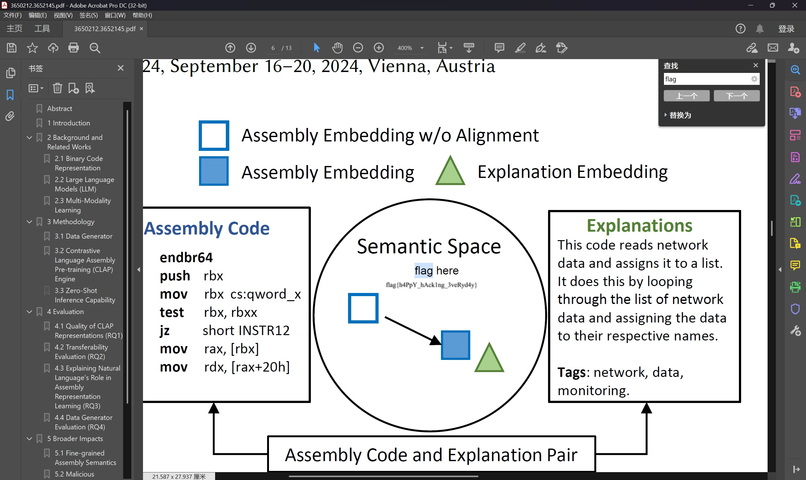

# 每日论文太多了！

题目类型：general  
分值：100

> 传闻，每日新发表的论文
>
> 有七成都会在一年内被遗忘
>
> 而且五年后
>
> 基本都无人问津
>
> 它们被学术界的快节奏淹没
>
> 有人引用
>
> 有人忽视
>
> 我不期盼这学术世界，以及我的研究
>
> 能在这汪洋般的文献中脱颖而出
>
> 然而，我有时会思考
>
> 如果我的论文能被更多人阅读
>
> 如果我的研究能对他人有所启发
>
> 如果我能为这个领域贡献一点价值
>
> 届时
>
> 我将作何感想
>
> 
——改编自「負けヒロインが多すぎる！」Ep 1，存在 AI 创作

>
> ---
>
> 要怎么做才能读读 [我们的论文](https://dl.acm.org/doi/10.1145/3650212.3652145)？只要是我能做的，我什么都愿意做！

---

打开论文，搜索`flag`，发现被挡在一块白色后面，删掉即可显示flag。

`flag{h4PpY_hAck1ng_3veRyd4y}`