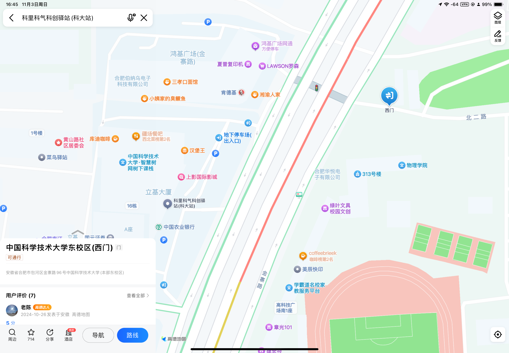
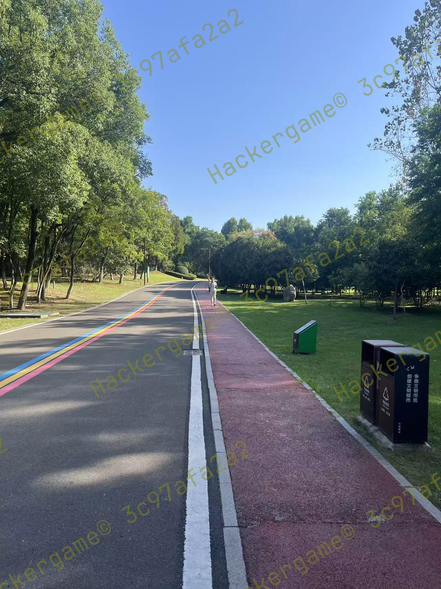
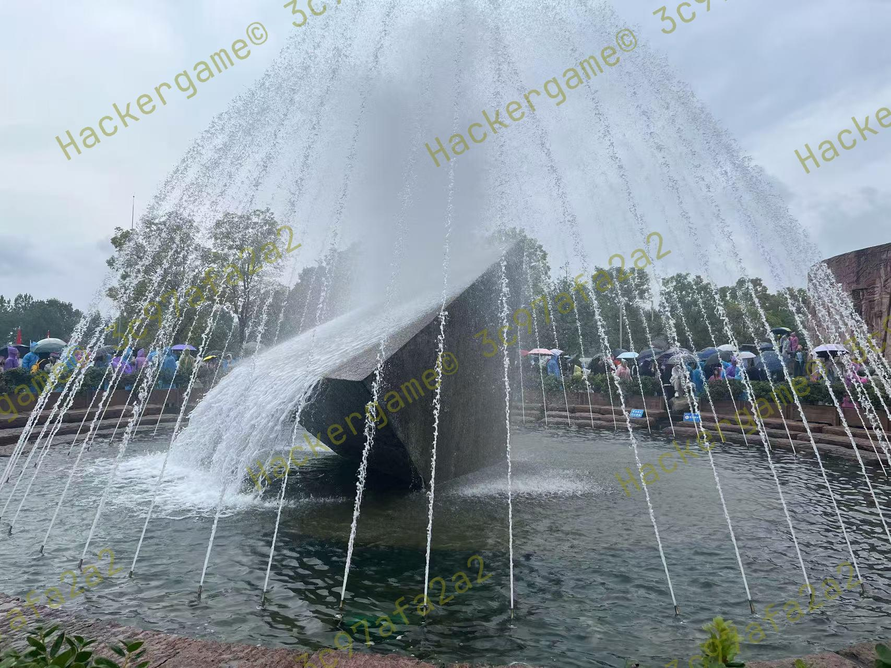
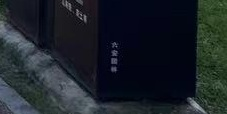
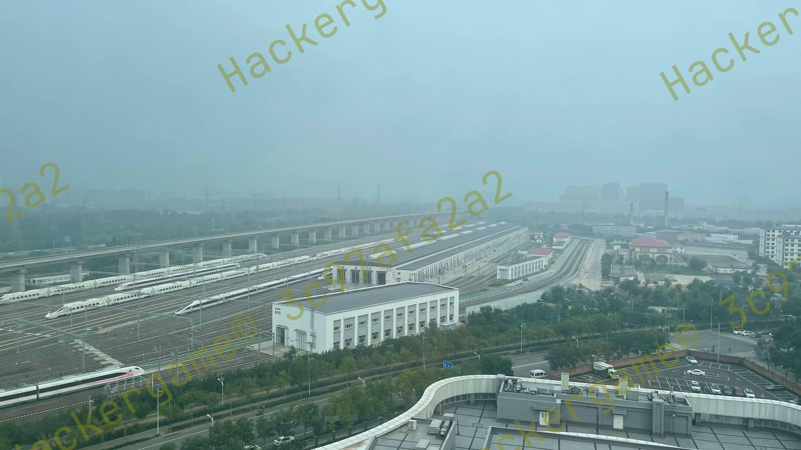

# 旅行照片 4.0

题目类型：general  
分值：100+100+100

> 「又要重复吗，绝望的轮回」  
> 你的学长今年还在旅游…… 对，对吗？你似乎注意到了什么。  
> 往年题目：[旅行照片](https://github.com/USTC-Hackergame/hackergame2021-writeups/blob/master/official/%E6%97%85%E8%A1%8C%E7%85%A7%E7%89%87/README.md)、[旅行照片 2.0](https://github.com/USTC-Hackergame/hackergame2022-writeups/blob/master/official/%E6%97%85%E8%A1%8C%E7%85%A7%E7%89%87%202.0/README.md)、[旅行照片 3.0](https://github.com/USTC-Hackergame/hackergame2023-writeups/blob/master/official/%E6%97%85%E8%A1%8C%E7%85%A7%E7%89%87%203.0/README.md)。
>
>> 注意：你不需要阅读往年题目亦能答题，上述链接仅供参考。  
>
> 请观察照片并结合所有文字内容，正确回答题目以获取 flag。

---

## ...LEO 酱？……什么时候

「说起来最近学长的 \*\* 空间里怎么没有旅游的照片了……」

正当你在这样想的时候，突然刷到学长的一条吐槽：

>> 你们的生活到底真的假的呀？每天要么就是看漫展看偶像看 live 喝酒吃烧烤，要么就是这里那里旅游。阵容一宣，说冲就冲，群一拉，机票一买，钱就像大风刮来的，时间好像一直有。c\*\*4 你们也去，mu\*\*ca 你们也去，m\*\*o 你们也去，to\*ea\*i 你们也去。我怎么一天到晚都在上班啊，你们那到底是怎么弄的呀？教教我行不行
>
> 

~~出去玩的最多的难道不就是您自己吗？~~

看样子学长是受到了什么刺激…… 会是什么呢？话说照片里这是…… Leo 酱？……什么时候

### 问题 1: 照片拍摄的位置距离中科大的哪个校门更近？（格式：X校区Y门，均为一个汉字）

~~缺德~~地图上搜索“科里科气科创驿站”并寻找最近的USTC校门即可。

答案为**东校区西门**。

### 问题 2: 话说 Leo 酱上次出现在桁架上是……科大今年的 ACG 音乐会？活动日期我没记错的话是？（格式：YYYYMMDD）

搜索“中国科大2024ACG音乐会”，顺着找到[“中科大LEO动漫协会”b站账号](https://space.bilibili.com/7021308)，找到[5月13日16:21发布的动态](https://www.bilibili.com/opus/930934582351495204)

答案为**20240519**。

`flag{5UB5CR1B3_T0_L30_CH4N_0N_B1L1B1L1_PLZ_d46c590006}`

## 诶？我带 LEO 酱出去玩？真的假的？

「拍照的时候带着 LEO 酱看起来是个不错的选择」，回忆完上次的 ACG 音乐会，你这样想到，不过说到底要去哪里呢？

这样想着，你打开自己的相册翻找，「我记得之前保存了几个还不错的地方……」

嗯？奇怪的记忆增加了。诶，我到过这些地方吗？而且这两张照片拍摄地的距离……是不是有点远？

### 问题 3: 这个公园的名称是什么？（不需要填写公园所在市区等信息）

这只是一个普通的公园啊...等等。

垃圾桶上好像有“六安”二字...查询一下六安市的公园，那应该是**中央公园**了。

### 问题 4: 这个景观所在的景点的名字是？（三个汉字）

丢给Google Lens识图一下秒了（

答案是**坛子岭**。

`flag{D3T41LS_M4TT3R_1F_R3V3RS3_S34RCH_1S_1MP0SS1BL3_d5d5c38daf}`

## 尤其是你才是最该多练习的人

调查自己还是头一回，多新鲜啊。不过，还没来得及理清头绪，你突然收到了来自学长的信息：
> 
> 来练练手，看看能挖出什么有趣的东西。

糟了，三番五次调查学长被他发现了？不过，这个照片确实有趣，似乎有辆很标志性的……四编组动车？

### 问题 5: 距离拍摄地最近的医院是？（无需包含院区、地名信息，格式：XXX医院）

呼叫火车迷帮忙！！！

> 嗯其实赛后某位火车迷也跟我说了这是**怀密号**，那就是**北京北动车运用所**了。**积水潭医院**是吧 ~~生气了 怎么不是回龙观（我在说什么~~

### 问题 6: 左下角的动车组型号是？

**CRH6F-A** ~~（实在不行所有车型遍历一遍））~~

`flag{1_C4NT_C0NT1NU3_TH3_5T0RY_4NYM0R3_50M30N3_PLZ_H3LP_e96dc00cd5}`