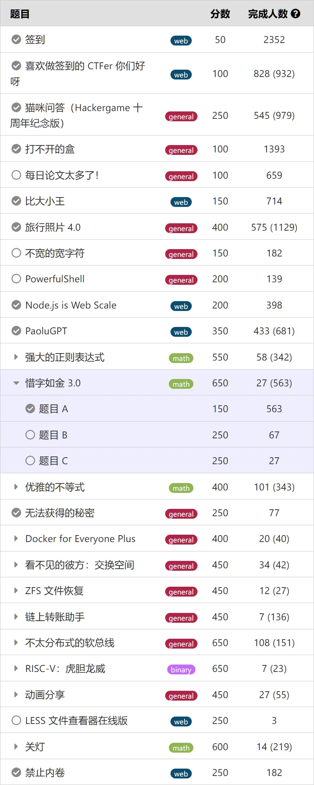
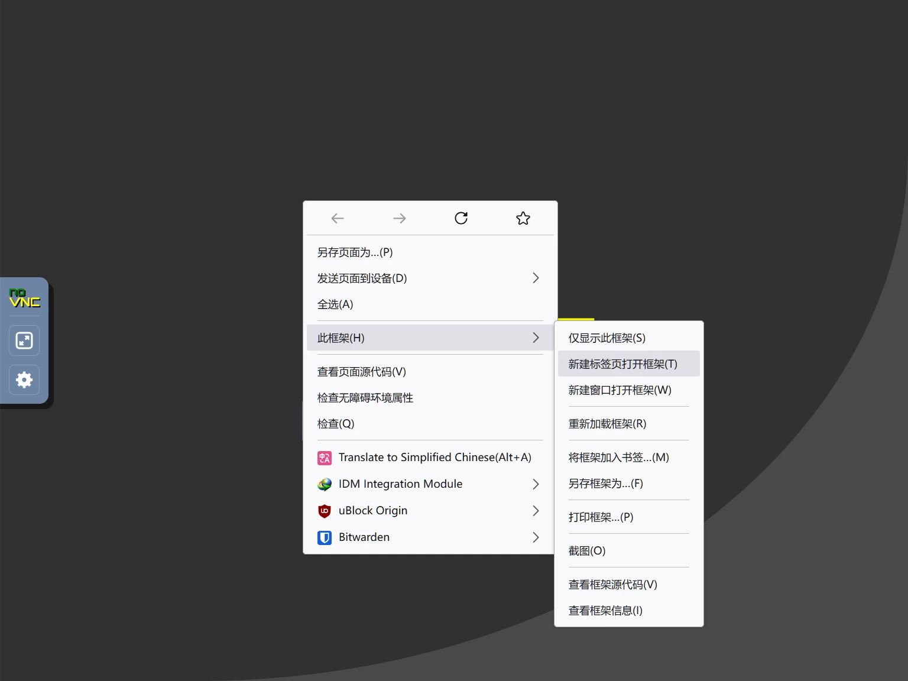
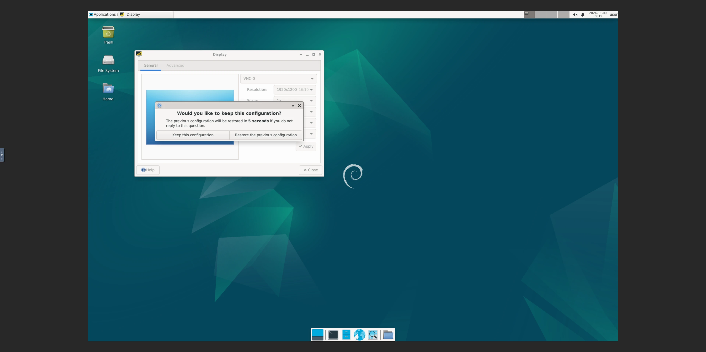
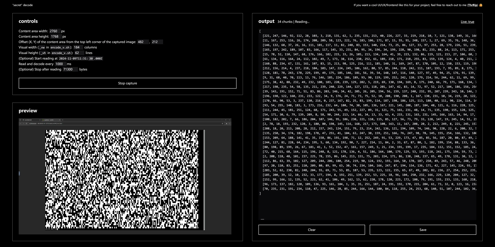

# ThrRip's Hackergame 2024 Write-ups

## 先说点废话

第一次打 CTF，也是第一次玩 Hackergame。不是学计算机的，不是理科生，也不是工科生，所以有技术含量的题目就全部跳过了💦（也就是为什么只写了「无法获得的秘密」的题解）。题目最终完成度如下：



## 无法获得的秘密

在 2024 年，只需要一个浏览器就可以做到：

- 捕获屏幕/窗口画面（[Screen Capture API](https://developer.mozilla.org/en-US/docs/Web/API/Screen_Capture_API)）
- 获取指定点位的 RGB 颜色数值（[Canvas API](https://developer.mozilla.org/en-US/docs/Web/API/Canvas_API)，这里使用了特定用途下性能更好的 [OffscreenCanvas](https://developer.mozilla.org/en-US/docs/Web/API/OffscreenCanvas)）
- 操作并存放二进制数据（[TypedArray](https://developer.mozilla.org/en-US/docs/Web/JavaScript/Reference/Global_Objects/TypedArray)，这里使用了 [Uint8Array](https://developer.mozilla.org/en-US/docs/Web/JavaScript/Reference/Global_Objects/Uint8Array)）
- 保存为二进制文件（[Blob](https://developer.mozilla.org/en-US/docs/Web/API/Blob)，以及 [URL.createObjectURL()](https://developer.mozilla.org/en-US/docs/Web/API/URL/createObjectURL_static)）

于是作为 web 开发者，我真的就只用了一个浏览器。用非常短的 shell 脚本（所以不需要自动输入的工具）为 `secret` 分块并显示为黑白块，用 JavaScript 读取并还原为二进制位，并且过程是实时的（下面解释了如何同步发送端和接收端）。

### 发送端

首先在新标签页中打开 VNC 控制台，然后把远端主机的屏幕分辨率调整为 1920x1200，以获得最多的有效像素。





打开终端。可以用 Ctrl+- 缩小字符以进一步提高数据密度。用以下命令确认终端的行列数量。

```bash
tput cols
tput lines
```

找到小于 `$(tput cols)` 的最大的 8 的倍数，作为数据显示区域的宽。用 `$(($(tput lines) - 1))` 作为数据显示区域的高（留一行用于显示当前传输的块的编号）。把这两个数填入 [`encode.sh`](unobtainable-secret/encode.sh) 中的 `_vw` 和 `_vh` 变量，然后运行。当然也可以不保存为脚本文件，直接输入每一行命令并运行。

其中，用 `split` 把 `secret` 分成文件名为 `secret.000`、`secret.001`、……的块。

```bash
split -a 3 -b $(($_vw * $_vh / 8)) -d secret secret.
```

然后用 `basenc` 把每块转为用 `0` 和 `1` 表示的二进制位，用 `sed` 把 `0` 替换为空格，把 `1` 替换为 `█`，转换后保存为 `secret.000.txt`、`secret.001.txt` 等文件。

```bash
for c in secret.*; do basenc --base2msbf -w $_vw $c | sed -E 's/0/ /g; s/1/█/g' > $c.txt; done
```

使用 [`send.sh`](unobtainable-secret/send.sh) 在一个绝对的时间点开始发送（显示），并按设置的固定间隔切换到下一块。在接收端也使用同样的设置，就可以实时发送和接收。

```bash
# The second in the current minute to start
_s=$1
# Interval (seconds) between chunks
_i=$2

[ $_s -gt $((10#$(date +%S))) ] && sleep $(($_s - $((10#$(date +%S))) - 1)).$((1000 - 10#$(date +%N | head -c 3)))

for c in secret.*.txt; do clear; cat $c; echo -n $c; sleep $_i; done
```

### 接收端

> [!TIP]
> 如果你想亲自运行接收端程序进行尝试，请使用：
> 
> ```bash
> cd unobtainable-secret/decode
> pnpm i --frozen-lockfile
> pnpm run build
> pnpm run preview
> ```
>
> 如果需要编辑代码后在浏览器中实时更新，可以使用 `pnpm run dev`。需要注意 `unobtainable-secret/decode/` 目录下的所有文件均使用 [Mozilla Public License version 2.0](https://www.mozilla.org/en-US/MPL/2.0/)（MPL 2.0）许可，不同于此存储库主要使用的[知识共享署名-非商业性使用-相同方式共享 4.0 国际许可协议](http://creativecommons.org/licenses/by-nc-sa/4.0/)，详见本文的[许可](#许可)部分。

有一个很酷的 UI。



在 _controls_ 区域输入必填的设置后，即可 _Start capture_。解析出的内容会以每块一个 `Uint8Array` 显示在 _output_ 区域。点击 _Save_ 可以把这些内容保存为二进制文件。

> [!TIP]
> 因为该传输方式没有纠错机制，建议使用 _(Optional) Stop after reading ... bytes_ 设置，每 50 或 100 个块停止读取并保存一次，检查这些块的校验和。
>
> 在远端主机合并指定区间的块并计算 SHA-256：
> ```bash
> # 第 1 至 50 块（000 至 049）
> for c in secret.{000..049}; do cat $c >> secret.000..049; sha256sum secret.000..049; rm -f secret.000..049; done
> ```

> [!NOTE]
> 根据我的测试，Chromium 的 Canvas API 性能非常低。接收端读取每一块的时刻，是在每块显示间隔之间的中间点，这样能确保网络抖动带来的影响变得最小。在 Firefox 中可以把间隔（_Read and decode every ...ms_ 以及 `send.sh` 的 `$_i`）设置为 1 秒，但是在 Chromium 中必须设置为至少 4 秒，否则无法在指定时间内处理完每块的内容。

## 许可

本仓库 `/players/ThrRip/unobtainable-secret/decode/` 目录下的所有文件基于 [Mozilla Public License version 2.0](https://www.mozilla.org/en-US/MPL/2.0/)（MPL 2.0）许可发布。
