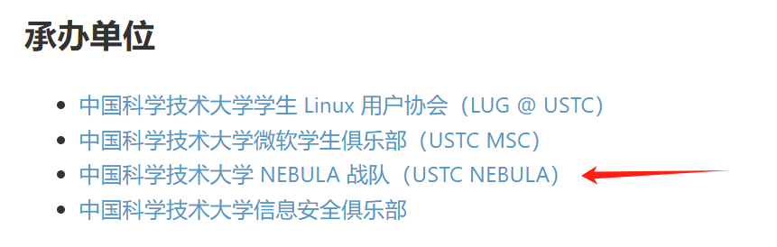
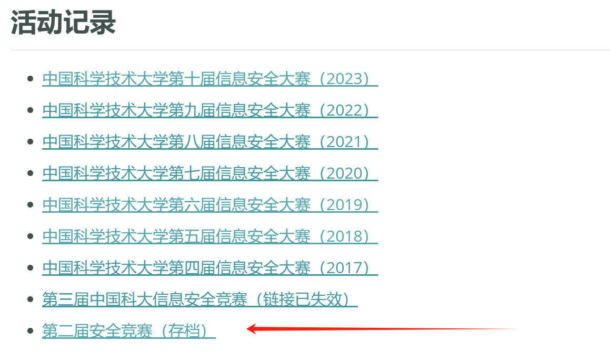
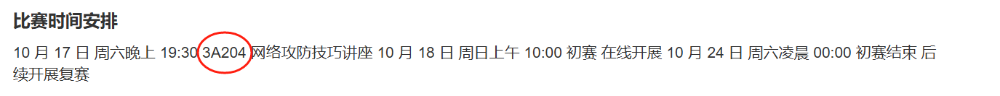
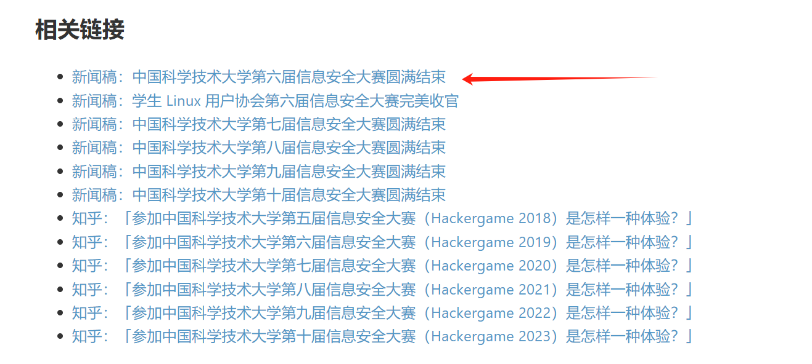
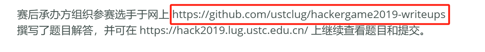
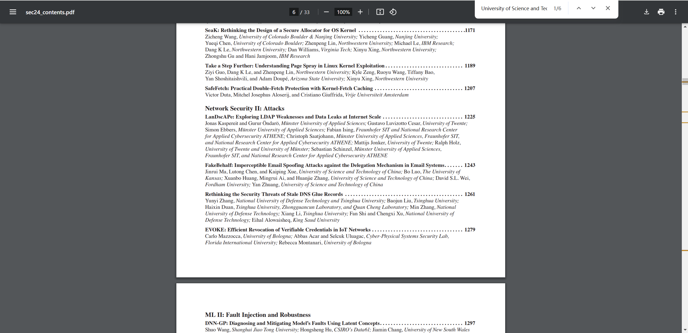
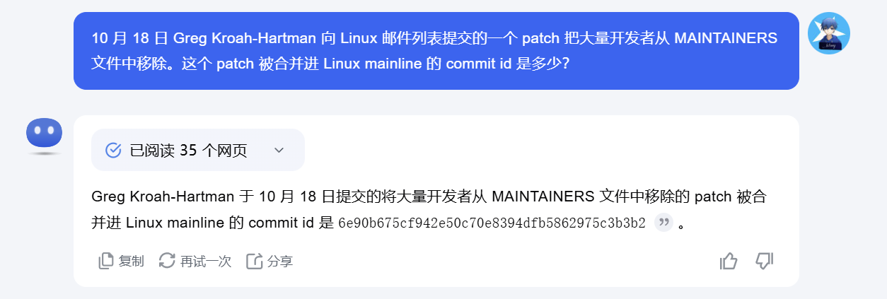

# Hackergame 2024 Writeup

## 前言

沉迷 Hackergame 2024，虽然复变函数一点没复习，但本次相较上次确实有了十足进步。
总分1850 -> 3850 总排名449 / 2386 -> 105 / 2460

## 签到

老签到了，不废话直接启动，注意到url加入的/?pass=false，改个true秒了。

## 喜欢做签到的 CTFer 你们好呀

我认为他既然都说了是中科大的CTF战队……直接去Hackergame的首页看看。
果不其然在这

~~不知道为什么我的tab自动补全是用不了的~~

~~我不止一次在尝试sudo，一直给我跳转到奶龙~~

### Checkin Again & Again

help的指令一个一个试，试到 `env` 就出来flag了。

### Checkin Again

紧跟着是 `cat` 的尝试，他提示我了目录下还有 `hidden files` ，说实话我第一时间确实想的是 `cat hidden files` 结果读不出来，我还尝试半天 `\` 以免不能正常读取。

后来才想明白 `hidden files` 是隐藏的文件，所以 `cat .flag` 出flag。

## 猫咪问答（Hackergame 十周年纪念版）

> 1. 在 Hackergame 2015 比赛开始前一天晚上开展的赛前讲座是在哪个教室举行的？

搜了半天先看[第一个网站](https://lug.ustc.edu.cn/wiki/lug/events/hackergame/)，往前推

显然这里是 Hackergame 2015。紧随其后的是[答案页面](https://lug.ustc.edu.cn/wiki/sec/contest.html)。

得到答案：3A204。

> 2. 众所周知，Hackergame 共约 25 道题目。近五年（不含今年）举办的 Hackergame 中，题目数量最接近这个数字的那一届比赛里有多少人注册参加？

反正我是靠一届一届往前找 writeup 数的，`https://github.com/USTC-Hackergame/hackergame[year]-writeups` 挨个数 writeup 题目数量，算一下哪个最接近 25。

但是没有 2019 的 writeup ，那么我还是选择了回到hg首页，找到

得到wp地址，最后数出 2019 年的最接近，正好找writeup地址的新闻稿页面就写了注册人数。

得到答案：2682

> 3. Hackergame 2018 让哪个热门检索词成为了科大图书馆当月热搜第一？

每届 HackerGame 在 writeup 里都会有幕后花絮和彩蛋的，直接去 2018 的 writeup 页面，找到幕后花絮。

得到答案：程序员的自我修养

> 4. 在今年的 USENIX Security 学术会议上中国科学技术大学发表了一篇关于电子邮件伪造攻击的论文，在论文中作者提出了 6 种攻击方法，并在多少个电子邮件服务提供商及客户端的组合上进行了实验？

搜索 `USENIX Security`，来到[官网](https://www.usenix.org/conference/usenixsecurity24)，而后[科技会谈](https://www.usenix.org/conference/usenixsecurity24/technical-sessions)，而后[主题表](https://www.usenix.org/conference/usenixsecurity24/technical-sessions)，论文一般后面都会标注发表者组织，搜索中科大英文名 `University of Science and Technology of China` 得到

得到论文名 `FakeBehalf: Imperceptible Email Spoofing Attacks against the Delegation Mechanism in Email Systems` 而后把论文文件甩给AI帮我分析问题

~~看了其他人题解，原来可以最开始就直接把整段问题给AI~~

得到答案：336

> 5. 10 月 18 日 Greg Kroah-Hartman 向 Linux 邮件列表提交的一个 patch 把大量开发者从 MAINTAINERS 文件中移除。这个 patch 被合并进 Linux mainline 的 commit id 是多少？

这道题倒是直接问了AI……~~为什么上一题没想到直接问呢~~

得到答案：6e90b6

> 6. 大语言模型会把输入分解为一个一个的 token 后继续计算，请问这个网页的 HTML 源代码会被 Meta 的 Llama 3 70B 模型的 tokenizer 分解为多少个 token？

~~刚开始真想过写代码，但我以往届猫咪问答的经验告诉我，猫咪不该会写代码。~~

所以我选择 Google 搜索 `meta llama tokenizer` 得到[在线tokenizer](https://lunary.ai/llama3-tokenizer)，直接从题目页面的浏览器控制台贴源码，直接得到的答案不对，可能是我的贴的代码跟原型对不上，不过可以上下试几个数。

得到答案：1833

## 打不开的盒

下载下来的文件 `flagbox.stl` ，以前没接触过模型，查了一下知道是模型文件，在网上直接找了一个在线模型预览，摄像头拉进去对着敲。

## 每日论文太多了！

打开题目[论文链接](https://dl.acm.org/doi/10.1145/3650212.3652145)，把 PDF 下载下来。直接用浏览器搜索 flag 就可以发现有东西但看不见，复制粘贴出来发现 `flag here` 。

扔进任意一款编辑器，回到这个位置，拖图片，老规矩，对着敲。

## 旅行照片 4.0

跟以往比简单很多了

### LEO_CHAN?

> **问题 1: 照片拍摄的位置距离中科大的哪个校门更近？（格式：**`X校区Y门`**，均为一个汉字）**

百度搜索科里科气创新驿站，进了一个[爱企查页面](https://aiqicha.baidu.com/mark/markDetail?dataId=5e5fd3b27b6c92f364e054a6779aba49)，得到申请人地址 `安徽省合肥市蜀山区稻香村街道金寨路91号立基大厦A座16楼` 高德地图搜索 `立基大厦`，看地图就能看出来在东校区西门对面。

得到答案：东校区西门

> 问题 2: 话说 Leo 酱上次出现在桁架上是……科大今年的 ACG 音乐会？活动日期我没记错的话是？（格式：`YYYYMMDD`）

虽然是外校选手，但每年中科大ACG相关的活动我都基本有在看~~NEU实名羡慕USTC~~，对我还是挺简单的，直接B站搜索 `中科大 ACG 音乐会` ，能找到系列视频，每一个视频下都有日期。

得到答案：20240519

### FULL_RECALL

> 问题 3: 这个公园的名称是什么？（不需要填写公园所在市区等信息）

第一眼看到垃圾桶上「六安园林」，在高德地图中，进入六合市，搜索公园，直觉写的「中央公园」，确实对了。

得到答案：中央公园

> 问题 4: 这个景观所在的景点的名字是？（三个汉字）

第二章图扔到识图里，顺着翻一翻就能翻到。

得到答案：坛子岭

### OMINOUS_BELL

> 问题 5: 距离拍摄地最近的医院是？（无需包含院区、地名信息，格式：XXX 医院）

扔进识图，翻了一大串链接，地点差不多在北京北动车所，老规矩，高德先在北京搜索北动车所，然后再周边搜索医院。

得到答案：积水潭医院

> 问题 6: 左下角的动车组型号是？

其实我第六题的答案出的算是比第五题早，刚开始没觉得识图能认出来，所以先从 `四编组动车` 入手了，直接问了AI四编组动车的型号，根据上一题查的一堆链接里能得知大概是北动车所有 S2/S5 , 从AI的回答里得到在北郊铁路 S2/S5 运营的CRH6F-A。

得到答案：CRH6F-A

## Node.js is Web Scale

百度搜索 `JS 漏洞` ，得到JS原型链污染。
扔给GPT教我利用JS原型链污染解题，自己稍加构造？
`key`: `__proto__.cat`, `value`: `cat /flag`
然后访问 `/execute?cmd=cat` 就拿到 flag 了。

## PaoluGPT

### 千里挑一

题目提示flag在给出的聊天记录里，让gpt帮我写了个爬取页面的[脚本](./assets/html.py)，爬了所有页面，在vscode里直接打开目录，在所有文件里搜索 `flag` ，秒了。

### 窥视未知

在题目附件里找到了数据库查询逻辑 `select id, title from messages where shown = true` 题目叫窥视未知，应该是 `shown = false` 了，我直接进行一个sqlmap，随便选了一个聊天记录的url，带上session扫了一遍，确实有注入点，那就好办了，把最开始扫描的指令加上 `-T messages -C id,title --where="shown = false" --dump` 即可。

用得到的 `conversation_id` 访问页面，搜索 `flag` ，秒了。

## 不太分布式的软总线

### What DBus Gonna Do?

如常，把题目代码扔给GPT，得到GetFlag1的逻辑是接收 `Please give me flag1` 字符串，很好解，直接拿sh就能秒。

### If I Could Be A File Descriptor

依然是GPT解析题目逻辑，要求有一个文件标识符，其中含有 `Please give me flag2\n` 字符串，但不能是系统上的文件~~但只读系统明明本来也不能写文件~~，后来严谨的看了一下检测逻辑，是检测 `/proc/self/fd/%d` 指向的内容不能包含 `/` ，所以其实我中间尝试了/dev下的各种方法也依然不可行，总的来讲，这道题当时卡了我很久，因为第一题我是用sh解的，导致我以为后面都只能用sh，直到后来才反应过来也可以用C语言编写程序。

思路打开就好办了，用C语言的特权——创建匿名管道，写入字符串，直接读取，但我自己C语言能力不到位，让gpt写的程序在传递给dbus的时候始终有点问题，红温了之后只让C语言创建了匿名管道，而后直接调用系统指令来读了文件标识符（还是sh适合我）。

### Comm Say Maybe

依旧是思路打开的一集，解出第二问之后还是老规矩，用gpt解析GetFlag3的逻辑，要求是调用 `getflag3` 进程才能给flag，但系统上给出的getflag3程序显然不会给你flag，最后实际上需要自己把 `getflag3` 这个程序稍作修改，让其能够正常输出，再在程序前部用prctl设置进程名为 `getflag3` ，秒杀。

## 禁止内卷

做完了才知道为什么解出这题的群友 拍大腿 ，查看题目逻辑，知道我们解题需要的文件是 `answers.json` ，我们上传文件的目录是 `/tmp/upload` ，题干又特意提示了网站目录在 `/tmp/web`，想必一定是跟路径有关，但显然，文件名正常是不能包含类似于 `../` 这种东西的，所以就要通过改请求了，打开burpsuite，截POST中的filename，把这里改成 `../web/xxx` 这种格式就可以进行任意 `/tmp/web` 下文件的替换，我刚开始脑抽只想着怎么把 `answers.json` 拿出来，结果直接传了个文件把 `answers.json` 覆盖了，彻底没活了，只能重开容器，出来重新读一遍题干，提示我直接使用 `flask run` 和 `--reload` ，查了一下flask基本用法，我才反应过来，直接使用 `flask run` 的意思是，程序文件是 `app.py` ，`--reload` 的意思是直接把程序文件替换掉之后会自动重启，所以这下才明白原来要替换的是 `app.py` ，所以让gpt帮我写一个可以下载 `answers.json` 的程序，然后上传替换掉 `app.py` 即可。

## 后记

从高一开始打的比赛了，每年都能学到很多东西，并不像现在很多大型比赛那么硬核，更偏向于让每一名参赛选手在每一届都能学到新东西。

作为一个非常业余的 CTFer，能拿到现在的成绩对我来说其实我自己很满意了。

但其实眼睁睁看着自己的排名在最后从100以内掉到105，校内从第4一直掉到第8，却非常无力，还是挺难受的。

最后，期待下一届Hackergame，希望在下一届比赛里我还能有所收获。
