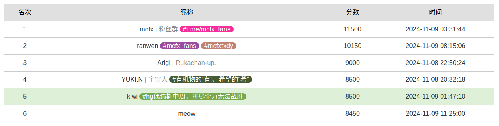
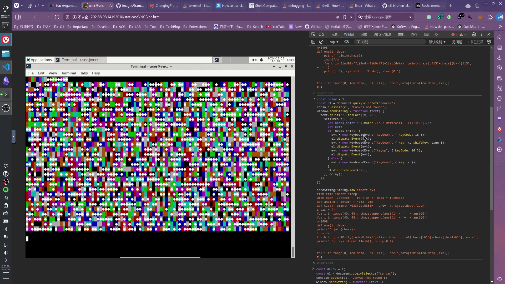

HG 偶遇期中周，拼尽全力无法战胜

[欢迎到我的博客阅读](https://mivik.moe/2024/solution/hackergame2024/)

期中周能抽出时间打比赛也是厉害。

总体感觉比上一次要有趣一些，几个 binary 题目自己完全没动力去整就搁置了。这篇 writeup 也是在这种赶工的心态下写的所以请多包涵。

主要写几个和官方思路有出入的题目，其它就不赘述了。



---

## 每日论文太多了！

现在加入 [pdfcpu](https://pdfcpu.io) 神教。

```bash
pdfcpu extract --mode image 3650212.3652145.pdf output
```

## 旅行照片 4.0

小红书真好用。

那个需要从垃圾桶上看到 `六安` 的除外。

## 不宽的宽字符

最大的收获是知道了 Windows 的 `wchar_t` 是 16 位而不是 32 位的。

不用 UTF-8 的皆为异端。[UTF-8 Everywhere](https://utf8everywhere.org/)

```cpp
#include <cctype>
#include <cstdint>
#include <fstream>
#include <iostream>
#include <string>
#include <windows.h>

wchar_t woutput[100];
uint8_t output[100];

int main() {
  const char *payload = "Z:\\var\\..\\theflag";

  char *p = (char *)woutput;
  strcpy(p, payload);
  auto wsize = strlen(payload) / 2 + 1;

  auto size = WideCharToMultiByte(CP_UTF8, 0, woutput, wsize, (char *)output,
                                  sizeof(output), nullptr, nullptr);
  size += 1;
  std::cout << size << std::endl;
  for (int i = 0; i < size; ++i) {
    printf("%02x ", (int)output[i]);
  }

  FILE *fp = fopen("test.bin", "wb");
  fwrite(output, 1, size, fp);
  fclose(fp);
  return 0;
}
```

这里加了一些 padding 来保证刚好能塞进去。

## PowerfulShell

Shell 有个东西叫 [Parameter Expansion](https://www.gnu.org/software/bash/manual/html_node/Shell-Parameter-Expansion.html)，其中有一种可以拿来截取字符串。然后这题不能输入字母，可以用的字符有：

```bash
> _1=~
# _1=/players
> _2=$-
# _2=hB
> _3=$_
# _3=input
```

这里的 `$_` 是上一个命令的最后一个参数。在题目源文件里，`eval` 的上一条指令是 `read input`，因此是 `input`。

实际上做的时候没注意到 `~`，不然直接 `s` 和 `h` 拼接起来就得到官方的做法了。

如果只有 `input` 和 `hB` 的话有什么可以用？直接对 docker image 扫 bin 目录我们发现两条：`tput` 和 `i386`。`tput` 是用来输出终端信息的，但要让他向 stdout 输出有用的东西我们需要更多的我们没有的字符；`i386` 是切换架构，*直接执行会给你一个 Shell*。是的。

```bash
${_:0:1}386
```

## 惜字如金 3.0

基本和官方一致。给大家一句建议，像第三问后面这种一看就很线性的东西，善用 z3（）

## 优雅的不等式

在 [这个问题](https://math.stackexchange.com/questions/4666735/using-an-integral-to-generate-rational-approximations-of-pi) 可以看到一个对 $\pi$ 不错的逼近。取 $t=80$ 就可以达到指定的精度。

也就是说，我们现在有一个 $f(x)$ 积出来是 $pi-t\space (t\in\mathrm{Q})$。我们想对给定的 $p,q$ 得到一个方程 $g(x)$ 使 $\int_0^1 g \space\mathrm{dx}=pi-p/q (p/q<t)$ 且 $g(x)>0$。显然的想法是 $g(x)=f(x)+t-p/q$，但是！但是。这个东西。sympy 他积不出来。

……

我们合理怀疑是，sympy 他试图把后面的常数部分 $t-p/q$ 通分到前面去，导致积不出来；哎 🤓☝ 这时候我们乘一个 $x$ 避免他有这种奇怪的想法：$g(x)=f(x)+2x(t-p/q)$。

嗯好的可以积出来。但是。这个东西。sympy 他。验证不了。它在 $[0,1]$ 上恒正。

……

最后的构造是 $g(x)=f(x)+1/3 x^2(t-p/q)$。

## 无法获得的秘密

是谁这么喜欢出工业题？是谁这么喜欢做工业题？！！

哦是我啊，那… 没事了

哎 🤓☝ 全用灰度会不会太慢了，我们直接终端最大化然后 8 色至尊 ANSI 附加中间一个实心点，plus 颜色校准和页定位，43 秒即可传输完成，你值得拥有。



```python
import sys
from time import sleep
with open('/secret', 'rb') as f: data = f.read()
def ansi(d): return f'\033[{d}m'
def cls(): print('\033[2J\033[H', end=''), sys.stdout.flush()
chars = []
for i in range(40, 48): chars.append(ansi(i) + ' ' + ansi(0))
for i in range(40, 48): chars.append(ansi(i) + '●' + ansi(0))
n=1498
def one(i, data):
    print(''.join(chars))
    ind=i//n
    for b in [ind&0xff,(ind>>8)&0xff]+list(data): print(chars[b&15]+chars[(b>>4)&15], end='')
    print(' '), sys.stdout.flush(), sleep(0.1)


for i in range(0, len(data), n): cls(), one(i,data[i:min(len(data),i+n)])
```

下面是解码

```rust
use std::path::Path;

use anyhow::Result;
use image::Rgb;

fn distance(x: &Rgb<u8>, y: &Rgb<u8>) -> u32 {
    let x = x.0;
    let y = y.0;
    let r = x[0] as i32 - y[0] as i32;
    let g = x[1] as i32 - y[1] as i32;
    let b = x[2] as i32 - y[2] as i32;
    (r * r + g * g + b * b) as u32
}

fn main() -> Result<()> {
    let mut next_page = 0;

    for i in 40..2212 {
        let path = format!("../output/{i:04}.png");
        let image = image::open(path)?.to_rgb8();

        let get = |row: u32, col: u32, center: bool| {
            let x = 101 + 10 * col;
            let mut y = 301 + 19 * row;
            if !center {
                y -= 6;
            }
            image.get_pixel(x, y)
        };

        let colors = (0..8).map(|i| get(0, i, false)).collect::<Vec<_>>();
        let mut row = 1;
        let mut col = 0;
        let mut raw = [0; 3000];
        for j in 0..3000 {
            let bg = get(row, col, false);
            let mut dist = distance(bg, colors[0]);
            let mut idx = 0;
            for i in 1..8 {
                let d = distance(bg, colors[i]);
                if d < dist {
                    dist = d;
                    idx = i;
                }
            }
            let pixel = get(row, col, true);
            let is_dot = distance(pixel, &Rgb([255, 255, 255])) < distance(pixel, bg);
            raw[j] = (if is_dot { 8 } else { 0 }) + idx as u8;

            col += 1;
            if col == 100 {
                col = 0;
                row += 1;
            }
        }

        let mut bytes = [0; 1500];
        for i in 0..1500 {
            bytes[i] = (raw[2 * i]) + (raw[2 * i + 1] << 4);
        }
        while Path::new(&format!("data/{next_page}.bin")).exists() {
            next_page += 1;
        }
        let page = u16::from_le_bytes([bytes[0], bytes[1]]);
        println!("{page}");
        if page < next_page {
            continue;
        }
        if page != next_page {
            println!("Missing page: {next_page}");
        }
        next_page = page + 1;
        std::fs::write(format!("data/{page}.bin"), &bytes[2..])?;
        println!("page {page}");
    }

    Ok(())
}
```

哎 Rust 批闻着味儿就来了。

此外批量输入可以直接用网页端，用一段脚本模拟输入即可：

```js
const delay = 1;
const el = document.querySelector("canvas");
console.assert(el, "Canvas not found");
window.sendString = function (text) {
  text.split("").forEach((x) => {
    setTimeout(() => {
      var needs_shift = x.match(/[A-Z!@#$%^&*()_+{}:\"<>?~|]/);
      let evt;
      if (needs_shift) {
        evt = new KeyboardEvent("keydown", { keyCode: 16 });
        el.dispatchEvent(evt);
        evt = new KeyboardEvent("keydown", { key: x, shiftKey: true });
        el.dispatchEvent(evt);
        evt = new KeyboardEvent("keyup", { keyCode: 16 });
        el.dispatchEvent(evt);
      } else {
        evt = new KeyboardEvent("keydown", { key: x });
      }
      el.dispatchEvent(evt);
    }, delay);
  });
};
```

## 关灯

就是一个基本的高斯消元，裸的复杂度是 $O(n^9)$，如果考虑 Light chasing（本质上是把状态 reduce 到一行）会是 $O(n^6)$。最后一问 $n$ 是固定的，可以预处理矩阵 PLU 分解。

但是哎 🤓☝，请看无敌 GF(2) 矩阵运算库 [m4ri](https://github.com/malb/m4ri)，他主页上是这么写的：


$O(n^{3/\log n})$，我寻思这不恒等于 $O(e^3)$ 吗？常数复杂度高斯消元？？

无论如何实测跑得飞快。可以直接把矩阵预处理出来，然后根据输入算一下系数，最后高斯消元即可。

```cpp
#include <bitset>
#include <cassert>
#include <cstring>
#include <iostream>
#include <m4ri/m4ri.h>
#include <unordered_set>

const int n = 149;
const int N = n * n;
const int NN = n * n * n;

bool ans[N];
bool v[n][N], he[3][N];
int main() {
  std::ios::sync_with_stdio(0);

  mzd_t *A = mzd_init(N, N + 1);
  FILE *f = fopen("mat.txt", "r");
  for (int i = 0; i < N; i++) {
    int cnt = 0;
    fscanf(f, "%d", &cnt);
    while (cnt--) {
      int j;
      fscanf(f, "%d", &j);
      mzd_write_bit(A, i, j, 1);
    }
  }
  fclose(f);

  for (int i = 0; i < n; ++i) {
    auto &cur = he[(i + 2) % 3], &pre = he[(i + 1) % 3], &ppre = he[i % 3];
    for (int j = 0, p = 0; j < n; ++j)
      for (int k = 0; k < n; ++k, ++p) {
        cur[p] = v[i][p] = getchar() == '1';
        // cur[p] = v[i][p] = 0;
        cur[p] ^= pre[p];
        if (i > 1)
          cur[p] ^= ppre[p];
        if (j)
          cur[p] ^= pre[p - n];
        if (k)
          cur[p] ^= pre[p - 1];
        if (j + 1 < n)
          cur[p] ^= pre[p + n];
        if (k + 1 < n)
          cur[p] ^= pre[p + 1];
      }
  }
  auto &hehe = he[(n + 1) % 3];
  for (int i = 0; i < N; ++i)
    if (hehe[i])
      mzd_write_bit(A, i, N, 1);

  mzd_echelonize(A, 0);
  for (int i = N; i--;) {
    int j;
    for (j = 0; j < N; ++j)
      if (mzd_read_bit(A, i, j))
        break;
    if (j == N)
      continue;
    ans[j] = mzd_read_bit(A, i, N);
    for (int k = j + 1; k < N; ++k)
      if (mzd_read_bit(A, i, k))
        ans[j] ^= ans[k];
  }

  for (int i = 0; i < n; ++i) {
    for (int j = 0, p = 0; j < n; ++j)
      for (int k = 0; k < n; ++k, ++p) {
        bool t = i ? v[i - 1][p] : ans[p];
        putchar(t ? '1' : '0');
        if (t) {
          v[i][p] ^= 1;
          if (i)
            v[i - 1][p] ^= 1;
          if (i < n - 1)
            v[i + 1][p] ^= 1;
          if (j)
            v[i][p - n] ^= 1;
          if (k)
            v[i][p - 1] ^= 1;
          if (j + 1 < n)
            v[i][p + n] ^= 1;
          if (k + 1 < n)
            v[i][p + 1] ^= 1;
        }
      }
  }
  puts("");
}
```

## 图灵完备的浮点数减法

实际上很早之前就在 Hackernews 看到过 [Subtraction is Functionally Complete](https://orlp.net/blog/subtraction-is-functionally-complete/)，当时还把这个出成了逆向题，不过这题思路还是很不一样的。

本质上就是考虑溢出，你可以构造出两个函数使得：

$$
f_k (x)=x-f_{1k}-f_{2k}=\begin{cases}
0 & 0\le x<2^k,\\
1 & x\ge 2^{k+1}
\end{cases} \\
g_k (x)=x-g_{1k}-g_{2k}=\begin{cases}
0 & x=0,\\
x^k & x=2^{k+1}
\end{cases}
$$

然后就能干很多事情啦！怎么找常数？当然是 z3 啦！

```python
from z3 import *
import struct

s = Solver()
x = FP('x', Float64())
y = FP('y', Float64())
z = FP('z', Float64())


def val(v):
    return FPVal(float(v), Float64())


def tof(v):
    sign = v.sign()
    exponent = v.exponent_as_long()
    significand = v.significand_as_long()
    bits = ((1 if sign else 0) << 63) | (exponent << 52) | significand
    return struct.unpack('d', struct.pack('Q', bits))[0]


# g
for k in range(0, 9):
    s = Solver()
    s.add(val(2**k) - x - y == val(2 ** (k - 1)))
    s.add(val(0) - x - y == val(0))
    if s.check() == sat:
        m = s.model()
        print(2**k, m.eval(val(2**k) - x - y))
        for k in m:
            v = m[k]
            print(f'{k}: {tof(v):.20f}')
    else:
        print("unsat")
```

然后最后生成代码的代码：

```python
DEBUG = False
pc = 32

if not DEBUG:
    _f = open('output.txt', 'w')


_caches = {}


def _const(value):
    global pc
    if value in _caches:
        return _caches[value]
    result = pc
    pc += 1
    if not DEBUG:
        print(f'{value:.20f}', file=_f)
    _caches[value] = result
    return result


def _sub2(a, b):
    global pc
    result = pc
    pc += 1
    if not DEBUG:
        print(a, b, file=_f)
    return result


class Val:
    def __repr__(self):
        return str(self)

    def back(self):
        return self - Const(0.0)

    def __neg__(self):
        return Const(0.0) - self

    def f(self, k):
        return self - _fs[k] - _fss[k]

    def g(self, k):
        return self - _gss[k] - _gs[k]

    def bits(self, p=8):
        if isinstance(self, Const):
            t = int(self.v)
            assert 0 <= t < 2**p
            result = []
            for _ in range(p):
                result.append(Const(t & 1))
                t >>= 1
            return BitVec(result)

        t = self
        result = []
        for i in range(p - 1, -1, -1):
            bit = t.f(i).g(i + 1)
            t = t - bit
            for j in range(i, 0, -1):
                bit = bit.g(j)
            result.append(bit)

        return BitVec(result[::-1])


class Const(Val):
    def __init__(self, v):
        self.v = float(v)

    @property
    def pos(self):
        if hasattr(self, '_pos'):
            return self._pos
        self._pos = _const(self.v)
        return self._pos

    def __sub__(self, other):
        if isinstance(other, Var):
            return Var(_sub2(self.pos, other.pos))
        assert isinstance(other, Const)
        return Const(self.v - other.v)

    def __str__(self):
        return f'Const({self.v})'


_fs = [
    9024808620654594.00000000000000000000,
    -36028796876357636.00000000000000000000,
    55244188715091032.00000000000000000000,
    -144115188075855856.00000000000000000000,
    -246116941333034592.00000000000000000000,
    -576460752303423424.00000000000000000000,
    -610435908294422144.00000000000000000000,
    -2305843009213693696.00000000000000000000,
]
_fss = [Const(float(2**i - 1) - _fs[i]) for i in range(8)]
_fs = [Const(t) for t in _fs]
_gs = [
    4503599627370495.50000000000000000000,
    9007199254740991.00000000000000000000,
    18014398509481982.00000000000000000000,
    36028797018963964.00000000000000000000,
    72057594037927928.00000000000000000000,
    144115188075855856.00000000000000000000,
    288230376151711712.00000000000000000000,
    576460752303423424.00000000000000000000,
    1152921504606846848.00000000000000000000,
]
_gss = [Const(-g) for g in _gs]
_gs = [Const(g) for g in _gs]


class Var(Val):
    def __init__(self, pos):
        self.pos = pos

    def __str__(self):
        return f'Var({self.pos})'

    def __sub__(self, other):
        return Var(_sub2(self.pos, other.pos))


def add3(a, b, c):
    return a - ((Const(0.0) - b) - c)


def concat(*args):
    result = []
    for arg in args:
        assert isinstance(arg, BitVec)
        result.extend(arg.bits)
    return BitVec(result)


def bit_op(f):
    def g(a, b):
        if isinstance(a, Const) and isinstance(b, Var):
            return f(b, a)
        return f(a, b)

    return g


@bit_op
def bit_xor(a, b):
    if isinstance(b, Const):
        if int(b.v) == 0:
            return a
        else:
            return Const(1.0) - a

    s = a - (-b)
    return s - s.f(1).g(2)


@bit_op
def bit_and(a, b):
    if isinstance(b, Const):
        if int(b.v) == 0:
            return Const(0.0)
        else:
            return a

    return (a - (-b)).f(1).g(2).g(1)


class BitVec:
    def __init__(self, bits):
        self.bits = bits

    def __str__(self):
        return f'BitVec{self.bits}'

    def __repr__(self):
        return str(self)

    def __len__(self):
        return len(self.bits)

    def __add__(self, other):
        assert len(self) == len(other)
        carry = Const(0.0)
        result = []
        for i in range(len(self)):
            add = add3(self.bits[i], other.bits[i], carry)
            tmp = add.f(1).g(2)
            result.append(add - tmp)
            if i != len(self) - 1:
                carry = tmp.g(1)
        return BitVec(result)

    def __int__(self):
        result = 0
        for b in reversed(self.bits):
            assert isinstance(b, Const)
            result = result * 2 + int(b.v)
        return result

    def __xor__(self, other):
        assert len(self) == len(other)
        return BitVec([bit_xor(a, b) for a, b in zip(self.bits, other.bits)])

    def __and__(self, other):
        assert len(self) == len(other)
        return BitVec([bit_and(a, b) for a, b in zip(self.bits, other.bits)])

    def __invert__(self):
        return BitVec([Const(1.0) - b for b in self.bits])

    def __rshift__(self, n):
        return BitVec(self.bits[n:] + [Const(0.0)] * n)

    def rotr(self, n):
        return BitVec(self.bits[n:] + self.bits[:n])

    def scalar(self):
        t = Const(0.0)
        for b in reversed(self.bits):
            t = add3(t, t, b)
        return t


if 1 == 1:
    data = [Var(i) for i in range(32)]
else:
    data = [Const(0.0) for i in range(32)]
    data[5] = Const(0x23)

for i in range(32):
    data.append(Const(0.0))
data[32] = Const(128.0)
data[62] = Const(1.0)

data = [i.bits() for i in data]

st = [
    0x6A09E667,
    0xBB67AE85,
    0x3C6EF372,
    0xA54FF53A,
    0x510E527F,
    0x9B05688C,
    0x1F83D9AB,
    0x5BE0CD19,
]
st = [Const(i).bits(32) for i in st]
a, b, c, d, e, f, g, h = st

# fmt: off
K = [0x428a2f98, 0x71374491, 0xb5c0fbcf, 0xe9b5dba5, 0x3956c25b, 0x59f111f1,
    0x923f82a4, 0xab1c5ed5, 0xd807aa98, 0x12835b01, 0x243185be, 0x550c7dc3,
    0x72be5d74, 0x80deb1fe, 0x9bdc06a7, 0xc19bf174, 0xe49b69c1, 0xefbe4786,
    0x0fc19dc6, 0x240ca1cc, 0x2de92c6f, 0x4a7484aa, 0x5cb0a9dc, 0x76f988da,
    0x983e5152, 0xa831c66d, 0xb00327c8, 0xbf597fc7, 0xc6e00bf3, 0xd5a79147,
    0x06ca6351, 0x14292967, 0x27b70a85, 0x2e1b2138, 0x4d2c6dfc, 0x53380d13,
    0x650a7354, 0x766a0abb, 0x81c2c92e, 0x92722c85, 0xa2bfe8a1, 0xa81a664b,
    0xc24b8b70, 0xc76c51a3, 0xd192e819, 0xd6990624, 0xf40e3585, 0x106aa070,
    0x19a4c116, 0x1e376c08, 0x2748774c, 0x34b0bcb5, 0x391c0cb3, 0x4ed8aa4a,
    0x5b9cca4f, 0x682e6ff3, 0x748f82ee, 0x78a5636f, 0x84c87814, 0x8cc70208,
    0x90befffa, 0xa4506ceb, 0xbef9a3f7, 0xc67178f2]
# fmt: on
K = [Const(i).bits(32) for i in K]

w = [
    concat(data[i + 3], data[i + 2], data[i + 1], data[i])
    for i in range(0, 64, 4)
]

for i in range(16, 64):
    s0 = w[i - 15].rotr(7) ^ w[i - 15].rotr(18) ^ (w[i - 15] >> 3)
    s1 = w[i - 2].rotr(17) ^ w[i - 2].rotr(19) ^ (w[i - 2] >> 10)
    # print(int(s0), int(s1))
    w.append(w[i - 16] + s0 + w[i - 7] + s1)

for i in range(64):
    s1 = e.rotr(6) ^ e.rotr(11) ^ e.rotr(25)
    ch = (e & f) ^ (~e & g)
    temp1 = h + s1 + ch + K[i] + w[i]
    s0 = a.rotr(2) ^ a.rotr(13) ^ a.rotr(22)
    maj = (a & b) ^ (a & c) ^ (b & c)
    temp2 = s0 + maj

    h = g
    g = f
    f = e
    e = d + temp1
    d = c
    c = b
    b = a
    a = temp1 + temp2

st[0] = st[0] + a
st[1] = st[1] + b
st[2] = st[2] + c
st[3] = st[3] + d
st[4] = st[4] + e
st[5] = st[5] + f
st[6] = st[6] + g
st[7] = st[7] + h

result = []
for i in range(8):
    result += [
        st[i].bits[24:],
        st[i].bits[16:24],
        st[i].bits[8:16],
        st[i].bits[:8],
    ]

result = [BitVec(i).scalar() for i in result]
for i in result:
    i.back()
```

## 零知识数独

猜猜是谁没看到 Circom 的版本导致编译不出来兼容的电路，硬生生跑去 patch wasm 了？

## 名字太长的 LLM

DFS！DFS？DFS！！！！DFS！！

此外实际上完全不用 patch llama.cpp。llama.cpp 有个接口是 `logits_processor`，可以在生成 logits 前对概率做预处理，我们在这里直接对概率前 20 大的枚举一下就好了。

可能因为运气比较好，写出来几遍就过了，CPU 上完整跑一次只需要两分钟。

```python
from llama_cpp import Llama
import llama_cpp.llama_chat_format as llama_chat_format

model_path = '../qwen2.5-3b-instruct-q8_0.gguf'


llm = Llama(
    model_path=model_path,
    n_ctx=1024,
    seed=200,
)
eos_token_id = llm.token_eos()
bos_token_id = llm.token_bos()
eos_token = (
    llm._model.token_get_text(eos_token_id) if eos_token_id != -1 else ''
)
bos_token = (
    llm._model.token_get_text(bos_token_id) if bos_token_id != -1 else ''
)
formatter = llama_chat_format.Jinja2ChatFormatter(
    template=llm.metadata['tokenizer.chat_template'],
    eos_token=eos_token,
    bos_token=bos_token,
    stop_token_ids=[eos_token_id],
)
result = formatter(
    messages=[
        {'role': 'system', 'content': 'You are a professional CTF player.'},
        {
            'role': 'user',
            'content': 'Write a short article for Hackergame 2024 (中国科学技术大学 (University of Science and Technology of China) 第十一届信息安全大赛) in English. The more funny and unreal the better. About 500 words.',
        },
    ]
)

words = {}
for i in range(llm.n_vocab()):
    t = llm._model.token_get_text(i)
    words.setdefault(len(t), {})[t] = i


prompt = result.prompt
prompt = llm.tokenize(
    prompt.encode('utf-8'),
    add_bos=not result.added_special,
    special=True,
)
appended = []
with open('after.txt', 'rb') as f:
    s = f.read()

alters = []
alter_cur = []


def logits_processor(
    input_ids,
    scores,
):
    global alters

    wow = scores.argsort()
    for i in wow[-1:-20:-1]:
        ss = llm.detokenize(appended + [i])
        if all(
            (a == ord('x') and b in map(ord, 'hackergame of ustc')) or a == b
            for a, b in zip(s[: len(ss)], ss)
        ):
            alters.append(i)

    if alter_cur[-1] >= len(alters):
        # run out of options, clear alters to notify the caller
        alters = []
    else:
        scores[alters[alter_cur[-1]]] = 100

    return scores


i = 0
while True:
    gen = llm.generate(
        prompt,
        logits_processor=[logits_processor],
    )
    alter_cur.append(0)
    while True:
        alters.clear()
        logic = next(gen)

        if not alters:
            print('# Oh no!! Going back!!!')
            alter_cur.pop()
            appended.pop()
            alter_cur[-1] += 1
            gen = llm.generate(
                prompt + appended,
                logits_processor=[logits_processor],
            )
            continue

        appended.append(logic)
        output = llm.detokenize(appended)
        print('=====\n' + output.decode())
        if len(output) >= len(s):
            quit()
        alter_cur.append(0)
```
