# 让我们玩 Hackergame 2024

## 前言

> 本 Writeup 同时发布于[我的博客](https://zwh.moe/posts/moyu/hackergame-2024)，~~虽然一年过去了依旧没多少文章。~~

盼望着，盼望着，一年一度的~~网安原神~~ hackergame ~~搜索~~技术小考终于来了。今年的入门题相比去年少了些，只拿到 1k7。作为一个非计算机专业用户感觉我还是太菜了。

接下来来聊聊做各道题的心路历程，写的顺序也是我做出来的顺序。可能包含：AI 是我大爹、碎碎念、无端玩梗、自娱自乐等混沌要素（

## 签到

开门需要在~~听着[悠扬的小曲](http://202.38.93.141:12024/static/Hackergame.mp3)的同时~~在 60s 内输入各国文字的启动，但是不能粘贴（恼

不行，我太菜了什么都做不到，还是“等不及了，马上启动！”吧。怎么地址栏多了个 `?pass=false`？改为 `true` 看看？

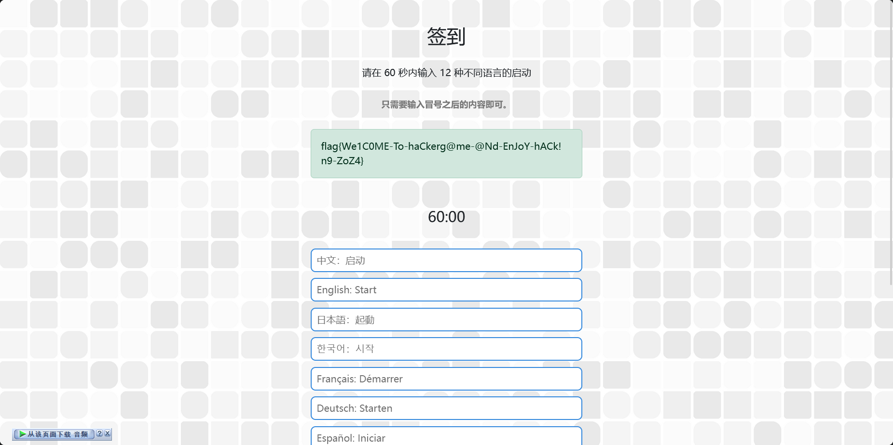

就这样，拿到了签到题的 flag：`flag{We1C0ME-To-haCkerg@me-@Nd-EnJoY-hACk!n9-ZoZ4} `

附一个《hackergame 传奇》歌词：（转自官方 Writeup）这歌啊，非常的好听，应该拉着看这篇文章的各位一起循环。

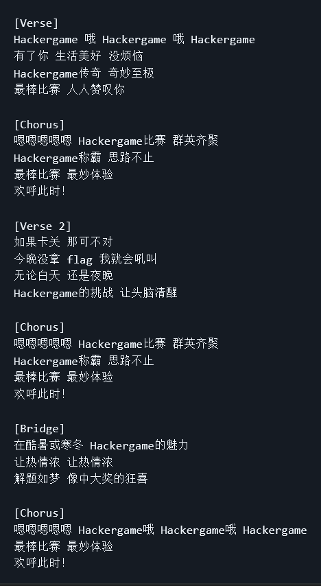

## 猫咪问答（Hackergame 十周年纪念版）

熟悉的猫咪问答，熟悉的搜索技术小考，熟悉的找不到答案在吼叫（

> 1. 在 Hackergame 2015 比赛开始前一天晚上开展的赛前讲座是在哪个教室举行的？（30 分） 提示：填写教室编号，如 5207、3A101。

这道题搜了好几个网站，最后通过 [Hackergame 在 LUG@USTC 的介绍页面](https://lug.ustc.edu.cn/wiki/lug/events/hackergame/)找到了科大第二届信息安全大赛（那时候还没叫 hackergame 呢）的[内容存档](https://lug.ustc.edu.cn/wiki/sec/contest.html)。可以看到比赛时间安排里面有 `10 月 17 日 周六晚上 19:30 3A204 网络攻防技巧讲座`。所以答案是 `3A204`。~~就这么活生生把水题做成了难题。~~

> 2. 众所周知，Hackergame 共约 25 道题目。近五年（不含今年）举办的 Hackergame 中，题目数量最接近这个数字的那一届比赛里有多少人注册参加？（30 分） 提示：是一个非负整数。

看第一题里说过的 Hackergame 的介绍页面，把每年比赛的仓库（前几年的在 `ustclug` 组织下） 翻一次数数，最后得出来是 19 年最接近（28 题），再把 `hackergame 2019` 丢给咕噜噜。搜到了[这个](https://news.ustclug.org/2019/12/hackergame-2019/)。所以答案为 `2682`。

> 3. Hackergame 2018 让哪个热门检索词成为了科大图书馆当月热搜第一？（20 分） 提示：仅由中文汉字构成。

众所周知，只有猫咪问答会考查询图书馆相关的东西（~~如果还有其他考的那当我没说~~

基于此直接定位 [2018 年猫咪问答的 Writeup](https://github.com/ustclug/hackergame2018-writeups/blob/master/official/ustcquiz/README.md)，找到了图书馆题目的关键词 `程序员的自我修养`，即为本题答案。这种解法某种意义上也是一种巧合，应该不算预期解吧？

> 4. 在今年的 USENIX Security 学术会议上中国科学技术大学发表了一篇关于电子邮件伪造攻击的论文，在论文中作者提出了 6 种攻击方法，并在多少个电子邮件服务提供商及客户端的组合上进行了实验？（10 分） 提示：是一个非负整数。

搜 `USENIX Security USTC`、`USENIX Security email`、`USENIX 中科大` 等关键词都没搜到，血压高了。直到后面用 `USENIX Security 2024 ustc` 搜到一则[新闻](https://if.ustc.edu.cn/news/2024_08_20.php)。得到题目所述论文题目为 FakeBehalf: Imperceptible Email Spoofing Attacks against the Delegation Mechansim in Email Systems。请进咕噜噜得到[论文介绍地址](https://www.usenix.org/conference/usenixsecurity24/presentation/ma-jinrui)和[论文链接](https://www.usenix.org/system/files/usenixsecurity24-ma-jinrui.pdf)。

但是这时候第二个血压点来了，论文介绍里面写的 16 和 20 都不是题目答案，所以还得啃论文。翻来覆去的读之后，在 `6 Imperceptible Email Spoofing Attack` 下找到了这么一段话（高亮标注）：

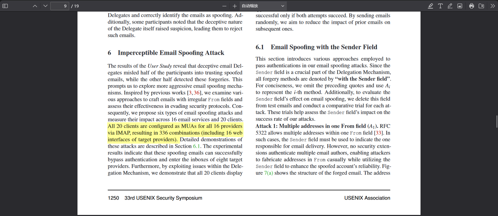

其中说到 `resulting in 336 combinations`（336 个组合），所以答案为 `336`。别看我这么轻松的说这个过程，做起来还是非常痛苦的，也是我倒数第二道才解出来的题目。

> 5. 10 月 18 日 Greg Kroah-Hartman 向 Linux 邮件列表提交的一个 patch 把大量开发者从 MAINTAINERS 文件中移除。这个 patch 被合并进 Linux mainline 的 commit id 是多少？（5 分） 提示：id 前 6 位，字母小写，如 c1e939。

终于来到熟悉的最新最热的题目了。因为这个事件我关注的各个 Telegram 频道都有转发过 [AOSC 写的新闻稿](https://aosc.io/news/detail/2024-10-24-condemnation-of-the-linux-foundation-and-its-employees.zh-cn.md)。稿子里直接给好合并这个糟糕的 patch 的 GitHub [传送门](https://github.com/torvalds/linux/commit/6e90b675cf942e50c70e8394dfb5862975c3b3b2)了。所以答案是 `6e90b6`。

> 6. 大语言模型会把输入分解为一个一个的 token 后继续计算，请问这个网页的 HTML 源代码会被 Meta 的 Llama 3 70B 模型的 tokenizer 分解为多少个 token？（5 分） 提示：首次打开本页时的 HTML 源代码，答案是一个非负整数。

这题我一度想爆破，直到后边找到了 Tiktokenizer 之后开始摆烂了。

浏览器进无痕（并关闭所有插件，以排除插件修改网页源代码的可能），使用 token 进入题目网站。F12 复制网站代码（右键因为需要 token 不是正确的源代码而不能使用），此时因为做其他题找到了某个大模型的页面看到了 Tiktokenizer。好了，网站代码复制到 Tiktokenizer，得到 1829，往上试几个数确定 `1833` 为正确答案。

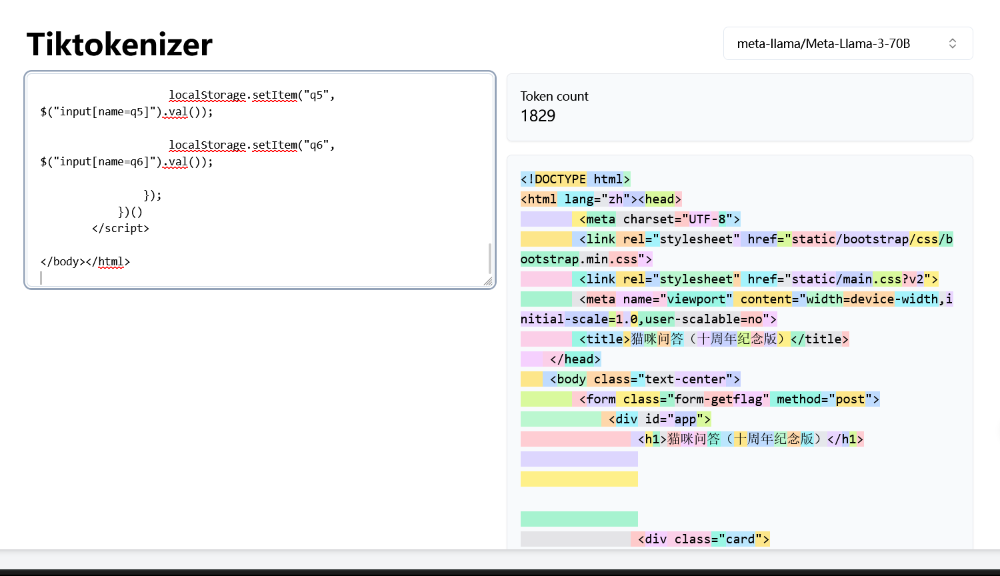

至此，得到了本题的两个 flag：`flag{4_GooD_©α7_iS_THE_c4t_ωHØ_c4n_P@ss_TH3_QuiZ}`、`flag{7eN_¥eαRs_of_hα©KergΛm3_ØmEd3tOบ_WI7h_ИEkO_QU12}`。

## 旅行照片 4.0

[去年的 3.0 没做成功](https://zwh.moe/posts/moyu/hackergame-2023#:r1t:-30)，我对此做出了深刻检讨，主要的问题就是注意力涣散。而在今年，经历了需要集中注意力的 PuzzleHunt 之后，现在的我是无敌的！

~~然后这个屑今年的 GeekGame 搜图题注意力涣散没做出来~~

### LEO_CHAN? （题目 1-2）

> 问题 1: 照片拍摄的位置距离中科大的哪个校门更近？（格式：X校区Y门，均为一个汉字）

直接搜图得到同款图片，得知图片描述的是**中国蜀山科里科气科创驿站—科大站**，再对上述地点进行搜索得到一则[新闻](https://www.imsilkroad.com/news/p/480044.html)，上面写着`中国蜀山科里科气科创驿站——科大站位于金寨路与槽郢路交口，正对中国科学技术大学东校区西门......`。所以题目 1 答案为 `东校区西门`。

> 问题 2: 话说 Leo 酱上次出现在桁架上是……科大今年的 ACG 音乐会？活动日期我没记错的话是？（格式：YYYYMMDD）

直接搜 **科大 ACG 音乐会** 找到 B 站相关视频，可以通过直接或间接的跳转找到 [中科大 LEO 动漫协会的账号主页](https://space.bilibili.com/7021308)。翻动态找到了[这条](https://www.bilibili.com/opus/930934582351495204)，确认时间为 `20240519`。

提交得到 flag1：`flag{5UB5CR1B3_T0_L30_CH4N_0N_B1L1B1L1_PLZ_7647de202b}`（人话：bilibili 关注 LEO 酱谢谢喵）

### FULL_RECALL（题目 3-4）

> 问题 3: 这个公园的名称是什么？（不需要填写公园所在市区等信息）

~~显而易见~~集中注意力发现垃圾桶写着“六安园林”，接下来就是直接搜 `六安 公园` 一个一个进行匹配了，最后答案是 `中央森林公园`。

> 问题 4: 这个景观所在的景点的名字是？（三个汉字）

直接搜图发现是三峡截流石，对这个词进行搜索可得到其在宜昌的`坛子岭`景点。

提交得到 flag2:` flag{D3T41LS_M4TT3R_1F_R3V3RS3_S34RCH_1S_1MP0SS1BL3_f156cdbd44}`（如果无法进行逆向搜索，细节很重要），正好契合了第二部分的做法。

### OMINOUS_BELL（题目 5-6）

> 问题 5: 距离拍摄地最近的医院是？（无需包含院区、地名信息，格式：XXX医院）

> 问题 6: 左下角的动车组型号是？

不是，隔壁 GeekGame 刚考完铁路知识啊（虽然没做出来），怎么 Hackergame 也考？

说回正题。两题均在一张图上，正向图寻毫无头绪，只能就着动车组下手了。直接对着图片里的动车搜图，许多结果都指向怀密号 `CRH6F-A`，涂装对比没毛病，且查询该信息也能发现其正好是四编组，符合 ft 中提到的“似乎有辆很标志性的……四编组动车？”，这样第六题的答案就出来了。

对怀密号进行搜索可知它走的线路是**北京市郊铁路怀柔—密云线**。搜索这条线路，百度提供了一个高亮该线路路线的地图，接下来就是分析图片的拍摄视角以及周围的东西进行匹配了，后面根据道路和远处的三个红色屋顶大概确认了所在区域（红圈），区域周围有个北京`积水潭医院`（绿圈）即为第五题答案。


提交得到flag3：`flag{1_C4NT_C0NT1NU3_TH3_5T0RY_4NYM0R3_50M30N3_PLZ_H3LP_1120265b41}`

不得不说第三组题目是真的费尽心力了，直到后面灵感大开直接搜到出结果。

## 喜欢做签到的 CTFer 你们好呀

~~我是雷军，接下来由我来教这题的步骤。~~通过一系列搜索跳转得到 Nebula 战队的[官网](https://www.nebuu.la/)。写 Writeup 时才发现这个网站写在了“承办单位”中。~~怎么感觉自己不是在做无用功就是在做无用功的路上。~~

可以发现是个 Terminal 风格的网页。毫无头猪，随便输入个 `help` 看看：

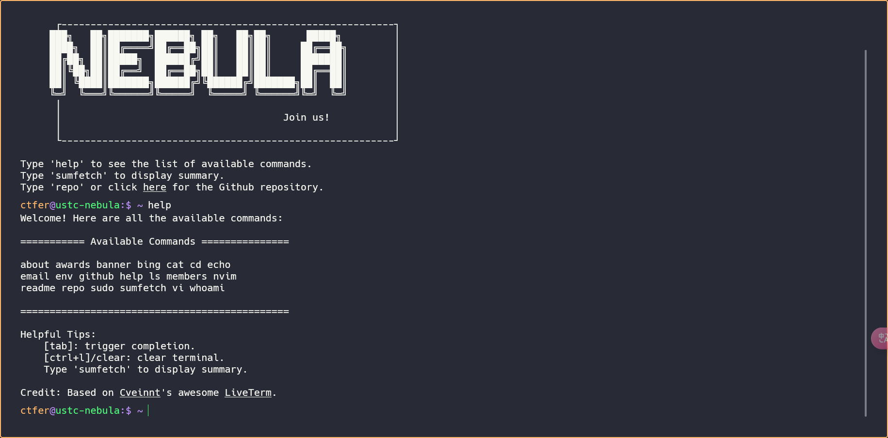

里面给出了所有可执行的命令，接下来一个一个试呗（

试到 `env` 的时候，我们找到了第一个 flag：`flag{actually_theres_another_flag_here_trY_to_f1nD_1t_y0urself___join_us_ustc_nebula}`。

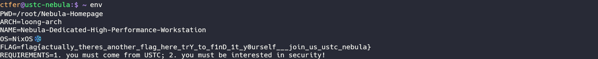

然后就试不出来了（

回看执行命令的记录，注意到 `cat` 执行输出发现里边有个 hidden files，那就先用 `ls -a` 看看有啥隐藏文件吧（

然后就看到了隐藏的 `.flag`，再来个 `cat .flag` 拿下第二个 flag：`flag{0k_175_a_h1dd3n_s3c3rt_f14g___please_join_us_ustc_nebula_anD_two_maJor_requirements_aRe_shown_somewhere_else}`

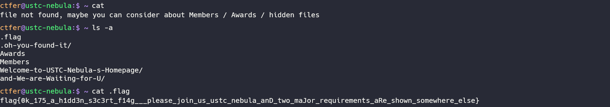

~~最后，我开开心心的做题的时候，一 `sudo` 就跳转奶龙，你们这些喜欢奶龙的 CTFer 给我听好，要是再让我看到你们整奶龙，我就遥控离你们最近的小米 SU7 创似你们！~~

（以上内容均由人工生成）

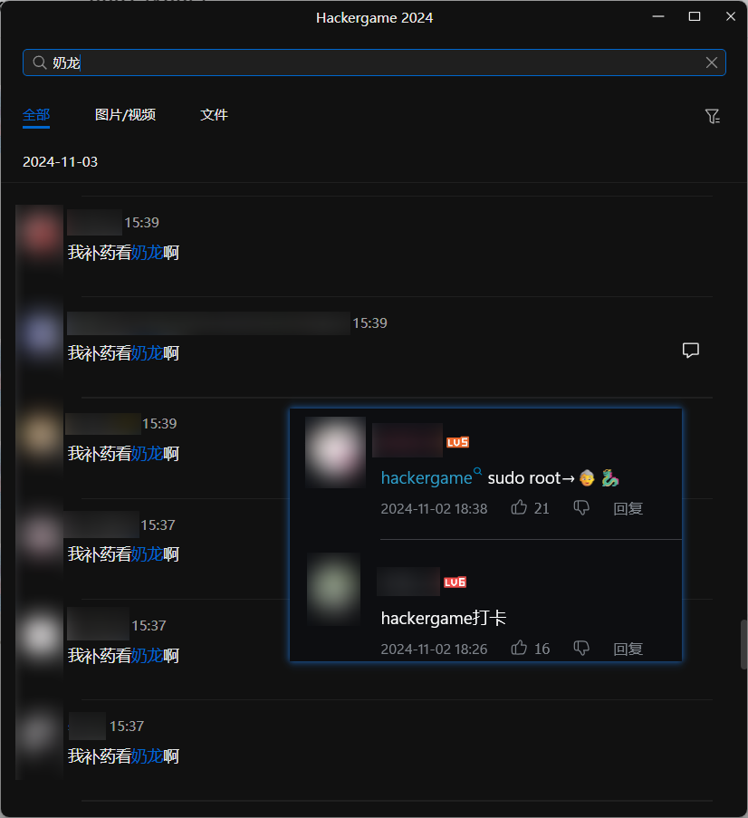

## 零知识数独

### 数独高手

作为一个非计算机专业的，想的都是通过网站解数独而不是编程。刚好之前参加 Puzzle Hunt 时找到一些专门解数独的网站。比如[焖肉面](https://philippica.github.io/cipher_machine/)、[Sudokumaker](https://sudokumaker.app)、[Noq Solver](https://www.noq.solutions/)。随便找一个完成四个难度的数独都能拿到 flag。~~（为什么不展示 flag？因为不想再写数独了）~~

### zk 高手

我都没想到这题是纸老虎级别，难度都在配置环境和找命令上了。以下是做这道题我的摸索过程。

通过搜索大概了解了零知识的相关内容（而且发现数独还是个零知识证明的典型例子）。按照[这篇教程](https://snowolf0620.xyz/index.php/zkp/1016.html)配置了一下基础环境（对于这道题来说，还得在源代码目录安装 npm `circomlib` 包，否则找不到引用的电路）。随后通过 Copilot 了解了其输入格式，按照其输入格式范例对着题目修改 `unsolved_grid` 和 `solved_grid` 保存为 `input.json`。然后就傻傻的执行 `setup.sh` 覆盖掉原有的 `sudoku.zkey` 和 `verification_key.json`，再自己一步步生成 witness 和签名了，操作的时候发现 witness 缺脚本没法生成了又手动操作了一遍命令，最后生成 `proof.json` 丢上去报错了发现不对劲。

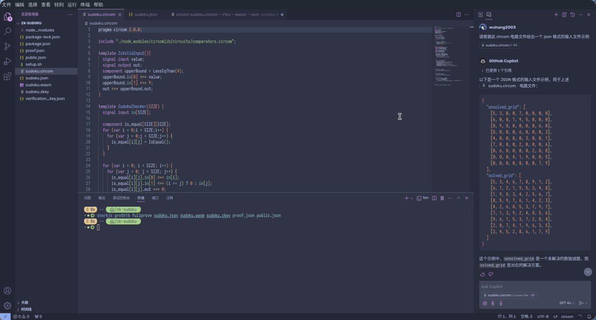

后面一想如果全部中间文件（指的 zkey 和 wasm）都得需要自己生成那代码附件给部分中间文件干什么？带着这个问题又翻了那篇文章，找到了个能同时生成 witness 文件和证明文件的一步到位的命令 `snarkjs groth16 fullprove input.json circuit.wasm circuit_final.zkey proof.json public.json`。刚好用到了输入的 JSON 和题目提供的 `sudoku.wasm`、`sudoku.zkey`。执行了一下正常生成 `proof.json`，丢去验证直接下班（

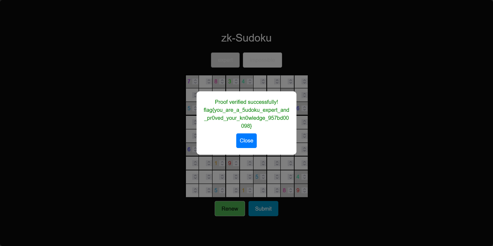

flag：`flag{you_are_a_5udoku_expert_and_pr0ved_your_kn0wledge_957bd00098}`

截至比赛结束时，这题仅 66 人做出，过程梳理了一下并不复杂，主要是现学原理与操作，感觉有点纸老虎了（

## 打不开的盒

拿 SolidWorks 打开但是软件爆炸了，于是随便找了个在线预览 STL 模型的网站，发现在线框模式下转个角度就能看到 flag。

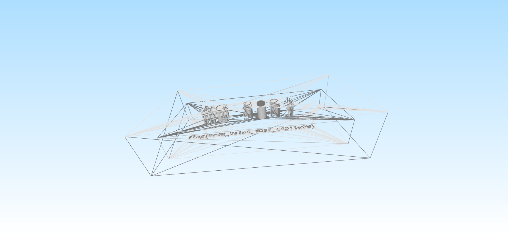

flag：`flag{Dr4W_Us!nG_fR3E_C4D!!w0W}`

## 惜字如金 3.0 / 题目 A

主要就参照哪一行报错就把那一行里变量/函数等缺失的字母补上，秒了。真就比去年还简单。

flag：`flag{C0mpl3ted-Th3-Pyth0n-C0de-N0w}`

## 每日论文太多了！

下了论文之后的一天内都毫无头绪，第二天下午又翻了一遍，看到解出的人数挺多，感觉这不是一道非常难的题，于是又开始啃论文了。

在论文网页用浏览器搜索 `flag`，会发现在一张图里面有隐藏文字，拉一下还能带出来完整的隐藏文本 `flag here`。我以为是找隐藏文字里的 flag，但是直到我拿了一个 PDF 编辑器随便拖动了一下图片......

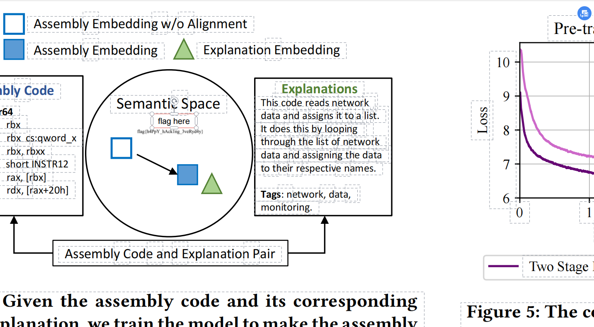

焯！（还有这图怎么这么糊啊）

后来复盘发现这幅图里边有个不太和谐的边框，或许这就意味着这图有问题。果然注意力不够还得运气来凑（不是

flag：`flag{h4PpY_hAck1ng_3veRyd4y}`

## 比大小王

一眼丁真脚本题，AI 启动！但是生成的油猴脚本效率有些拉了，对面答完了最多才做了 46 道左右。于是后面让 AI 改写控制台脚本了。很神奇的是，控制台脚本依旧没赢过对面，但是出 flag 了。感觉有点运气成分在里边。

flag：`flag{I-@M-7hE-h@CkEr-KINg-OF-Comp4RinG-NuMB3r$-ZOz4}`


附 AI 生成的控制台脚本：

```js
// 获取游戏的初始数据
let gameData = state.values;
let inputs = [];
let lessThanButton = document.getElementById('less-than');
let greaterThanButton = document.getElementById('greater-than');

// 使用setInterval函数每50毫秒自动提交一个答案
let intervalId = setInterval(() => {
  // 如果游戏已经结束，需要清除定时器并提交答案
  if (inputs.length >= gameData.length) {
    clearInterval(intervalId);
    submit(inputs);
  } else {
    // 判断当前的两个数哪个更大，并模拟点击相应的按钮
    let pair = gameData[inputs.length];
    if (pair[0] < pair[1]) {
      lessThanButton.click();
      inputs.push('<');
    } else {
      greaterThanButton.click();
      inputs.push('>');
    }
  }
}, 50);
```

## PaoluGPT / 千里挑一

看到这题目就猜到是从这些聊天记录中找藏的 flag，但是链接不想一个一个点，所以还是丢给 AI 写了个油猴脚本自动探寻网页上所有的子路径。果不其然，脚本找到了 flag 所在的网页。打开网页，发现滚轮没划到，直接拖到最底下就能看到 flag 了。

第二小问尝试了一下有点头绪但是不确定，

flag：`flag{zU1_xiA0_de_11m_Pa0lule!!!_a1a2048d7d}`

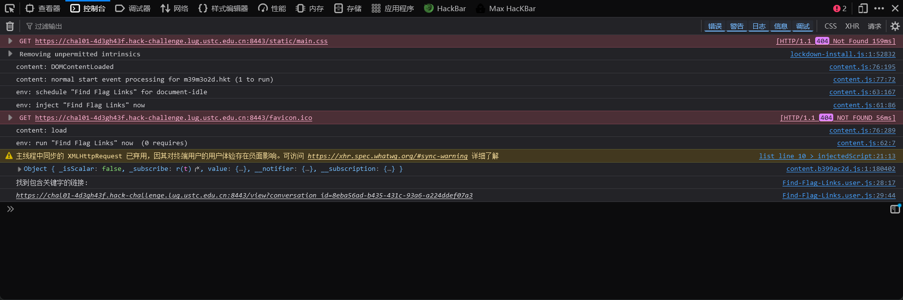

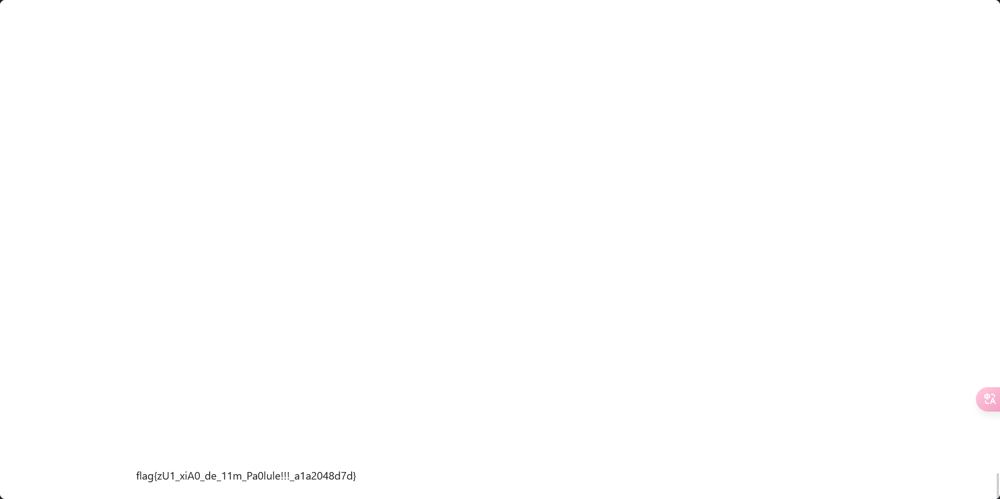

附 AI 生成的油猴脚本：

```js
// ==UserScript==
// @name         Find Flag Links
// @namespace    http://tampermonkey.net/
// @version      1.0
// @description  查找页面中包含关键字的链接
// @match        换成题目环境链接/*
// @grant        none
// ==/UserScript==

(function() {
    'use strict';

    // 提取所有链接
    const links = Array.from(document.querySelectorAll('a[href]')).map(a => a.href);
    const keyword = 'flag'; // 关键字

    // 查找包含关键字的链接
    const foundLinks = links.filter(link => {
        const xhr = new XMLHttpRequest();
        xhr.open('GET', link, false); // 使用同步请求
        xhr.send(null);
        return xhr.status === 200 && xhr.responseText.includes(keyword);
    });

    // 输出结果
    if (foundLinks.length > 0) {
        console.log('找到包含关键字的链接:');
        foundLinks.forEach(link => console.log(link));
    } else {
        console.log('未找到包含关键字的链接');
    }
})();
```

## 结尾

这一次的得分情况：


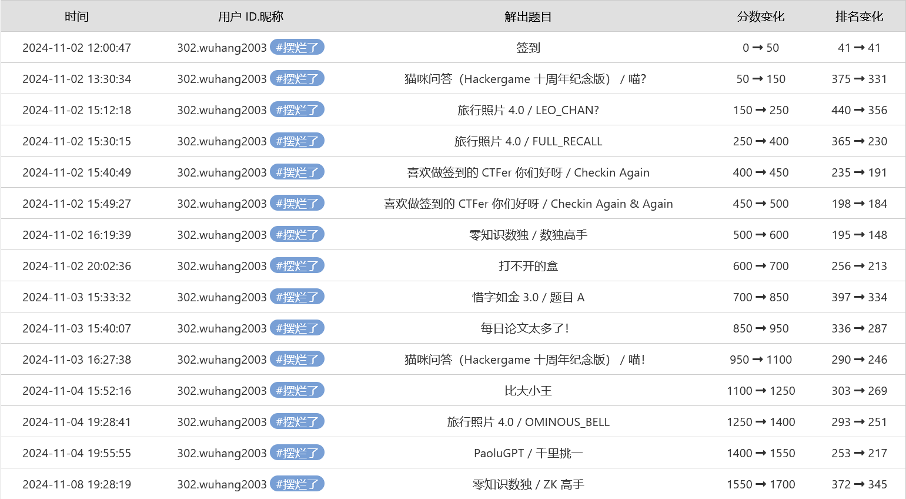

排名相对去年基本没啥变动。今年 Web 感觉还是不太熟悉，拿的分不多；Math 今年入门门槛低了些，比去年拿得多了点；General 送分题少了还是那个水平。当然，做成了一道不到 100 人做成的题还是有点小惊喜的。但总体上，作为萌新还是在仰望大佬的路上前行。

就是这样，感谢各位看官的阅读。明年~~我将继续以小白的身份~~再见！